# Bayesian Inference

The first week covers [Chapter 1 (The Golem of Prague)](https://bookdown.org/content/4857/the-golem-of-prague.html), [Chapter 2 (Small Worlds and Large Worlds)](https://bookdown.org/content/4857/small-worlds-and-large-worlds.html), and [Chapter 3 (Sampling the Imaginary)](https://bookdown.org/content/4857/sampling-the-imaginary.html).

## Lectures

Lecture 1:

<iframe src="https://www.youtube.com/embed/cclUd_HoRlo" width="100%" height="400px" data-external="1"></iframe>

Lecture 2:

<iframe src="https://www.youtube.com/embed/guTdrfycW2Q" width="100%" height="400px" data-external="1"></iframe>


## Exercises

### Chapter 1

There are no exercises for Chapter 1.

### Chapter 2

:::question
> **2E1.** Which of the expressions below correspond to the statement: *the probability of rain on Monday*?  
>   (1) Pr(rain)  
>   (2) Pr(rain|Monday)  
>   (3) Pr(Monday|rain)  
>   (4) Pr(rain, Monday) / Pr(Monday)  
:::

I take this question to mean the probability of rain given that it is Monday. That means both (2) and (4) are correct.

:::question
> **2E2.** Which of the following statements corresponds to the expression: Pr(Monday|rain)?  
>   (1) The probability of rain on Monday.  
>   (2) The probability of rain, given that it is Monday.  
>   (3) The probability that it is Monday, given that it is raining.  
>   (4) The probability that it is Monday and that it is raining.
:::

Only answer (3) corresponds to the expression Pr(Monday|rain).

:::question
> **2E3.** Which of the following expressions below correspond to the statement: *the probability that it is Monday, given that it is raining*?  
>   (1) Pr(Monday|rain)  
>   (2) Pr(rain|Monday)  
>   (3) Pr(rain|Monday) Pr(Monday)  
>   (4) Pr(rain|Monday) Pr(Monday) / Pr(rain)  
>   (5) Pr(Monday|rain) Pr(rain) / Pr(Monday)
:::

There are again two correct answers. Answer option (1) is the standard notation for the conditional probability. Answer option (4) is equivalent, as this is [Bayes' Theorem](https://en.wikipedia.org/wiki/Bayes'_theorem#Statement_of_theorem).

:::question
> **2E4.** The Bayesian statistician Bruno de Finetti (1906--1985) began his 1973 book on probability theory with the dedication: "PROBABILITY DOES NOT EXIST." The capitals appeared in the original, so I imagine de Finetti wanted us to shout this statement. What he meant is that probability is a device for describing uncertainty from the perspective of an observer with limited knowledge; it has no objective reality. Discuss the globe tossing example from the chapter, in light of this statement. What does it mean to say "the probability of water is 0.7"?
:::

The idea is that probability is only a subjective perception of the likelihood that something will happen. In the globe tossing example, the result will always be either "land" or "water" (i.e., 0 or 1). When we toss the globe, we don't know what the result will be, but we know it will always be "land" or "water." To express our uncertainty in the outcome, we use probability. Because we know that water is more likely than land, we may say that the probability of "water" is 0.7; however, we'll never actually observe a result of 0.7 waters, or observe any probability. We will only ever observe the two results of "land" and "water."

:::question
> **2M1.** Recall the globe tossing model from the chapter. Compute and plot the grid approximate posterior distribution for each of the following sets of observations. In each case, assume a uniform prior for *p*.
>   (1) W, W, W
>   (2) W, W, W, L
>   (3) L, W, W, L, W, W, W
:::


```r
library(tidyverse)

dist <- tibble(p_grid = seq(from = 0, to = 1, length.out = 20),
               prior = rep(1, times = 20)) %>%
  mutate(likelihood_1 = dbinom(3, size = 3, prob = p_grid),
         likelihood_2 = dbinom(3, size = 4, prob = p_grid),
         likelihood_3 = dbinom(5, size = 7, prob = p_grid),
         across(starts_with("likelihood"), ~ .x * prior),
         across(starts_with("likelihood"), ~ .x / sum(.x))) %>%
  pivot_longer(cols = starts_with("likelihood"), names_to = "pattern",
               values_to = "posterior") %>%
  separate(pattern, c(NA, "pattern"), sep = "_", convert = TRUE) %>%
  mutate(obs = case_when(pattern == 1L ~ "W, W, W",
                         pattern == 2L ~ "W, W, W, L",
                         pattern == 3L ~ "L, W, W, L, W, W, W"))

ggplot(dist, aes(x = p_grid, y = posterior)) +
  facet_wrap(vars(fct_inorder(obs)), nrow = 1) +
  geom_line() +
  geom_point() +
  labs(x = "Proportion Water (p)", y = "Posterior Density")
```

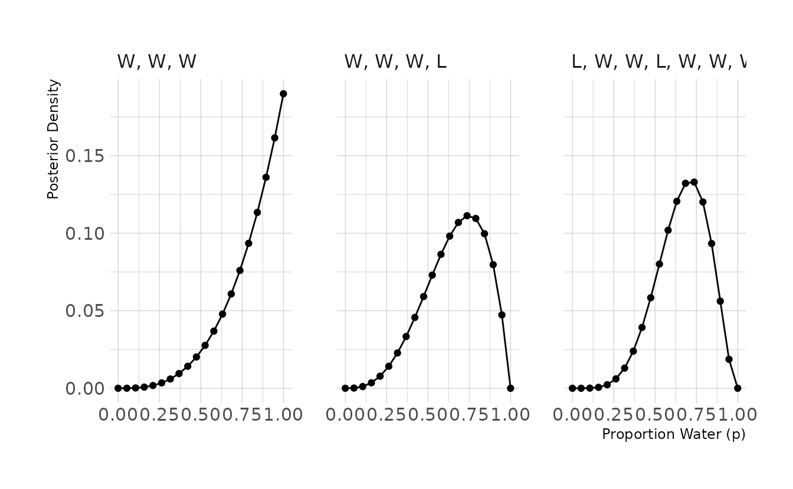

:::question
> **2M2.** Now assume a prior for *p* that is equal to zero when *p* < 0.5 and is a positive constant when *p* &ge; 0.5. Again compute and plot the grid approximate posterior distribution for each of the sets of observations in the problem just above.
:::

For this problem we can use the same code as above, just altering how the prior is defined.


```r
dist <- tibble(p_grid = seq(from = 0, to = 1, length.out = 20)) %>%
  mutate(prior = case_when(p_grid < 0.5 ~ 0L,
                           TRUE ~ 1L),
         likelihood_1 = dbinom(3, size = 3, prob = p_grid),
         likelihood_2 = dbinom(3, size = 4, prob = p_grid),
         likelihood_3 = dbinom(5, size = 7, prob = p_grid),
         across(starts_with("likelihood"), ~ .x * prior),
         across(starts_with("likelihood"), ~ .x / sum(.x))) %>%
  pivot_longer(cols = starts_with("likelihood"), names_to = "pattern",
               values_to = "posterior") %>%
  separate(pattern, c(NA, "pattern"), sep = "_", convert = TRUE) %>%
  mutate(obs = case_when(pattern == 1L ~ "W, W, W",
                         pattern == 2L ~ "W, W, W, L",
                         pattern == 3L ~ "L, W, W, L, W, W, W"))

ggplot(dist, aes(x = p_grid, y = posterior)) +
  facet_wrap(vars(fct_inorder(obs)), nrow = 1) +
  geom_line() +
  geom_point() +
  labs(x = "Proportion Water (p)", y = "Posterior Density")
```

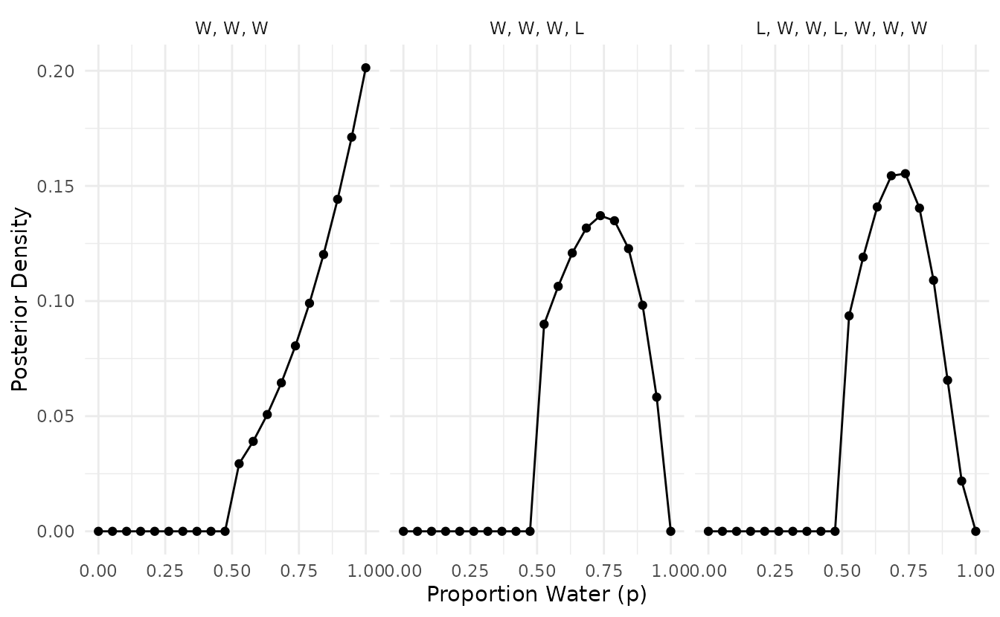

:::question
> **2M3.** Suppose there are two globes, one for Earth and one for Mars. The Earth globe is 70% covered in water. The Mars globe is 100% land. Further suppose that one of these globes---you don't know which---was tossed in the air and produced a "land" observatiion. Assume that each globe was equally likely to be tossed. Show that the posterior probability that the globe was the Earth, conditional on seeing "land" (Pr(Earth|land)), is 0.23.
:::


```r
# probability of land, given Earth
p_le <- 0.3

# probability of land, given Mars
p_lm <- 1.0

# probability of Earth
p_e <- 0.5

# probability of land
p_l <- (p_e * p_le) + ((1 - p_e) * p_lm)

# probability of Earth, given land (using Bayes' Theorem)
p_el <- (p_le * p_e) / p_l
p_el
#> [1] 0.231
```

:::question
> **2M4.** Suppose you have a deck with only three cards. Each card has only two sides, and each side is either black or white. One card has two black sides. The second card has one black and one white side. The third card has two white sides. Now suppose all three cards are placed in a bag and shuffled. Someone reaches into the bag and pulls out a card and places it flat on a table. A black side is shown facing up, but you don't know the color of the side facing down. Show that the probability that the other side is also black is 2/3. Use the counting method (Section 2 of the chapter) to approach this problem. This means counting up the ways that each card could produce the observed data (a black side faceing up on the table).
:::


```r
card_bb_likelihood <- 2
card_bw_likelihood <- 1
card_ww_likelihood <- 0

likelihood <- c(card_bb_likelihood, card_bw_likelihood, card_ww_likelihood)
prior <- c(1, 1, 1)
posterior <- likelihood * prior
posterior <- posterior / sum(posterior)

posterior[1]
#> [1] 0.667
```

:::question
> **2M5.** Now suppose there are four cards: B/B, B/W, W/W, and another B/B. Again suppose a card is drawn from the bag and a black side appears face up. Again calculate the probability that the other side is black.
:::


```r
card_bb_likelihood <- 2
card_bw_likelihood <- 1
card_ww_likelihood <- 0

likelihood <- c(card_bb_likelihood, card_bw_likelihood, card_ww_likelihood,
                card_bb_likelihood)
prior <- c(1, 1, 1, 1)
posterior <- likelihood * prior
posterior <- posterior / sum(posterior)

posterior[1] + posterior[4]
#> [1] 0.8
```

:::question
> **2M6.** Imagine that black ink is heavy, and so cards with black sides are heavier than cards with white sides. As a result, it's less likely that a card with black sides is pulled from the bag. So again assume there are three cards: B/B, B/W, and W/W. After experimenting a number of times, you conclude that for every way to pull the B/B card from the bag, there are 2 ways to pull the B/W card and 3 ways to pull the W/W card. Again suppose that a card is pulled and a black side appears face up. Show that the probability the other side is black is now 0.5. Use the counting method, as before.
:::


```r
card_bb_likelihood <- 2
card_bw_likelihood <- 1
card_ww_likelihood <- 0

likelihood <- c(card_bb_likelihood, card_bw_likelihood, card_ww_likelihood)
prior <- c(1, 2, 3)
posterior <- likelihood * prior
posterior <- posterior / sum(posterior)

posterior[1]
#> [1] 0.5
```

:::question
> **2M7.** Assume again the original card problem, with a single card showing a black side face up. Before looking at the other side, we draw another card from the bag and lay it face up on the table. The face that is shown on the new card is white. Show that the probability that the first card, the one showing a black side, has black on its other side is now 0.75. Use the counting method, if you can. Hint: Treat this like the sequence of globe tosses, countng all the ways to see each observation, for each possiible first card.
:::


```r
# 2 choices for first card, with 3 options for second card: 2 W/W + 1 W/B
card_bb_likelihood <- 2 * 3 
card_wb_likelihood <- 1 * 2 
card_ww_likelihood <- 0

likelihood <- c(card_bb_likelihood, card_wb_likelihood, card_ww_likelihood)
prior <- c(1,1,1)
posterior <- prior * likelihood
posterior <- posterior / sum(posterior)

posterior[1]
#> [1] 0.75
```

:::question
> **2H1.** Suppose there are two species of panda bear. Both are equally common in the wild and live in the sample places. They look exactly alike and eat the same food, and there is  yet no genetic assay capable of telling them apart. They differ however in their family sizes. Species A gives birth to twins 10% of the time, otherwise birthing a single infant. Species births twins 20% of the time, ottherwise birthing singleton infants. Assume these numbers are known with certainty, from many years of field research.  
> Now suppose you are managing a captive panda breeding program. You have a newe female panda of unknown species, and she has just given birth to twins. What is the probability that her next birth will also be twins?
:::


```r
# After first birth, likelihood of species A and B is equal to the rate the
# species give birth to twins
a_likelihood <- 0.1
b_likelihood <- 0.2

# Next calculate the posterior probability that the panda belongs to each
# species, assume species are equally likely
likelihood <- c(a_likelihood, b_likelihood)
prior <- c(1, 1) 
posterior <- likelihood * prior
posterior <- posterior / sum(posterior)
posterior
#> [1] 0.333 0.667

# The probability the next birth is twins is the probability the panda belongs
# to each species times the likelihood each species gives birth to twins
(posterior[1] * a_likelihood) + (posterior[2] * b_likelihood)
#> [1] 0.167
```

:::question
> **2H2.** Recall all the facts from the problem above. Now compute the probability that the panda we have is from species A, asssuming we have observed only the first birth at that it was twins.
:::


```r
# probability of species A
p_a <- 0.5

# probability of twins, given species A
p_ta <- 0.1

# probability of twins, given species B
p_tb <- 0.2

# probability of twins
p_t <- (p_a * p_ta) + ((1 - p_a) * p_tb)

# probability of species A, given twins (using Bayes' Theorem)
# (note this is equivalent to `posterior[1]` above)
p_at <- (p_ta * p_a) / p_t
p_at
#> [1] 0.333
```

:::question
> **2H3.** Continuing on from the previous problem, suppose the same panda mother has a second birth and that it is not twins, but a singleton infant. Compute the posterior probability that this panda is species A.
:::


```r
# likelihood for each species is Pr(twins) * Pr(singleton)
a_likelihood <- 0.1 * (1 - 0.1)
b_likelihood <- 0.2 * (1 - 0.2)

# compute posterior probabilities
likelihood <- c(a_likelihood, b_likelihood)
prior <- c(1, 1)
posterior <- likelihood * prior
posterior <- posterior / sum(posterior)

posterior[1]
#> [1] 0.36
```

:::question
> **2H4.** A common boast of Bayesian statisticians is that Bayesian inference makes it easy to use all of the data, even if the data are of different types.  
> So suppose now that a veterinarian comes along who has a new genetic test that she claims can identify the species of our mother panda. But the test, like all tests, is imperfect. This is the information you have about the test:  
>
>  - The probability it correctly identifies a species A panda is 0.8.  
>  - The probability it correctly identifies a species B panda is 0.65.  
>
> The vet administers the test to your panda and tells you that the test is positive for species A. First ignore your previous information from the births and compute the posterior probability that your panda is species A. Then redo your calculation, now using the birth data as well.
:::


```r
# use Bayes' Theorem to determine the probability of species A, given a positive
# test
p_ap <- (0.8 * 0.5) / ((0.5 * 0.8) + (0.5 * 0.35))
p_ap
#> [1] 0.696


# Now include test data with observed births
# likelihood for each species is Pr(twins) * Pr(singleton)
a_likelihood <- 0.1 * (1 - 0.1)
b_likelihood <- 0.2 * (1 - 0.2)

# compute posterior probabilities, using test result as prior
likelihood <- c(a_likelihood, b_likelihood)
prior <- c(p_ap, (1 - p_ap))
posterior <- likelihood * prior
posterior <- posterior / sum(posterior)

posterior[1]
#> [1] 0.563
```

### Chapter 3

:::{.question .code-question}
> **Easy.** The Easy problems use the sample from the posterior distribution for the globe tossing example. The code will give you a specific set of samples, so that you can check your answers exactly.


```r
p_grid <- seq(from = 0, to = 1, length.out = 1000)
prior <- rep(1, 1000)
likelihood <- dbinom(6, size = 9, prob = p_grid)
posterior <- likelihood * prior
posterior <- posterior / sum(posterior)

set.seed(100)
samples <- sample(p_grid, prob = posterior, size = 1e4, replace = TRUE)
```

> Use the values in `samples` to answer the questions that follow.
:::

:::question
> **3E1.** How much posterior probability lies below *p* = 0.2?
:::


```r
mean(samples < 0.2)
#> [1] 4e-04
```

:::question
> **3E2.** How much posterior probability lies above *p* = 0.8?
:::


```r
mean(samples > 0.8)
#> [1] 0.112
```

:::question
> **3E3.** How much posterior probability lies between *p* = 0.2 and *p* = 0.8?
:::


```r
library(tidyverse)
mean(between(samples, 0.2, 0.8))
#> [1] 0.888
```

:::question
> **3E4.** 20% of the posterior probability lies below which value of *p*?
:::


```r
quantile(samples, probs = 0.2)
#>   20% 
#> 0.519
```

:::question
> **3E5.** 20% of the posterior probability lies above which value of *p*?
:::


```r
quantile(samples, probs = 0.8)
#>   80% 
#> 0.756
```

:::question
> **3E6.** Which values of *p* contain the narrowest interval equal to 66% of the posterior probability?
:::


```r
library(rethinking)
HPDI(samples, prob = 0.66)
#> |0.66 0.66| 
#> 0.509 0.774
```

:::question
> **3E7.** Which values of *p* contain 66% of the posterior probability, assuming equal posterior probability both below and above the interval?
:::


```r
PI(samples, prob = 0.66)
#>   17%   83% 
#> 0.503 0.770
```

:::question
> **3M1.** Suppose the globe tossing data had turned out to be 8 water in 15 tosses. Constructe the posterior distribution, using grid approximation. Use the same flat prior as before.
:::


```r
p_grid <- seq(from = 0, to = 1, length.out = 1000)
prior <- rep(1, 1000)
likelihood <- dbinom(8, size = 15, prob = p_grid)
posterior <- likelihood * prior
posterior <- posterior / sum(posterior)

tibble(p = p_grid, posterior = posterior) %>%
  ggplot(aes(x = p, y = posterior)) +
  geom_point() +
  geom_line() +
  labs(x = "Proportion Water (p)", y = "Posterior Density")
```

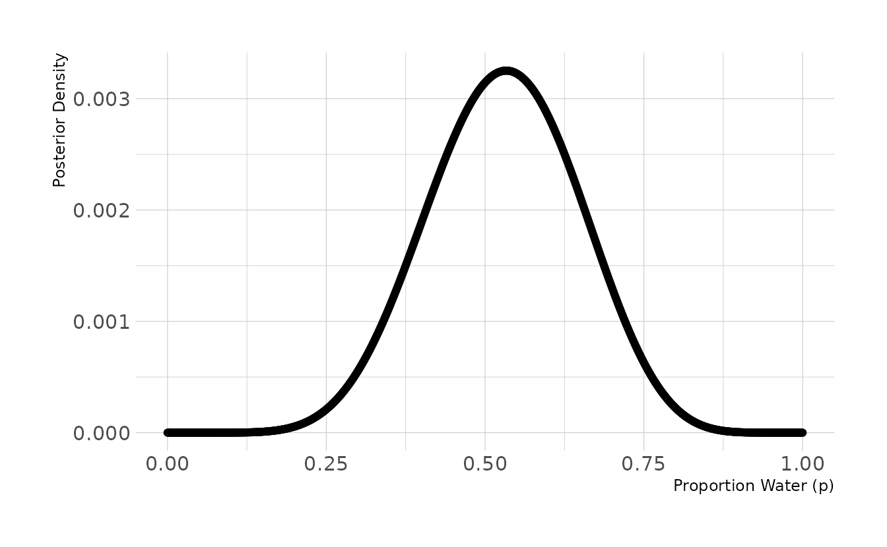

:::question
> **3M2.** Draw 10,000 samples from the grid approximation from above. Then use the sample to calculate the 90% HPDI for *p*.
:::


```r
set.seed(101)
samples <- sample(p_grid, prob = posterior, size = 1e4, replace = TRUE)

HPDI(samples, prob = 0.9)
#>  |0.9  0.9| 
#> 0.334 0.722
```

:::question
> **3M3.** Construct a posterior predictive check for this model and data. The means simulate the distribution of samples, averaging over the posterior uncertainty in *p*. What is the probability of observing 8 water in 15 tosses?
:::


```r
w <- rbinom(1e4, size = 15, prob = samples)
mean(w == 8)
#> [1] 0.15
```

:::question
> **3M4.** Using the posterior distribution constructed from the new (8/15) data, now calculate the probability of observing 6 water in 9 tosses.
:::


```r
w <- rbinom(1e4, size = 9, prob = samples)
mean(w == 6)
#> [1] 0.171
```

:::question
> **3M5.** Start over at **3M1**, but now use a prior that is zero below *p* = 0.5 and a constant above *p* = 0.5. This corresponds to prior information that a majority of the Earth's surface is water. Repeat each problem above and compare the inferences (using both priors) to the true value *p* = 0.7.
:::


```r
# 3M5.1
p_grid <- seq(from = 0, to = 1, length.out = 1000)
prior <- case_when(p_grid < 0.5 ~ 0L,
                   TRUE ~ 1L)
likelihood <- dbinom(8, size = 15, prob = p_grid)
posterior <- likelihood * prior
posterior <- posterior / sum(posterior)

tibble(p = p_grid, posterior = posterior) %>%
  ggplot(aes(x = p, y = posterior)) +
  geom_point() +
  geom_line() +
  labs(x = "Proportion Water (p)", y = "Posterior Density")
```

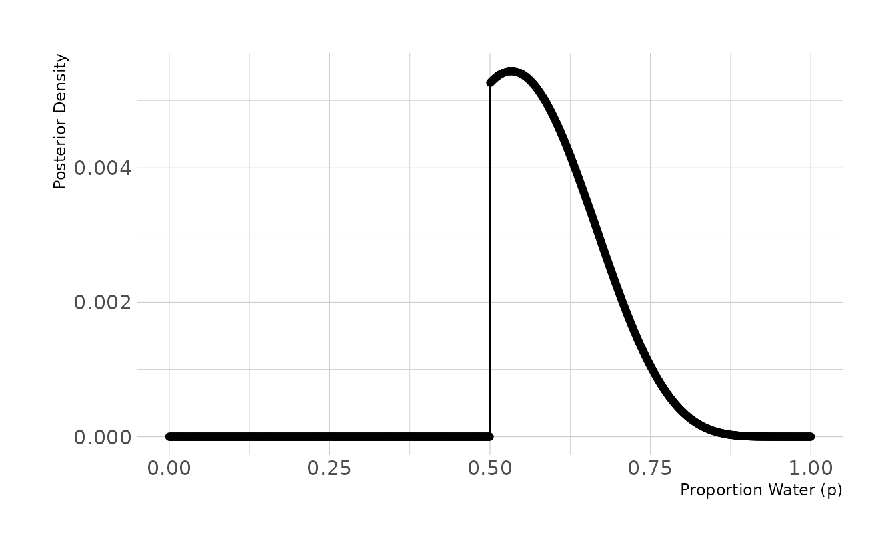

```r
# 3M5.2
set.seed(101)
samples <- sample(p_grid, prob = posterior, size = 1e4, replace = TRUE)
HPDI(samples, prob = 0.9)
#>  |0.9  0.9| 
#> 0.501 0.711

# 3M5.3
w <- rbinom(1e4, size = 15, prob = samples)
mean(w == 8)
#> [1] 0.161

# 3M5.4
w <- rbinom(1e4, size = 9, prob = samples)
mean(w == 6)
#> [1] 0.236
```

The HPDI from **3M2** is much narrower with the new prior ([.501, .711] vs. [.334, 0.722]). Additionally, the probabilities of observing 8 in 15 and 6 in 9 have both increased, as value of *p* < 0.5 are no longer taking up posterior density. Thus the model with the new prior is giving us better information.

:::question
> **3M6.** Suppose you want to estimate the Earth's proportion of water very precisely. Specifically, you want the 99% percentile interval of the posterior distribution of *p* to be only 0.05 wide. This means the distance between the upper and lower bound of the interval should be 0.05. How many times will you have to toss the globe to do this?
:::


```r
single_sim <- function(tosses, prior_type = c("uniform", "step")) {
  prior_type <- match.arg(prior_type)
  obs <- rbinom(1, size = tosses, prob = 0.7)
  
  p_grid <- seq(from = 0, to = 1, length.out = 1000)
  prior <- rep(1, 1000)
  if (prior_type == "step") prior[1:500] <- 0
  
  likelihood <- dbinom(obs, size = tosses, prob = p_grid)
  posterior <- likelihood * prior
  posterior <- posterior / sum(posterior)
  
  samples <- sample(p_grid, prob = posterior, size = 1e4, replace = TRUE)
  interval <- PI(samples, prob = 0.99)
  width <- interval[2] - interval[1]
}
single_cond <- function(tosses, prior_type, reps = 100) {
  tibble(tosses = tosses,
         prior_type = prior_type,
         width = map_dbl(seq_len(reps), ~single_sim(tosses = tosses,
                                                    prior_type = prior_type)))
}

simulation <- crossing(tosses = seq(1000, 5000, by = 100),
                       prior_type = c("uniform", "step")) %>%
  pmap_dfr(single_cond, reps = 100) %>%
  group_by(tosses, prior_type) %>%
  summarize(avg_width = mean(width), .groups = "drop") %>%
  mutate(prior_type = case_when(prior_type == "uniform" ~ "Uniform Prior",
                                prior_type == "step" ~ "Step Prior"),
         prior_type = factor(prior_type, levels = c("Uniform Prior",
                                                    "Step Prior")))

ggplot(simulation, aes(x = tosses, y = avg_width)) +
  facet_wrap(~prior_type, nrow = 1) +
  geom_point() +
  geom_line() +
  scale_x_comma() +
  labs(x = "Tosses", y = "Average Interval Width") +
  theme(panel.spacing.x = unit(2, "lines"))
```


This figure shows the average interval width for 100 simulations for the given number of tosses. That is, if the true proportion *p* is 0.7 and we toss the globe 1,000 times, the average interval width is approximately 0.074. To get an interval width of .05 or smaller, we would need around 2,300 tosses.

:::{.question .code-question}
> **Hard.** The Hard problems here all use the data below. These data indicate the gender (male = 1, female = 0) of officially reported first and second born children in 100 two-child families. So for example, the first family in the data reported a boy (1) and then a girl (0). The second family reported a girl (0) and then a boy (1). The third family reported two girls. You can load these tow vectors into R's memory by typing:


```r
data(homeworkch3)
birth1
#>   [1] 1 0 0 0 1 1 0 1 0 1 0 0 1 1 0 1 1 0 0 0 1 0 0 0 1 0 0 0 0 1 1 1 0 1 0 1 1
#>  [38] 1 0 1 0 1 1 0 1 0 0 1 1 0 1 0 0 0 0 0 0 0 1 1 0 1 0 0 1 0 0 0 1 0 0 1 1 1
#>  [75] 1 0 1 0 1 1 1 1 1 0 0 1 0 1 1 0 1 0 1 1 1 0 1 1 1 1
birth2
#>   [1] 0 1 0 1 0 1 1 1 0 0 1 1 1 1 1 0 0 1 1 1 0 0 1 1 1 0 1 1 1 0 1 1 1 0 1 0 0
#>  [38] 1 1 1 1 0 0 1 0 1 1 1 1 1 1 1 1 1 1 1 1 1 1 1 1 0 1 1 0 1 1 0 1 1 1 0 0 0
#>  [75] 0 0 0 1 0 0 0 1 1 0 0 1 0 0 1 1 0 0 0 1 1 1 0 0 0 0
```

> Use these vectors as data. So for example to compute the total number of boys born across all of these births, you could use:


```r
sum(birth1) + sum(birth2)
#> [1] 111
```
:::

:::question
> **3H1.** Using grid approximation, compute the posterior distribution for the probability of a birth being a boy. Assume a uniform prior probability. Which parameter value maximizes the posterior probability?
:::


```r
p_grid <- seq(from = 0, to = 1, length.out = 1000)
prior <- rep(1, 1000)

boys <- sum(birth1) + sum(birth2)
total <- length(birth1) + length(birth2)
likelihood <- dbinom(boys, size = total, prob = p_grid)
posterior <- likelihood * prior
posterior <- posterior / sum(posterior)

tibble(p = p_grid, posterior = posterior) %>%
  ggplot(aes(x = p, y = posterior)) +
  geom_point() +
  geom_line() +
  labs(x = "Proportion Boys (p)", y = "Posterior Density")

p_grid[which.max(posterior)]
#> [1] 0.555
```

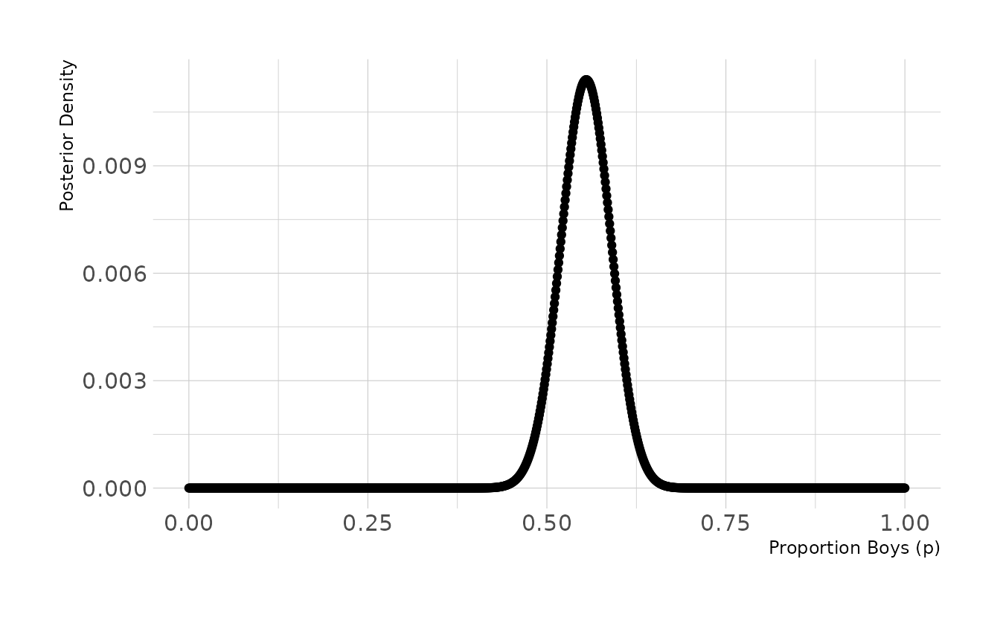

:::question
> **3H2.** Using the `sample` function, draw 10,000 random parameter values from the posterior distribution you calculated above. Use these sample to estimate the 50%, 89%, and 97% highest posterior density intervals.
:::


```r
samples <- sample(p_grid, prob = posterior, size = 1e4, replace = TRUE)
HPDI(samples, prob = c(0.50, 0.89, 0.97))
#> |0.97 |0.89  |0.5  0.5| 0.89| 0.97| 
#> 0.474 0.496 0.531 0.578 0.609 0.628
```

:::question
> **3H3.** Use `rbinom` to simulate 10,000 replicates of 200 births. You should end up with 10,000 numbers, each one a count of boys out of 200 births. Compare the distribution of predicted numbers of boys to the actual count in the data (111 boys out of 200 births). There are many good ways to visualize the simulations, but the `dens` command (part of the `rethinking` package) is prbably the easiest way in this case. Does it look like the model fits the data well? That is, does the distribution of predictions include the actual observation as a central, likely outcome?
:::


```r
library(tidybayes)
break_func <- function(x) {
  length(seq(min(x), max(x), by = 1)) + 1
}

set.seed(300)
b <- rbinom(1e4, size = 200, prob = samples)

ggplot() +
  stat_histinterval(aes(x = b), .width = c(0.66, 0.89), breaks = break_func) +
  geom_vline(aes(xintercept = boys), linetype = "dashed", color = "red") +
  labs(x = "Number of Boys", y = "Density")
```

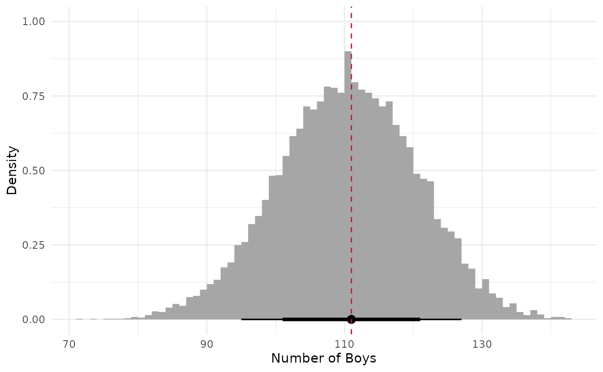

Based on this posterior predictive distribution, the model appears to fit well, with the observed value of 111 in the middle of the distribution.

:::question
> **3H4.** Now compare 10,000 counts of boys from 100 simulated first borns only the number of boys in the first births, `birth1`. How does the model look in this light?
:::


```r
set.seed(301)
b <- rbinom(1e4, size = 100, prob = samples)


ggplot() +
  stat_histinterval(aes(x = b), .width = c(0.66, 0.89), breaks = break_func) +
  geom_vline(aes(xintercept = sum(birth1)), linetype = "dashed",
             color = "red") +
  labs(x = "Number of Boys", y = "Density")
```

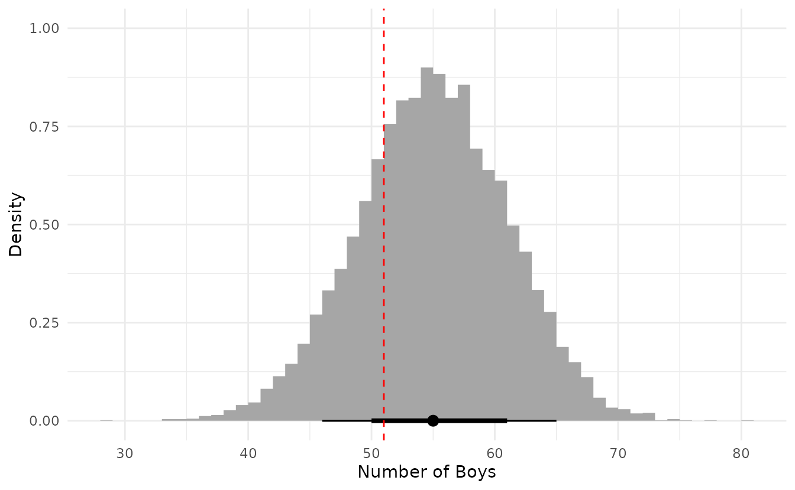

Based on first births only, the model appears to fit less well. Specifically, the model appears to be overestimating the number of first births who are boys. However, it does not appear to be a large discrepancy, as the observed value is still within the middle 66% interval.

:::question
> **3H5.** The model assumes that sex of first and second births are independent. To check this assumption, focus now on second births that followed female first borns. Compare 10,000 simulated conts of boys to only those second births that followed girls. To do this correctly, you need to count the number of first borns who were girls and simulate that many births, 10,000 times. Compare the counts of boys in your simulations to the actual observed count of boys following girls. How does the model look in this light? Any guesses what is going on in these data?
:::


```r
fb_girls <- length(birth1) - sum(birth1)

set.seed(302)
b <- rbinom(1e4, size = fb_girls, prob = samples)

obs_bfg <- sum(birth2[which(birth1 == 0)])

ggplot() +
  stat_histinterval(aes(x = b), .width = c(0.66, 0.89), breaks = break_func) +
  geom_vline(aes(xintercept = obs_bfg), linetype = "dashed",
             color = "red") +
  labs(x = "Number of Boys", y = "Density")
```

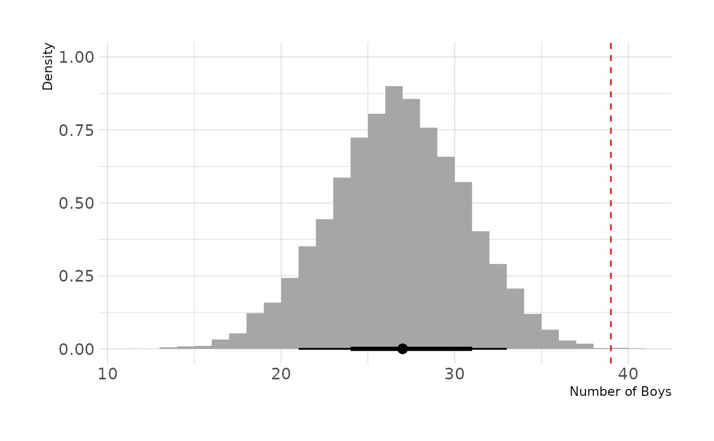

The model is severely under estimating the number of second-born boys when the first born child is a girl. Thus, our assumption that births are independent appears to be violated.

## Homework

:::question
> **1.** Suppose the globe tossing data (Chapter 2) had turned out to be 4 water and 11 land. Construct the posterior distribution, using grid approximation. Use the same flat prior as in the book.
:::

First, we create our grid and create our prior, which is a constant for all values of the grid.


```r
dist <- tibble(p_grid = seq(from = 0, to = 1, length.out = 1000),
               prior = rep(1, times = 1000))
dist
#> # A tibble: 1,000 × 2
#>     p_grid prior
#>      <dbl> <dbl>
#>  1 0           1
#>  2 0.00100     1
#>  3 0.00200     1
#>  4 0.00300     1
#>  5 0.00400     1
#>  6 0.00501     1
#>  7 0.00601     1
#>  8 0.00701     1
#>  9 0.00801     1
#> 10 0.00901     1
#> # … with 990 more rows
```

Next, we calculate the likelihood of 4 water and 11 land for each value of the grid and normalize so that all values sum to 1.


```r
dist <- dist %>% 
  mutate(likelihood = dbinom(4, size = 15, prob = p_grid),
         posterior = likelihood * prior,
         posterior = posterior / sum(posterior))
dist
#> # A tibble: 1,000 × 4
#>     p_grid prior    likelihood posterior
#>      <dbl> <dbl>         <dbl>     <dbl>
#>  1 0           1 0              0       
#>  2 0.00100     1 0.00000000136  2.17e-11
#>  3 0.00200     1 0.0000000214   3.44e-10
#>  4 0.00300     1 0.000000107    1.72e- 9
#>  5 0.00400     1 0.000000336    5.38e- 9
#>  6 0.00501     1 0.000000811    1.30e- 8
#>  7 0.00601     1 0.00000166     2.66e- 8
#>  8 0.00701     1 0.00000305     4.88e- 8
#>  9 0.00801     1 0.00000514     8.23e- 8
#> 10 0.00901     1 0.00000814     1.30e- 7
#> # … with 990 more rows
```


Finally, we can sample from and visualize the posterior distribution. The majority of the posterior is below 0.5, with a mean of 0.30. This is not surprising, given that this is what the data indicates (i.e., more land observed than water).


```r
set.seed(123)

dist %>% 
  slice_sample(n = 10000, weight_by = posterior, replace = TRUE) %>% 
  ggplot(aes(x = p_grid)) +
  stat_histinterval(.width = c(0.67, 0.89, 0.97), breaks = seq(0, 1, 0.02),
                    point_interval = mean_hdci) +
  labs(x = "Proportion Water (p)", y = "Posterior Density")
```

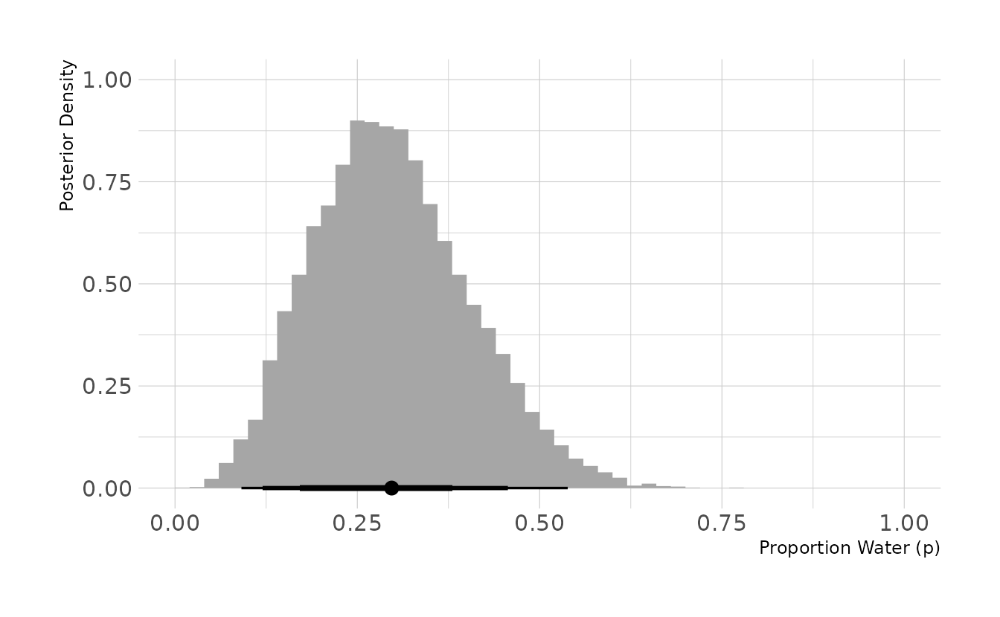

:::question
> **2.** Now suppose the data are 4 water and 2 land. Compute the posterior again, but this time use a prior that is zero below *p* = 0.5 and a constant above *p* = 0.5. This corresponds to prior information that a majority of the Earth's surface is water.
:::

We follow the same process, but now we define a prior that is 0 for the *p* < .5 and 1 for *p* &ge; .5.


```r
dist <- tibble(p_grid = seq(from = 0, to = 1, length.out = 1000),
               prior = rep(c(0, 1), each = 500)) %>% 
  mutate(likelihood = dbinom(4, size = 6, prob = p_grid),
         posterior = likelihood * prior,
         posterior = posterior / sum(posterior))
dist
#> # A tibble: 1,000 × 4
#>     p_grid prior likelihood posterior
#>      <dbl> <dbl>      <dbl>     <dbl>
#>  1 0           0   0                0
#>  2 0.00100     0   1.50e-11         0
#>  3 0.00200     0   2.40e-10         0
#>  4 0.00300     0   1.21e- 9         0
#>  5 0.00400     0   3.82e- 9         0
#>  6 0.00501     0   9.32e- 9         0
#>  7 0.00601     0   1.93e- 8         0
#>  8 0.00701     0   3.57e- 8         0
#>  9 0.00801     0   6.07e- 8         0
#> 10 0.00901     0   9.70e- 8         0
#> # … with 990 more rows
```


We now see that the posterior distribution is truncated at .5. The mean is around 0.69, which is expected given that 4 out of 6 trials (two-thirds) were water.


```r
set.seed(123)

dist %>% 
  slice_sample(n = 10000, weight_by = posterior, replace = TRUE) %>% 
  ggplot(aes(x = p_grid)) +
  stat_histinterval(.width = c(0.67, 0.89, 0.97), breaks = seq(0, 1, 0.02),
                    point_interval = mean_hdci) +
  labs(x = "Proportion Water (p)", y = "Posterior Density")
```

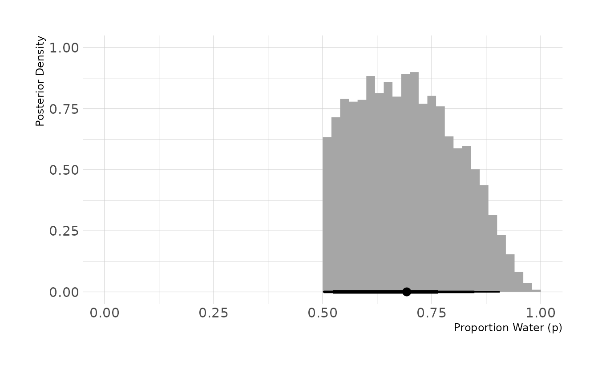

:::question
> **3.** For the posterior distribution from **2**, compute 89% percentile and HPDI intervals. Compare the widths of these intervals. Which is wider? Why? If you had only the information in the interval, what might you misunderstand about the shape of the posterior distribution?
:::

First, we take 10,000 samples from the posterior calculated in the previous question. Then we summarize with `PI()` and `HPDI()`.


```r
set.seed(123)

intervals <- dist %>% 
  slice_sample(n = 10000, weight_by = posterior, replace = TRUE) %>% 
  summarize(bound = c("lower", "upper"),
            pi = PI(p_grid, prob = 0.89),
            hpdi = HPDI(p_grid, prob = 0.89))
intervals
#> # A tibble: 2 × 3
#>   bound    pi  hpdi
#>   <chr> <dbl> <dbl>
#> 1 lower 0.525 0.503
#> 2 upper 0.882 0.848
```


The 89% percentile interval is [0.525, 0.882], and the highest posterior density interval is [0.503, 0.848]. The percentile interval is 0.357 wide, and the highest posterior density interval is 0.345 wide. Thus, percentile interval is wider. This is because the HPDI finds the narrowest interval that contains 89% of the data. Therefore, unless the posterior is perfectly symmetrical, the central 89% will, by definition, be wider than the HDPI.

For both intervals, the only boundary information is conveyed. No information about the actual shape of the posterior is conveyed. Without visualizing the posterior, the interval boundaries might tempt us to (incorrectly) assume that all values in the interval are equally likely or that values in the middle of the range are the most plausible. However, we know from the previous problem that the posterior is asymmetrical, with values closer to the low end of the interval more plausible than values at the high end of the interval.

:::question
> **4.** OPTIONAL CHALLENGE. Suppose there is bias in sampling so that Land is more likely than Water to be recorded. Specifically, assume that 1-in-5 (20%) of Water samples are accidentally recorded instead as "Land." First, write a generative simulation of this sampling process. Assuming the true proportion of Water is 0.70, what proportion does your simulation tend to produce instead? Second, using a simulated sample of 20 tosses, compute the unbiased posterior distribution of the true proportion of water.
:::

We'll start by writing a function to generate the biased data. First, we generate the specified number of `tosses` with the `true_prop`. Normally, we would use `rbinom(n = 1, size = tosses)`, but this will only provide the total number of successes (tosses with a "water" result). We want the results from each individual toss. So, as an example, rather than 1 trial of 100 tosses, we do 100 trials of 1 toss.

Next, we generate random uniform numbers between 0 and 1. These indicate which trials are biased. For every element of `bias_sim` that is less than `bias`, the corresponding element of `true_trials` is changed to 0 in a new vector called `bias_trials`. If the original results was 0 ("land"), then the bias has no effect (i.e., 0 is changed to 0). If the original result was 1 ("water"), then there is a `bias` chance that the result will be changed to 0.

Finally, we sum the total number of 1s ("water") after implementing the bias and return the results.


```r
biased_globe <- function(tosses = 100, true_prop = 0.7, bias = 0.2) {
  true_trials <- rbinom(n = tosses, size = 1, prob = true_prop)
  bias_sim <- runif(n = tosses, min = 0, max = 1)

  bias_trials <- true_trials
  bias_trials[which(bias_sim < bias)] <- 0L
  sum(bias_trials)
}
```

What does this bias mean for our estimated proportion of water? To explore, we'll run a short simulation. We'll use our `biased_globe()` function to do 1,000 simulations of 100 tosses. For each of the simulations, we can see the proportion of tosses that were water, with the bias included.


```r
bias_prop <- map_int(seq_len(1000),
                     ~biased_globe(tosses = 100, true_prop = 0.7, bias = 0.2))

ggplot() +
  stat_histinterval(aes(x = bias_prop / 100), .width = c(0.67, 0.89, 0.97),
                    breaks = seq(0, 1, by = 0.01)) +
  geom_vline(aes(xintercept = 0.7), linetype = "dashed", color = "red") +
  expand_limits(x = c(0, 1)) +
  labs(x = "Proportion Water (p)", y = "Simulations")
```

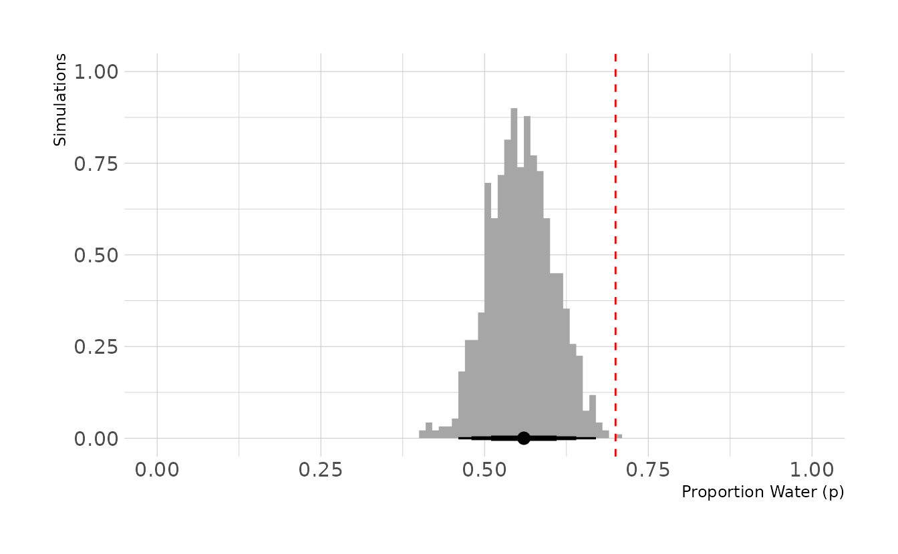

In the previous figure, the true proportion, 0.7, is indicated by the dashed red line. However, we can see that the biased tosses are greatly reducing the number of "waters" that we actually observe. On average, we observe 56 waters, for an estimated proportion of 0.56.

Our final step is to compute an unbiased posterior distribution of the true proportion of water, using 20 tosses from the biased data generation process. We'll start by generating our 20 tosses.


```r
set.seed(123)
biased_dat <- biased_globe(tosses = 20)
biased_dat
#> [1] 11
```

In our data, we observed 11 waters. Our final step is to estimate the unbiased posterior. We can accomplish this by using the biased sampling rate of 0.8. That is, each true water observation has an 80% chance of actually being recorded as a water observation. This is shown in the `crtd_likelihood` line below. In the `dbinom()` function, rather than setting `prob = p_grid`, we set `prob = p_grid * 0.8`, to reflect the bias in sampling. We then see that the biased posterior peaks around 0.55, whereas correcting for the bias results in a posterior that peaks right around 0.70.


```r
library(geomtextpath)

posterior <- tibble(p_grid = seq(0, 1, length.out = 1000)) %>% 
  mutate(prior = dbeta(p_grid, shape1 = 1, shape2 = 1),
         bias_likelihood = dbinom(biased_dat, size = 20, prob = p_grid),
         crtd_likelihood = dbinom(biased_dat, size = 20, prob = p_grid * 0.8),
         bias_posterior = bias_likelihood * prior,
         crtd_posterior = crtd_likelihood * prior,
         bias_posterior = bias_posterior / sum(bias_posterior),
         crtd_posterior = crtd_posterior / sum(crtd_posterior))

ggplot(posterior, aes(x = p_grid)) +
  geom_textline(aes(y = bias_posterior), linetype = "dashed", color = "grey70",
                size = 6, linewidth = 1, label = "Biased", hjust = 0.45,
                family = "Source Sans Pro") +
  geom_textline(aes(y = crtd_posterior), linetype = "solid", color = "#009FB7",
                size = 6, linewidth = 1, label = "Corrected", hjust = 0.4,
                family = "Source Sans Pro") +
  scale_x_continuous(breaks = seq(0, 1, 0.1)) +
  labs(x = "Proportion Water (p)", y = "Posterior Density")
```

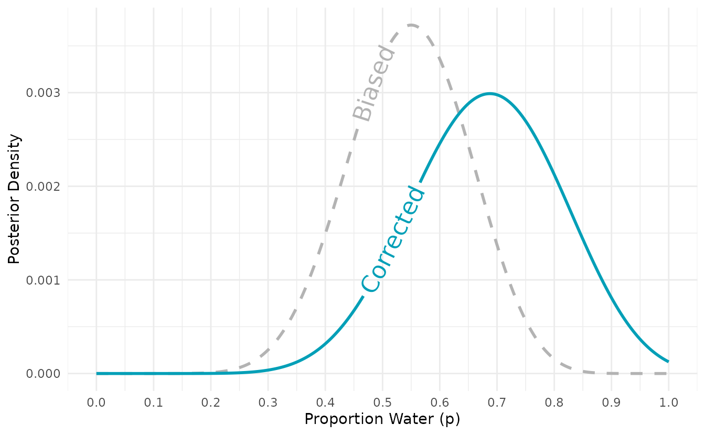
