# Causes, Confounds & Colliders

The third week covers [Chapter 5 (The Many Variables & The Spurious Waffles)](https://bookdown.org/content/4857/the-many-variables-the-spurious-waffles.html) and  [Chapter 6 (The Haunted DAG & The Causal Terror)](https://bookdown.org/content/4857/the-haunted-dag-the-causal-terror.html).

## Lectures

Lecture 5:

<iframe src="https://www.youtube.com/embed/UpP-_mBvECI" width="100%" height="400px" data-external="1"></iframe>

Lecture 6:

<iframe src="https://www.youtube.com/embed/NSuTaeW6Orc" width="100%" height="400px" data-external="1"></iframe>

## Exercises

### Chapter 5

:::question
> **5E1.** Which of the linear models below are multiple linear regressions?
\begin{align}
  (1)\ \ \mu_i &= \alpha + \beta x_i \\
  (2)\ \ \mu_i &= \beta_x x_i + \beta_z z_i \\
  (3)\ \ \mu_i &= \alpha + \beta(x_i - z_i) \\
  (4)\ \ \mu_i &= \alpha + \beta_x x_i + \beta_z z_i
\end{align}
:::

Numbers 2 and 4 are multiple regressions. Number 1 contains only one predictor variable. Number 3, although two variables appear in the model, also only uses the difference of $x$ and $z$ as a single predictor. Only numbers 2 and 4 contain multiple predictor variables.

:::question
> **5E2.** Write down a multiple regression to evaluate the claim: *Animal diversity is linearly related to latitude, but only after controlling for plant diversity*. You just need to write down the model definition.
:::

We will denote animal diversity as $A$, latitude as $L$, and plant diversity as $P$. The linear model can then be defined as follows:

\begin{align}
  A_i &\sim \text{Normal}(\mu, \sigma) \\
  \mu_i &= \alpha + \beta_L L_i + \beta_P P_i
\end{align}

:::question
> **5E3.** Write down a multiple regression to evaluate the claim: *Neither amount of funding nor size of laboratory is by itself a good predictor of time to PhD degree; but together these variables are both positively associated with time to degree*. Write down the model definition and indicate which side of zero each slope parameter should be on.
:::

We will denote time to PhD degree as $T$, amount of funding as $F$, and size of laboratory as $L$. The model is then defined as:

\begin{align}
  T_i &\sim \text{Normal}(\mu_i, \sigma) \\
  \mu_i &= \alpha + \beta_F F_i + \beta_L L_i
\end{align}

Both $\beta_F$ and $\beta_L$ should be positive. In order for both funding and lab size to show a positive relationship together but no relationship separately, these two variables would need to be negatively correlated (i.e., large labs have less funding per student and small labs have more funding per student). Both could be positively associated with our outcome, but be negatively associated in the real world. Thus, analyzing the variables in isolation may mask the positive relationship.


:::question
> **5E4.** Suppose you have a single categorical predictor with 4 levels (unique values), labeled A, B, C and D. Let $A_i$ be an indicator variable that is 1 where case $i$ is in category $A$. Also suppose $B_i$, $C_i$, and $D_i$ for the other categories. Now which of the following linear models are inferentially equivalent ways to include the categorical variable in a regression? Model are inferentially equivalent when it's possible to compute one posterior distribution from the posterior distribution of another model.
\begin{align}
  (1)\ \ \mu_i &= \alpha + \beta_A A_i + \beta_B B_i + \beta_D D_i \\
  (2)\ \ \mu_i &= \alpha + \beta_A A_i + \beta_B B_i + \beta_C C_i + \beta_D D_i \\
  (3)\ \ \mu_i &= \alpha + \beta_B B_i + \beta_C C_i + \beta_D D_i \\
  (4)\ \ \mu_i &= \alpha_A A_i + \alpha_B B_i + \alpha_C C_i + \alpha_D D_i \\
  (5)\ \ \mu_i &= \alpha_A (1 - B_i - C_i - D_i) + \alpha_B B_i + \alpha_C C_i + \alpha_D D_i
\end{align}
:::

Numbers 1, 3, 4, and 5 are all inferentially equivalent. Numbers 1 and 3 both use 3 of the 4 indicator variables, meaning that you can always calculate the 4th from the three that are estimated and the intercept. Number 4 is equivalent to an index variable approach, which is inferentially equivalent to the indicator variable approach. Finally, Number 5 is mathematically equivalent to Number 4, assuming that each observation can belong to only 1 of the 4 groups.

Number 2 is not a valid model representation, as the model should only contain $k-1$ indicator variables with an intercept (when using an indicator variable approach). Because all 4 are included in the definition of Number 2, we should expect to have estimation problems (if the model will estimate at all).

:::question
> **5M1.** Invent your own example of a spurious correlation. An outcome variable should be correlated with both predictor variables. But when both predictors are entered in the same model, the correlation between the outcome and one of the predictors should mostly vanish (or at least be greatly reduced).
:::

In this (simulated) example, we'll predict ice cream sales from the temperature and the number of shark attacks. First, we'll fit two bivariate regressions, `mod_t` and `mod_s`, which include only temperature and shark attacks as predictors, respectively. Then we'll estimate multivariate regression, `mod_all`, which includes both predictors.


```r
set.seed(2022)
n <- 100
temp <- rnorm(n)
shark <- rnorm(n, temp)
ice_cream <- rnorm(n, temp)

spur_exp <- tibble(ice_cream, temp, shark) %>%
  mutate(across(everything(), standardize))

mod_t <- brm(ice_cream ~ 1 + temp, data = spur_exp, family = gaussian,
             prior = c(prior(normal(0, 0.2), class = Intercept),
                       prior(normal(0, 0.5), class = b),
                       prior(exponential(1), class = sigma)),
             iter = 4000, warmup = 2000, chains = 4, cores = 4, seed = 1234,
             file = here("fits", "chp5", "b5m1-t"))

mod_s <- brm(ice_cream ~ 1 + shark, data = spur_exp, family = gaussian,
             prior = c(prior(normal(0, 0.2), class = Intercept),
                       prior(normal(0, 0.5), class = b),
                       prior(exponential(1), class = sigma)),
             iter = 4000, warmup = 2000, chains = 4, cores = 4, seed = 1234,
             file = here("fits", "chp5", "b5m1-s"))

mod_all <- brm(ice_cream ~ 1 + temp + shark, data = spur_exp, family = gaussian,
               prior = c(prior(normal(0, 0.2), class = Intercept),
                         prior(normal(0, 0.5), class = b),
                         prior(exponential(1), class = sigma)),
               iter = 4000, warmup = 2000, chains = 4, cores = 4, seed = 1234,
               file = here("fits", "chp5", "b5m1-all"))
```

The plot below shows the posterior distributions of the $\beta$ coefficients for temperature and shark attacks. As expected, both have a positive relationship with ice cream sales in the bivariate models. However, when both predictors are included in `mod_all`, the posterior distribution for `b_shark` moves down to zero, whereas the distribution of `b_temp` remains basically the same. Thus, the relationship between ice cream sales and shark attacks is a spurious correlation, as both are informed by the temperature.


```r
bind_rows(
  spread_draws(mod_t, b_temp) %>%
    mutate(model = "mod_t"),
  spread_draws(mod_s, b_shark) %>%
    mutate(model = "mod_s"),
  spread_draws(mod_all, b_temp, b_shark) %>%
    mutate(model = "mod_all")
) %>%
  pivot_longer(cols = starts_with("b_"), names_to = "parameter",
               values_to = "value") %>%
  drop_na(value) %>%
  mutate(model = factor(model, levels = c("mod_t", "mod_s", "mod_all")),
         parameter = factor(parameter, levels = c("b_temp", "b_shark"))) %>%
  ggplot(aes(x = value, y = fct_rev(model))) +
  facet_wrap(~parameter, nrow = 1) +
  stat_halfeye(.width = 0.89) +
  labs(x = "Parameter Value", y = "Model")
```

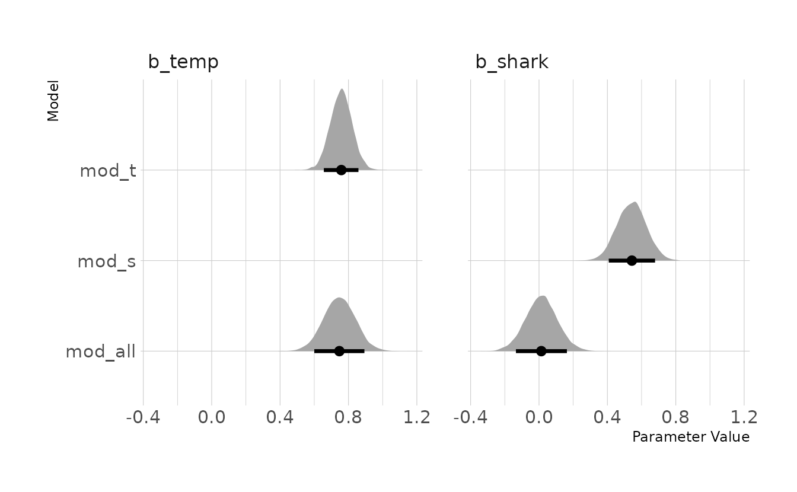

:::question
> **5M2.** Invent your own example of a masked relationship. An outcome variable should be correlated with both predictor variables, but in opposite directions. And the two predictor variables should be correlated with one another.
:::

For this (also simulated) example, we'll predict an academic test score from the amount of instruction a student received and the number of days they missed class. First, we'll fit two bivariate regressions, `mod_i` and `mod_d`, which include only instruction and days away as predictors, respectively. Then we'll estimate multivariate regression, `mod_test`, which includes both predictors.


```r
set.seed(2020)
n <- 100
u <- rnorm(n)
days_away <- rnorm(n, u)
instruction <- rnorm(n, u)
test_score <- rnorm(n, instruction - days_away)

mask_exp <- tibble(test_score, instruction, days_away) %>%
  mutate(across(everything(), standardize))

mod_i <- brm(test_score ~ 1 + instruction, data = mask_exp, family = gaussian,
             prior = c(prior(normal(0, 0.2), class = Intercept),
                       prior(normal(0, 0.5), class = b),
                       prior(exponential(1), class = sigma)),
             iter = 4000, warmup = 2000, chains = 4, cores = 4, seed = 1234,
             file = here("fits", "chp5", "b5m2-i"))

mod_d <- brm(test_score ~ 1 + days_away, data = mask_exp, family = gaussian,
             prior = c(prior(normal(0, 0.2), class = Intercept),
                       prior(normal(0, 0.5), class = b),
                       prior(exponential(1), class = sigma)),
             iter = 4000, warmup = 2000, chains = 4, cores = 4, seed = 1234,
             file = here("fits", "chp5", "b5m2-d"))

mod_test <- brm(test_score ~ 1 + instruction + days_away, data = mask_exp,
                family = gaussian,
                prior = c(prior(normal(0, 0.2), class = Intercept),
                          prior(normal(0, 0.5), class = b),
                          prior(exponential(1), class = sigma)),
                iter = 4000, warmup = 2000, chains = 4, cores = 4, seed = 1234,
                file = here("fits", "chp5", "b5m2-test"))
```

The figure below shows the posterior distributions of the $\beta$ parameters from each of the models. We can see that in full model, `mod_test`, `b_instruction` gets more positive and `b_days_away` gets more negative.


```r
bind_rows(
  spread_draws(mod_i, b_instruction) %>%
    mutate(model = "mod_i"),
  spread_draws(mod_d, b_days_away) %>%
    mutate(model = "mod_d"),
  spread_draws(mod_test, b_instruction, b_days_away) %>%
    mutate(model = "mod_test")
) %>%
  pivot_longer(cols = starts_with("b_"), names_to = "parameter",
               values_to = "value") %>%
  drop_na(value) %>%
  mutate(model = factor(model, levels = c("mod_i", "mod_d", "mod_test")),
         parameter = factor(parameter, levels = c("b_instruction",
                                                  "b_days_away"))) %>%
  ggplot(aes(x = value, y = fct_rev(model))) +
  facet_wrap(~parameter, nrow = 1) +
  stat_halfeye(.width = 0.89) +
  labs(x = "Parameter Value", y = "Model")
```

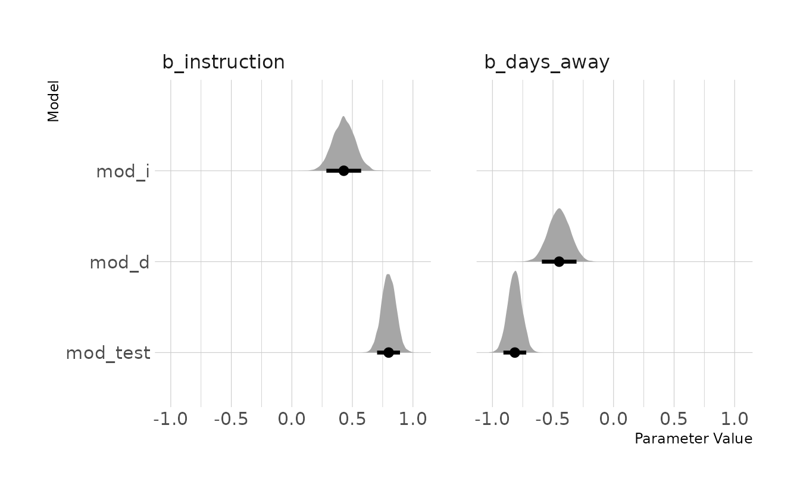

:::question
> **5M3.** It is sometimes observed that the best predictor of fire risk is the presence of firefighters---State and localities with many firefighters also have more fires. Presumably firefighters do not *cause* fires. Nevertheless, this is not a spurious correlation. Instead fires cause firefighters. Consider the same reversal of causal inference in the context of the divorce and marriage data. How might a high divorce rate cause a higher marriage rate? Can you think of a way to evaluate this relationship, using multiple regression?
:::

A high divorce rate means that there are more people available in the population of single-people that are available to marry. Additionally, people may be getting divorced for the specific purpose of marrying someone else. To evaluate this, we could add marriage number, or a "re-marry" indicator. We would then expect the coefficient for marriage rate to get closer to zero once this predictor is added to the model.

:::question
> **5M4.** In the divorce data, States with high numbers of members of the Church of Jesus Christ of Latter-day Saints (LDS) have much lower divorce rates than the regression models expected. Find a list of LDS population by State and use those numbers as a predictor variable, predicting divorce rate using marriage rate, median age at marriage, and percent LDS population (possibly standardized). You may want to consider transformations of the raw percent LDS variable.
:::

We can pull the LDS membership from the official [LDS website](https://newsroom.churchofjesuschrist.org/facts-and-statistics/state/alabama), and state populations from the United States census website. Conveniently, this is all pulled together on [World Population Review](https://web.archive.org/web/20220104045513/https://worldpopulationreview.com/state-rankings/mormon-population-by-state) (copied on January 4, 2022). The data is saved in [`data/lds-data-2021.csv`](https://github.com/wjakethompson/sr2-solutions/blob/main/data/lds-data-2021.csv). We can then combine this with our existing divorce data from `data("WaffleDivorce")`. For this analysis, I'll use LDS membership per capita. Specifically, the number of LDS members per 100,000 in the state's population. This will then be standardized, along with the other predictor variables, as was done in the chapter examples.


```r
lds <- read_csv(here("data", "lds-data-2021.csv"),
                col_types = cols(.default = col_integer(),
                                 state = col_character())) %>%
  mutate(lds_prop = members / population,
         lds_per_capita = lds_prop * 100000)

data("WaffleDivorce")
lds_divorce <- WaffleDivorce %>%
  as_tibble() %>%
  select(Location, Divorce, Marriage, MedianAgeMarriage) %>%
  left_join(select(lds, state, lds_per_capita),
            by = c("Location" = "state")) %>%
  mutate(lds_per_capita = log(lds_per_capita)) %>%
  mutate(across(where(is.numeric), standardize)) %>% 
  filter(!is.na(lds_per_capita))

lds_divorce
#> # A tibble: 49 × 5
#>    Location    Divorce Marriage MedianAgeMarriage lds_per_capita
#>    <chr>         <dbl>    <dbl>             <dbl>          <dbl>
#>  1 Alabama       1.65    0.0226            -0.606         -0.423
#>  2 Alaska        1.54    1.55              -0.687          1.21 
#>  3 Arizona       0.611   0.0490            -0.204          1.42 
#>  4 Arkansas      2.09    1.66              -1.41          -0.123
#>  5 California   -0.927  -0.267              0.600          0.409
#>  6 Colorado      1.05    0.892             -0.285          0.671
#>  7 Connecticut  -1.64   -0.794              1.24          -0.909
#>  8 Delaware     -0.433   0.786              0.439         -0.693
#>  9 Florida      -0.652  -0.820              0.278         -0.466
#> 10 Georgia       0.995   0.523             -0.124         -0.375
#> # … with 39 more rows
```

We're now ready to estimate our model.


```r
lds_mod <- brm(Divorce ~ 1 + Marriage + MedianAgeMarriage + lds_per_capita,
               data = lds_divorce, family = gaussian,
               prior = c(prior(normal(0, 0.2), class = Intercept),
                         prior(normal(0, 0.5), class = b, coef = Marriage),
                         prior(normal(0, 0.5), class = b, coef = MedianAgeMarriage),
                         prior(normal(0, 0.5), class = b, coef = lds_per_capita),
                         prior(exponential(1), class = sigma)),
               iter = 4000, warmup = 2000, chains = 4, cores = 4, seed = 1234,
               file = here("fits", "chp5", "b5m4"))
```

Finally, we can visualize our estimates. The intercept and coefficients for `Marriage` and `MedianAgeMarriage` are nearly identical to those from model `m5.3` in the text. Thus, it appears that our new predictor, LDS per capita, is contributing unique information. As expected, a higher population of LDS members in a state is associated with a lower divorce rate.


```r
spread_draws(lds_mod, `b_.*`, regex = TRUE) %>%
  pivot_longer(starts_with("b_"), names_to = "parameter",
               values_to = "value") %>%
  ggplot(aes(x = value, y = parameter)) +
  stat_halfeye(.width = c(0.67, 0.89, 0.97)) +
  labs(x = "Parameter Value", y = "Parameter")
```

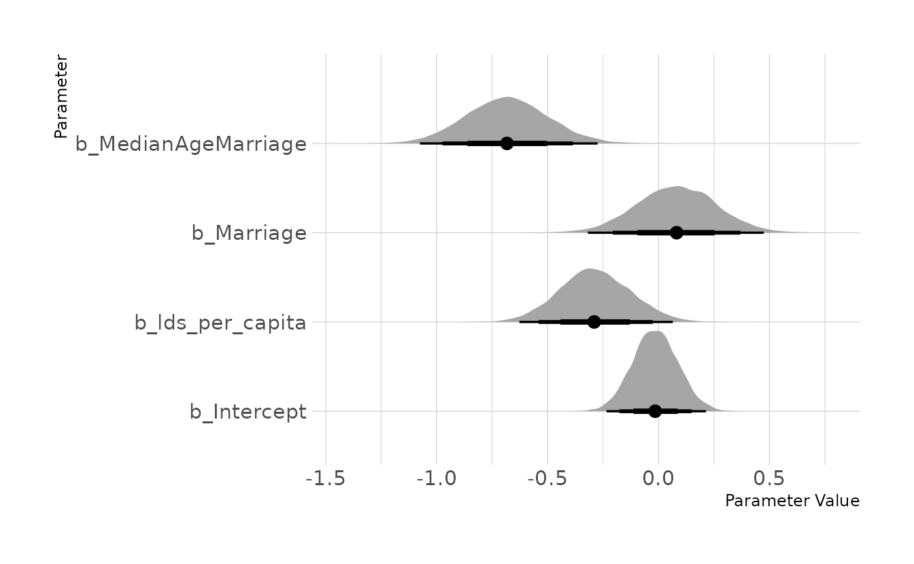

:::question
> **5M5.** One way to reason through multiple causation hypotheses is to imagine detailed mechanisms through which predictor variables may influence outcomes. For example, it is sometimes argued that the price of gasoline (predictor variable) is positively associated with lower obesity rates (outcome variable). However, there are at least two important mechanisms by which the price of gas could reduce obesity. First, it could lead to less driving and therefore more exercise. Second, it could lead to less driving, which leads to less eating out, which leds to less consumption of huge restaurant meals. Can you outline one or more multiple regressions that address these two mechanisms? Assume you can have any predictor data you need.
:::

Let's assume we have four variables: rate of obesity ($O$), price of gasoline ($G$), amount of driving ($D$), amount of exercise ($E$), and the rate of eating out at restaurants ($R$). Given these variables, we can outline the first proposed mechanism implies:

1. $D$ is negatively associated with $P$
2. $E$ is negatively associated with $D$
3. $O$ is negatively associated with $E$

This is a chain of causality, where each outcome is the input of the next chain. The second mechanism is similar:

1. $D$ is negatively associated with $P$
2. $R$ is positively associated with $D$
3. $O$ is positively associated with $R$


:::question
> **5H1.** In the divorce example, suppose the DAG is: $M \rightarrow A \rightarrow D$. What are the implied conditional independencies of the graph? Are the data consistent with it?
:::

We can use {dagitty} [@R-dagitty] to see the implied conditional independencies. From this code we see that the DAG implies that divorce rate is independent of marriage rate conditional on median age of marriage. 


```r
library(dagitty)

mad_dag <- dagitty("dag{M -> A -> D}")
impliedConditionalIndependencies(mad_dag)
#> D _||_ M | A
```

As shown in model `m5.3`, the data is consistent with this implied conditional independency. Thus this data is consistent with multiple DAGs. Specifically, it would support all Markov Equivalent DAGs. The second DAG in this list, `D <- A -> M`, is the DAG that was investigated in the text.


```r
equivalentDAGs(mad_dag)
#> [[1]]
#> dag {
#> A
#> D
#> M
#> A -> D
#> M -> A
#> }
#> 
#> [[2]]
#> dag {
#> A
#> D
#> M
#> A -> D
#> A -> M
#> }
#> 
#> [[3]]
#> dag {
#> A
#> D
#> M
#> A -> M
#> D -> A
#> }
```

:::question
> **5H2.** Assuming that the DAG for the divorce example is indeed $M \rightarrow A \rightarrow D$, fit a new model and use it to estimate the counterfactual effect of halving a State's marriage rate $M$. Using the counterfactual example from the chapter (starting on page 140) as a template.
:::

First, we'll estimate a model consistent this this DAG. Because there are two regressions here, we'll use {brms}'s multivariate syntax (i.e., `bf()`; see [here](https://paul-buerkner.github.io/brms/articles/brms_multivariate.html)).


```r
dat <- WaffleDivorce %>%
  select(A = MedianAgeMarriage,
         D = Divorce,
         M = Marriage) %>%
  mutate(across(everything(), standardize))

d_model <- bf(D ~ 1 + A)
a_model <- bf(A ~ 1 + M)

b5h2 <- brm(d_model + a_model + set_rescor(FALSE),
            data = dat, family = gaussian,
            prior = c(prior(normal(0, 0.2), class = Intercept, resp = D),
                      prior(normal(0, 0.5), class = b, resp = D),
                      prior(exponential(1), class = sigma, resp = D),
                      
                      prior(normal(0, 0.2), class = Intercept, resp = A),
                      prior(normal(0, 0.5), class = b, resp = A),
                      prior(exponential(1), class = sigma, resp = A)),
            iter = 4000, warmup = 2000, chains = 4, cores = 4, seed = 1234,
            file = here("fits", "chp5", "b5h2"))

summary(b5h2)
#>  Family: MV(gaussian, gaussian) 
#>   Links: mu = identity; sigma = identity
#>          mu = identity; sigma = identity 
#> Formula: D ~ 1 + A 
#>          A ~ 1 + M 
#>    Data: dat (Number of observations: 50) 
#>   Draws: 4 chains, each with iter = 2000; warmup = 0; thin = 1;
#>          total post-warmup draws = 8000
#> 
#> Population-Level Effects: 
#>             Estimate Est.Error l-95% CI u-95% CI Rhat Bulk_ESS Tail_ESS
#> D_Intercept     0.00      0.10    -0.20     0.20 1.00    10726     6132
#> A_Intercept    -0.00      0.09    -0.17     0.18 1.00    10190     6073
#> D_A            -0.56      0.11    -0.78    -0.34 1.00     9422     6605
#> A_M            -0.69      0.10    -0.89    -0.49 1.00     8993     5538
#> 
#> Family Specific Parameters: 
#>         Estimate Est.Error l-95% CI u-95% CI Rhat Bulk_ESS Tail_ESS
#> sigma_D     0.82      0.09     0.67     1.01 1.00    10660     5820
#> sigma_A     0.71      0.07     0.58     0.88 1.00    10351     6034
#> 
#> Draws were sampled using sample(hmc). For each parameter, Bulk_ESS
#> and Tail_ESS are effective sample size measures, and Rhat is the potential
#> scale reduction factor on split chains (at convergence, Rhat = 1).
```

We can then simulate our counterfactuals and plot with {ggplot2}. We see that there is a negative relationship between marriage rate and age. That is, as marriage rate increases, the age at marriage decreases on average. Specifically, $A$ moves about -0.7 units for every 1 unit increase in $M$, which is reflected in the estimate of `A_M` in the model summary above. For the counterfactual of $M$ on $D$, we see a positive relationship. This is because both the relationship of $M$ to $A$ and $A$ to $D$ are negative. In other words, as $M$ increases $A$ decreases, and as $A$ decreases $D$ increases. For every one unit increase in $M$, we expect about a 0.4 unit increase in $D$. This can also be derived by multiplying the slope coefficients from the model summary (i.e., &minus;0.56 &times; &minus;0.69 &thickapprox; 0.4).


```r
as_draws_df(b5h2) %>%
  as_tibble() %>%
  select(.draw, b_D_Intercept:sigma_A) %>% 
  expand(nesting(.draw, b_D_Intercept, b_A_Intercept, b_D_A, b_A_M,
                 sigma_D, sigma_A),
         m = seq(from = -2, to = 2, length.out = 30)) %>%
  mutate(a_sim = rnorm(n(), mean = b_A_Intercept + b_A_M * m, sd = sigma_A),
         d_sim = rnorm(n(), mean = b_D_Intercept + b_D_A * a_sim, sd = sigma_D)) %>%
  pivot_longer(ends_with("_sim"), names_to = "name", values_to = "value") %>%
  group_by(m, name) %>%
  mean_qi(value, .width = c(0.89)) %>%
  ungroup() %>%
  mutate(name = case_when(name == "a_sim" ~ "Counterfactual M &rarr; A",
                          TRUE ~ "Counterfactual M &rarr; A &rarr; D")) %>%
  ggplot(aes(x = m, y = value, ymin = .lower, ymax = .upper)) +
  facet_wrap(~name, nrow = 1) +
  geom_smooth(stat = "identity") +
  labs(x = "Manipulated M", y = "Counterfactual")
```

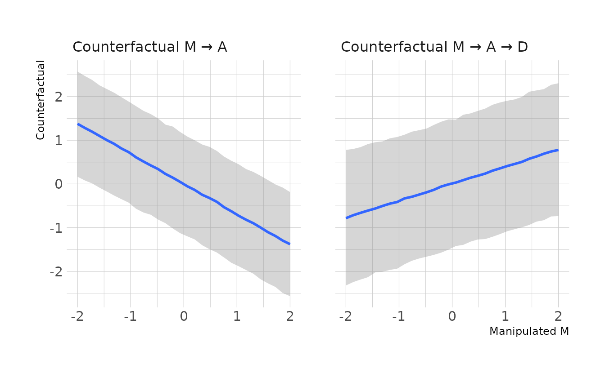

The question specifically asks for the counterfactual effect of halving a state's marriage rate. This is dependent on what the original marriage rate was. For this problem, we'll use the average marriage rate across all states, which is about 20. Half of that is 10, which in our standardized units that were used to fit the model is -2.66. Looking at the counterfactual plot, moving from an $M$ of 0 to an $M$ of -2.66 would result in a decrease in the divorce rate of about 1 standard deviation. We can calculate this directly using code as well. Here we also see an estimated difference of -1.03 standard deviations, with an 89% posterior interval of -3.14 to 1.08.


```r
as_draws_df(b5h2) %>% 
  mutate(a_avg = rnorm(n(), b_A_Intercept + b_A_M * 0, sigma_A),
         a_hlf = rnorm(n(), b_A_Intercept + b_A_M * -2.66, sigma_A),
         d_avg = rnorm(n(), b_D_Intercept + b_D_A * a_avg, sigma_D),
         d_hlf = rnorm(n(), b_D_Intercept + b_D_A * a_hlf, sigma_D),
         diff = d_hlf - d_avg) %>% 
  mean_hdi(diff, .width = 0.89)
#> # A tibble: 1 × 6
#>    diff .lower .upper .width .point .interval
#>   <dbl>  <dbl>  <dbl>  <dbl> <chr>  <chr>    
#> 1 -1.03  -3.11   1.09   0.89 mean   hdi
```


:::question
> **5H3.** Return to the milk energy model, `m5.7`. Suppose that the true causal relationship among the variables is:

<div class="table-question"></div>

> Now compute the counterfactual effect on $K$ of doubling $M$. You will need to account for both the direct and indirect paths of causation. Use the counterfactual example from the chapter (starting on page 140) as a template.
:::

First, we need to estimate our model.


```r
data(milk)

new_milk <- milk %>%
  select(kcal.per.g,
         neocortex.perc,
         mass) %>%
  drop_na(everything()) %>%
  mutate(log_mass = log(mass),
         K = standardize(kcal.per.g),
         N = standardize(neocortex.perc),
         M = standardize(log_mass))

K_model <- bf(K ~ 1 + M + N)
N_model <- bf(N ~ 1 + M)

b5h3 <- brm(K_model + N_model + set_rescor(FALSE),
            data = new_milk, family = gaussian,
            prior = c(prior(normal(0, 0.2), class = Intercept, resp = K),
                      prior(normal(0, 0.5), class = b, resp = K),
                      prior(exponential(1), class = sigma, resp = K),
                      
                      prior(normal(0, 0.2), class = Intercept, resp = N),
                      prior(normal(0, 0.5), class = b, resp = N),
                      prior(exponential(1), class = sigma, resp = N)),
            iter = 4000, warmup = 2000, chains = 4, cores = 4, seed = 1234,
            file = here("fits", "chp5", "b5h3"))

summary(b5h3)
#>  Family: MV(gaussian, gaussian) 
#>   Links: mu = identity; sigma = identity
#>          mu = identity; sigma = identity 
#> Formula: K ~ 1 + M + N 
#>          N ~ 1 + M 
#>    Data: new_milk (Number of observations: 17) 
#>   Draws: 4 chains, each with iter = 2000; warmup = 0; thin = 1;
#>          total post-warmup draws = 8000
#> 
#> Population-Level Effects: 
#>             Estimate Est.Error l-95% CI u-95% CI Rhat Bulk_ESS Tail_ESS
#> K_Intercept     0.00      0.14    -0.27     0.28 1.00     8841     5684
#> N_Intercept     0.00      0.13    -0.25     0.26 1.00     9335     5242
#> K_M            -0.68      0.27    -1.17    -0.11 1.00     5097     5278
#> K_N             0.57      0.26     0.02     1.05 1.00     4924     5189
#> N_M             0.66      0.17     0.32     0.98 1.00     8326     5454
#> 
#> Family Specific Parameters: 
#>         Estimate Est.Error l-95% CI u-95% CI Rhat Bulk_ESS Tail_ESS
#> sigma_K     0.81      0.17     0.56     1.21 1.00     6085     5711
#> sigma_N     0.72      0.14     0.50     1.05 1.00     8236     5409
#> 
#> Draws were sampled using sample(hmc). For each parameter, Bulk_ESS
#> and Tail_ESS are effective sample size measures, and Rhat is the potential
#> scale reduction factor on split chains (at convergence, Rhat = 1).
```

Now we can calculate the counterfactual. $M$ represents the mass, so we'll use evenly spaced values from 0.5 to 80, which captures the range of observed mass in the data. We'll then predict new values of $K$ from these masses. 


```r
milk_cf <- as_draws_df(b5h3) %>%
  as_tibble() %>% 
  select(.draw, b_K_Intercept:sigma_N) %>% 
  expand(nesting(.draw, b_K_Intercept, b_N_Intercept, b_K_M, b_K_N, b_N_M,
                 sigma_K, sigma_N),
         mass = seq(from = 0.5, to = 80, by = 0.5)) %>%
  mutate(log_mass = log(mass),
         M = (log_mass - mean(new_milk$log_mass)) / sd(new_milk$log_mass),
         n_sim = rnorm(n(), mean = b_N_Intercept + b_N_M * M, sd = sigma_N),
         k_sim = rnorm(n(), mean = b_K_Intercept + b_K_N * n_sim + b_K_M * M,
                       sd = sigma_K)) %>%
  pivot_longer(ends_with("_sim"), names_to = "name", values_to = "value") %>%
  group_by(mass, name) %>%
  mean_qi(value, .width = c(0.89)) %>%
  ungroup() %>%
  filter(name == "k_sim") %>%
  mutate(name = case_when(name == "n_sim" ~ "Counterfactual effect M on N",
                          TRUE ~ "Total Counterfactual effect of M on K"))

ggplot(milk_cf, aes(x = mass, y = value, ymin = .lower, ymax = .upper)) +
  geom_smooth(stat = "identity") +
  labs(x = "Manipulated Mass", y = "Counterfactual K")
```

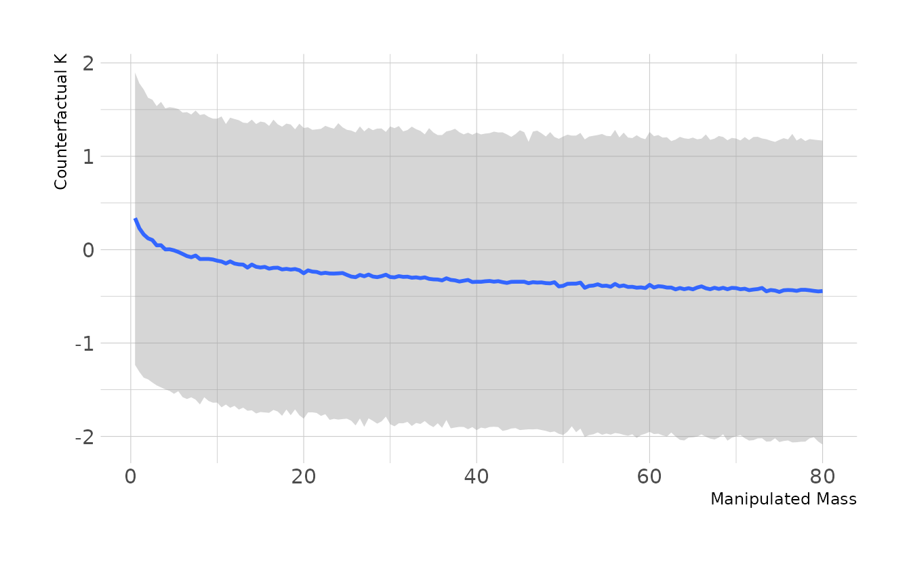

As we can see in the plot, because mass is log-transformed in the model, there is a non-linear relationship between the manipulated mass and our counterfactual. Thus, the impact of doubling mass depends on the original mass. As in the previous example, we'll use the average mass (&thickapprox;15kg) as the baseline. Thus in the standardized log units used to estimate our model, we're comparing an $M$ value of 0.746 to 1.154. The code below shows that doubling the mass has only a small effect on $K$ with a quick wide compatibility interval.


```r
(log(c(15, 30)) - mean(log(milk$mass))) / sd(log(milk$mass)) 
#> [1] 0.746 1.154

as_draws_df(b5h3) %>% 
  mutate(n_avg = rnorm(n(), b_N_Intercept + b_N_M * 0.746, sigma_N),
         n_dbl = rnorm(n(), b_N_Intercept + b_N_M * 1.154, sigma_N),
         k_avg = rnorm(n(), b_K_Intercept + b_K_M * 0.746 + b_K_N * n_avg,
                       sigma_K),
         k_dbl = rnorm(n(), b_K_Intercept + b_K_M * 1.154 + b_K_N * n_dbl,
                       sigma_K),
         diff = k_dbl - k_avg) %>% 
  median_hdi(diff, .width = 0.89)
#> # A tibble: 1 × 6
#>     diff .lower .upper .width .point .interval
#>    <dbl>  <dbl>  <dbl>  <dbl> <chr>  <chr>    
#> 1 -0.151  -2.45   1.82   0.89 median hdi
```


:::question
> **5H4.** Here is an open practice problem to engage your imagination. In the divorce data, States in the southern United States have many of the highest divorce rates. Add the `South` indicator variable to the analysis. First, draw one or more DAGs that represent your ideas for how Southern American culture might influence any of the other three variables ($D$, $M$, or $A$). Then list the testable implications of your DAGs, if there are any, and fit one or more models to evaluate the implications. What do you think the influence of "Southerness" is?
:::

First, let's draw a DAG using {ggdag} [@R-ggdag]. 


```r
dag_coords <-
  tibble(name = c("S", "A", "M", "D"),
         x = c(1, 1, 2, 3),
         y = c(3, 1, 2, 1))

dagify(D ~ A + M,
       M ~ A + S,
       A ~ S,
       coords = dag_coords) %>%
  ggplot(aes(x = x, y = y, xend = xend, yend = yend)) +
  geom_dag_text(color = "black", size = 10) +
  geom_dag_edges(edge_color = "black", edge_width = 2,
                 arrow_directed = grid::arrow(length = grid::unit(15, "pt"),
                                              type = "closed")) +
  theme_void()
```

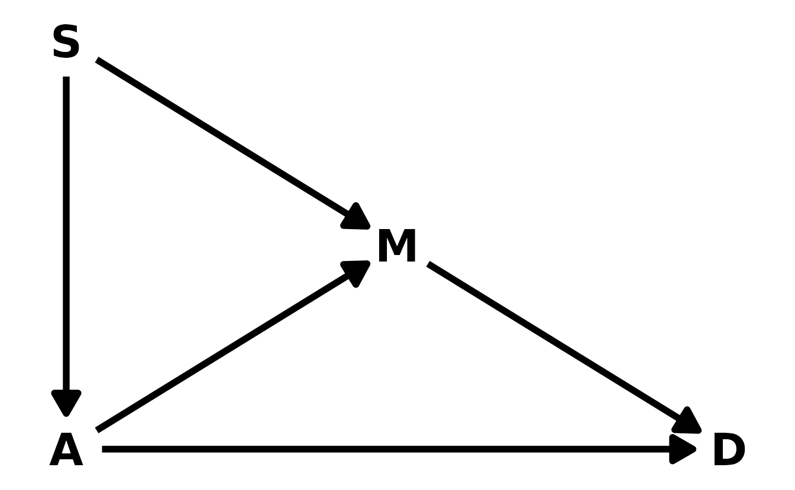

In this proposed model, we are hypothesizing that southerness influences the median age at marriage and the marriage rate. We can use {dagitty} to view the testable implications:


```r
div_dag <- dagitty("dag{S -> M -> D; S -> A -> D; A -> M}")
impliedConditionalIndependencies(div_dag)
#> D _||_ S | A, M
```

Given the DAG, divorce rate should be independent of southerness when we condition on median age at marriage and marriage rate. Let's estimate a model to test this. We'll include median age at marriage ($A$), marriage rate ($M$), and southerness ($S$) in the model. Because both $A$ and $M$ are included, we would expect the coefficient for $S$ to be zero, if the implied conditional independency holds.


```r
data("WaffleDivorce")

south_divorce <- WaffleDivorce %>%
  as_tibble() %>%
  select(D = Divorce,
         A = MedianAgeMarriage,
         M = Marriage,
         S = South) %>%
  drop_na(everything()) %>%
  mutate(across(where(is.double), standardize))

b5h4 <- brm(D ~ A + M + S, data = south_divorce, family = gaussian,
            prior = c(prior(normal(0, 0.2), class = Intercept),
                      prior(normal(0, 0.5), class = b),
                      prior(exponential(1), class = sigma)),
            iter = 4000, warmup = 2000, chains = 4, cores = 4, seed = 1234,
            file = here("fits", "chp5", "b5h4"))
```

Now we can look at the posterior distribution for the $\beta$ coefficient for southerness.


```r
spread_draws(b5h4, b_S) %>%
  ggplot(aes(x = b_S)) +
  stat_halfeye(.width = c(0.67, 0.89, 0.97)) +
  labs(x = expression(beta[S]), y = "Density")
```

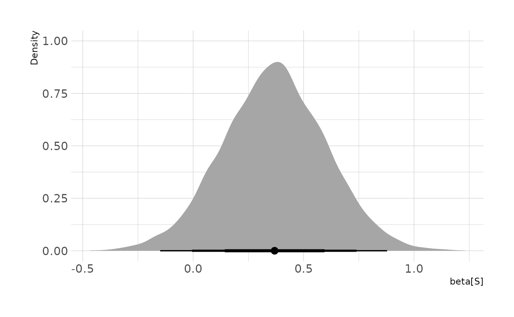

The effect of southerness is close to zero, but slightly larger than we might have expected. Thus, we have some preliminary evidence that the DAG we have drawn may not be accurate. However, the evidence is not strong enough to refute our proposed DAG either.

### Chapter 6

:::question
> **6E1.** List three mechanisms by which multiple regression can produce false inferences about causal effects.
:::

Three mechanisms are:

1. *Multicollinearity*. This occurs when two or more variables are strongly assocaited, conditional on the other variables in the model.
2. *Post-treatment Bias*. This occurs when the inclusion of a variable "blocks" the effect of another.
3. *Collider Bias*. This occurs when two variables are unrelated to each other, but are both related to a third variable. The inclusion of the third variable creates a statistical association in the model between the first two.

:::question
> **6E2.** For one of the mechanisms in the previous problem, provide an example of your choice, perhaps from your own research.
:::

In educational research, we are often interested in instructional interventions. For example, we might provide teacher with professional development ($D$). We expect the professional development to have a positive impact on the instruction ($I$) the teacher provides, which in turn should improve student performance ($P$). However, student performance is also influenced by the pre-existing knowledge state ($K$) of the teacher's students. If we are interested in estimating the effect of $D$ on $I$, the inclusion of $P$ in the model would be an example of a post-treatment bias, where the quality of the instruction (influencing the performance, $P$) masks the effect of the professional development as shown in the DAG.


```r
ed_dag <- dagitty("dag { D -> I -> P <- K }")
coordinates(ed_dag) <- list(x = c(D = 1, I = 1.5, P = 2, K = 2.5),
                            y = c(D = 3, I = 2, P = 1, K = 2))

ggplot(ed_dag, aes(x = x, y = y, xend = xend, yend = yend)) +
  geom_dag_text(color = "black", size = 10) +
  geom_dag_edges(edge_color = "black", edge_width = 2,
                 arrow_directed = grid::arrow(length = grid::unit(15, "pt"),
                                              type = "closed")) +
  theme_void()
```


:::question
> **6E3.** List the four elemental confounds. Can you explain the conditional dependencies of each?
:::

1. *The Fork*. The classic "confounder" example. A variable $Z$ is a common cause to both $X$ and $Y$, resulting in a correlation between $X$ and $Y$. In other words, $X$ is independent of $Y$, conditional on $Z$, or, in math notation, $X \!\perp\!\!\!\perp Y | Z$.

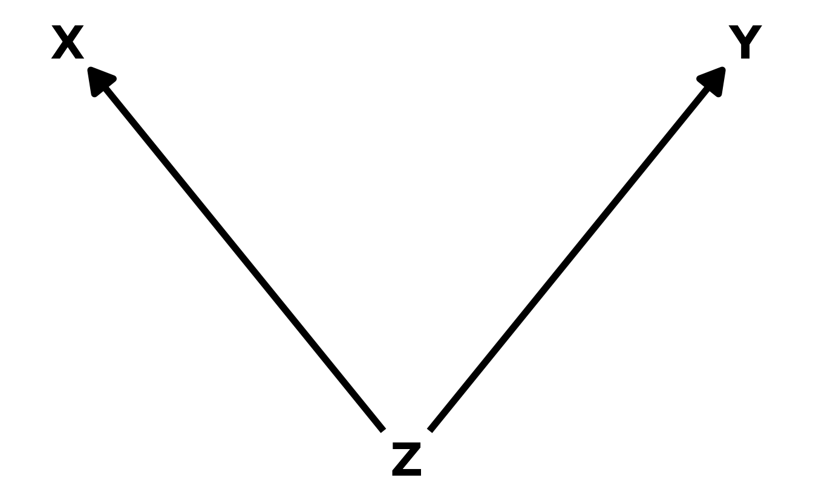

2. *The Pipe*. A variable $X$ influences, another variable $Z$, which in turn influences the outcome $Y$. A good example is the post-treatment bias described above. The treatment ($X$) is meant to influence some outcome ($Y$), but does so through an intermediary ($Z$). Including both $X$ and $Z$ can then make it appear as though $X$ has no effect on $Y$. Thus, as in the the fork, $X$ is independent of $Y$, conditional on $Z$. And in math again: $X \!\perp\!\!\!\perp Y | Z$.

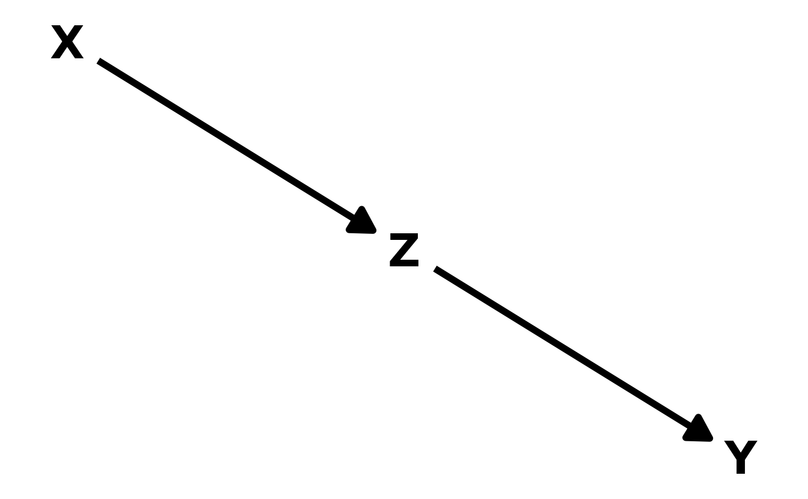

3. *The Collider*. Unlike the fork and the pipe, the collider induces a correlation between otherwise unassociated variables. Thus, $X$ is *not* independent from $Y$, conditional on $Z$. In math notation, this can be written as $X \not\!\perp\!\!\!\perp Y|Z$.

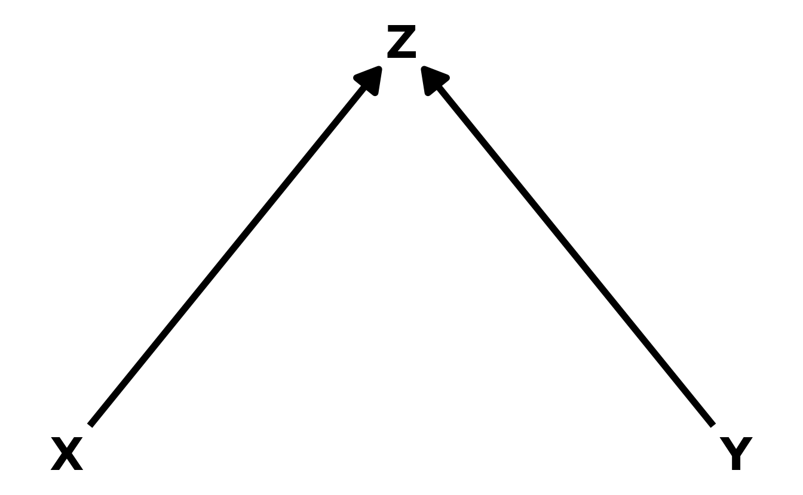

4. *The Descendant*. In this final case, the descendant, $D$, is influenced by another variable in the DAG, in this case $Z$. Conditioning on the descendant has the impact of partially conditioning on the parent variable. In this example, $Z$ is a collider. Thus, if we kept $Z$ out of the model, but included $D$, we would get a partial collider bias, because $D$ contains some of the information that is in $Z$. How much bias is introduced depends on the strength of the relationship between the the descendant and its parent. 

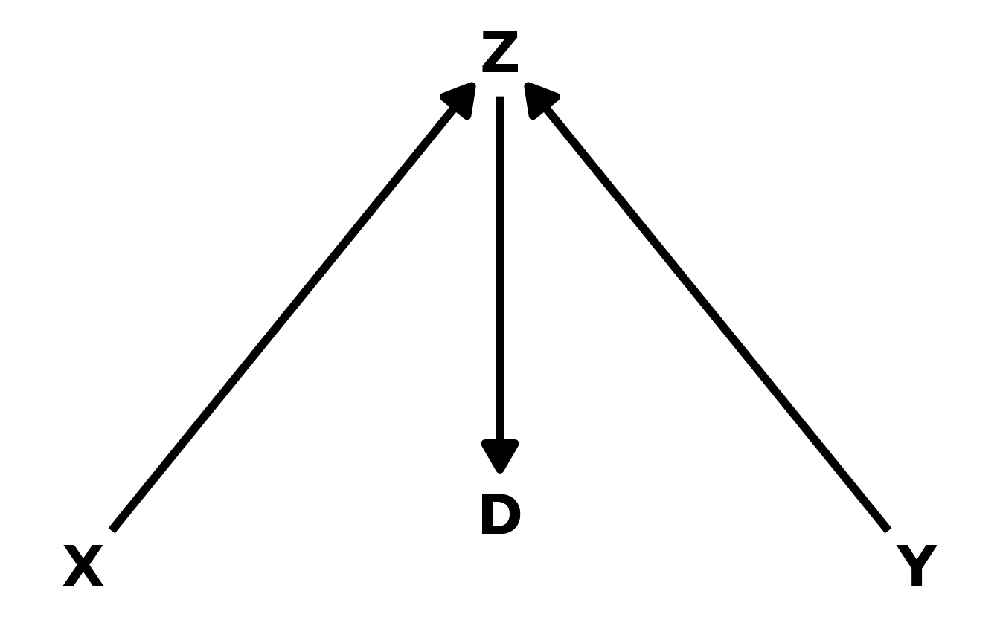

:::question
> **6E4.** How is a biased sample like conditioning on a collider? Think of the example at the open of the chapter.
:::

With a collider, an association is introduced between two variables when a third is added. A biased sample is like an un-measured collider. In the example that started the chapter, there was no association between trustworthiness and and newsworthiness. However, when selection status is added to the model, there appears to be a negative association. Now imagine that you only have data for the funded proposals. Here, there is an implicit conditioning on selection status, because you only have funded proposals. This is potentially more nefarious, because the collider isn't explicitly in your data, or has no variance (i.e., all proposals in your data have a selection score of `1`).

:::question
> **6M1.** Modify the DAG on page 186 to include the variable $V$, an unobserved cause of $C$ and $Y$: $C \leftarrow V \rightarrow Y$. Reanalyze the DAG. How many paths connect $X$ to $Y$? Which must be closed? Which variables should you condition on now?
:::

The new DAG looks like this:


```r
dag_coords <- tibble(name = c("X", "U", "A", "B", "C", "Y", "V"),
                     x = c(1, 1, 2, 2, 3, 3, 3.5),
                     y = c(1, 2, 2.5, 1.5, 2, 1, 1.5))

dagify(Y ~ X + C + V,
       X ~ U,
       U ~ A,
       B ~ U + C,
       C ~ A + V,
       coords = dag_coords) %>%
  ggplot(aes(x = x, y = y, xend = xend, yend = yend)) +
  geom_dag_point(data = . %>% filter(name %in% c("U", "V")),
                 shape = 1, stroke = 2, color = "black") +
  geom_dag_text(color = "black", size = 10) +
  geom_dag_edges(edge_color = "black", edge_width = 2,
                 arrow_directed = grid::arrow(length = grid::unit(15, "pt"),
                                              type = "closed")) +
  theme_void()
```

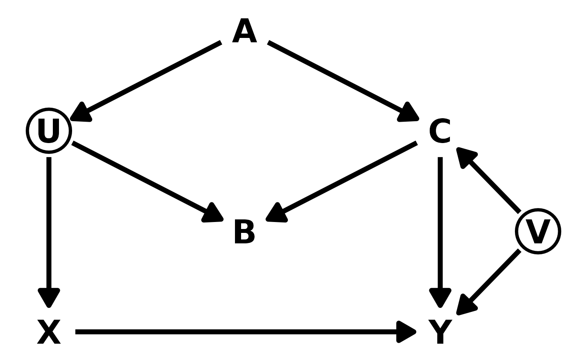

There are now 5 paths from $X$ to $Y$. The three paths from the original DAG, and 2 new paths introduced by $V$.

1. $X \rightarrow Y$
2. $X \leftarrow U \rightarrow B \leftarrow C \rightarrow Y$
3. $X \leftarrow U \rightarrow B \leftarrow C \leftarrow V \rightarrow Y$
4. $X \leftarrow U \leftarrow A \rightarrow C \rightarrow Y$
5. $X \leftarrow U \leftarrow A \rightarrow C \leftarrow V \rightarrow Y$

We want to keep path 1 open, because that is the causal path of interest. Paths 2 and 3 are already closed, because $B$ is a collider. Paths 4 and 5 are open because $A$ is a fork. In the original DAG, we could close either $A$ or $C$; however, in the new DAG, $C$ is a collider. Therefore, if we conditioned on $C$, we'd be opening up a new path through $V$. Therefore, if we want to make inferences about the causal effect of $X$ on $Y$, we must only condition on $A$ (assuming our DAG is correct). We can confirm using `dagitty::adjustmentSets()`.


```r
new_dag <- dagitty("dag { U [unobserved]
                          V [unobserved]
                          X -> Y
                          X <- U <- A -> C -> Y
                          U -> B <- C
                          C <- V -> Y }")

adjustmentSets(new_dag, exposure = "X", outcome = "Y")
#> { A }
```

:::question
> **6M2.** Sometimes, in order to avoid multicollinearity, people inspect pairwise correlations among predictors before including them in a model. This is a bad procedure, because what matters is the conditional association, not the association before the variables are included in the model. To highlight this, consider the DAG $X \rightarrow Z \rightarrow Y$. Simulate data from this DAG so that the correlation between $X$ and $Z$ is very large. Then include both in a model prediction $Y$. Do you observe any multicollinearity? Why or why not? What is different from the legs example in the chapter?
:::

First, we'll generate some data and confirm that `x` and `z` are highly correlated in our simulation.


```r
set.seed(1984)

n <- 1000
dat <- tibble(x = rnorm(n)) %>%
  mutate(z = rnorm(n, mean = x, sd = 0.1),
         y = rnorm(n, mean = z),
         across(everything(), standardize))

sim_cor <- cor(dat$x, dat$z)
sim_cor
#> [1] 0.995
```

In our generated data of `prettyNum(nrow(dat), big.mark = ",")` observations, there is a correlation of `fmt_prop(sim_cor, 3)` between `x` and `z`. Now let's estimate a model regressing `y` on both `x` and `z`.


```r
b6m2 <- brm(y ~ 1 + x + z, data = dat, family = gaussian,
            prior = c(prior(normal(0, 0.2), class = Intercept),
                      prior(normal(0, 0.5), class = b),
                      prior(exponential(1), class = sigma)),
            iter = 4000, warmup = 2000, chains = 4, cores = 4, seed = 1234,
            file = here("fits", "chp6", "b6m2"))

as_draws_df(b6m2) %>%
  as_tibble() %>% 
  select(b_Intercept, b_x, b_z, sigma) %>%
  pivot_longer(everything()) %>%
  ggplot(aes(x = value, y = name)) +
  stat_halfeye(.width = c(0.67, 0.89, 0.97))
```

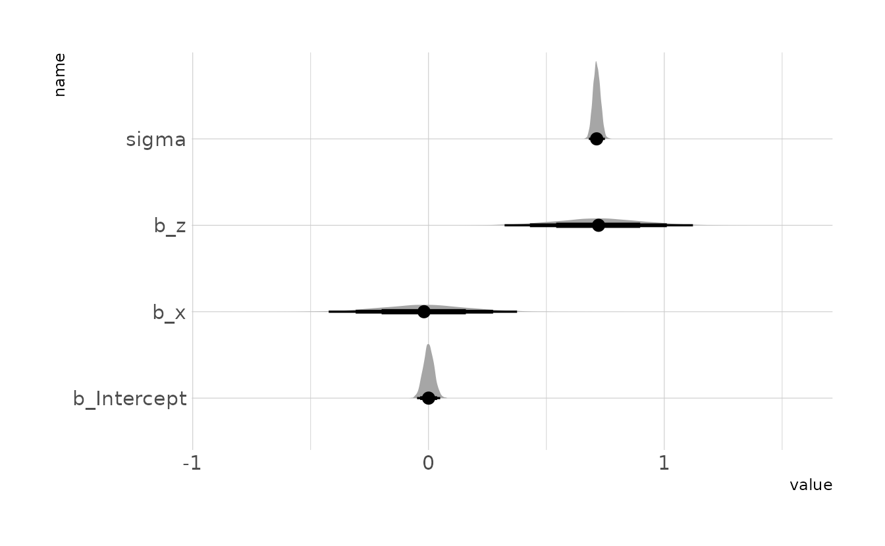

In the model summary, we can see that both `x` and `z` have estimates with relatively narrow posterior distributions. This is in contrast to the example of legs in the chapter, where the estimated standard deviations of the $beta$ parameters were much larger than the magnitudes of the parameters, and the posterior distributions had significant overlap. Thus, it does not appear as though we are observing multicollinearity.

This is due to the causal model that gave rise to this (simulated) data. In the legs example from the chapter, both legs predicted height (left DAG below). In this example, only $Z$ predicts the outcome. In DAG language, $Z$ is a pipe. Therefore, when the model is estimated, the golem is looking at what $X$ tells us, conditional on $Z$. The answer in this case is "not much" because $X$ and $Z$ are highly correlated, which is why the posterior for $X$ is centered on zero. The leg model does not condition on either of the predictors, as both have direct paths to the outcome variable. Thus, whether or not a model has multicollinearity depends not only on the pairwise relationship, but also the causal model.

<div class="figure" style="text-align: center">
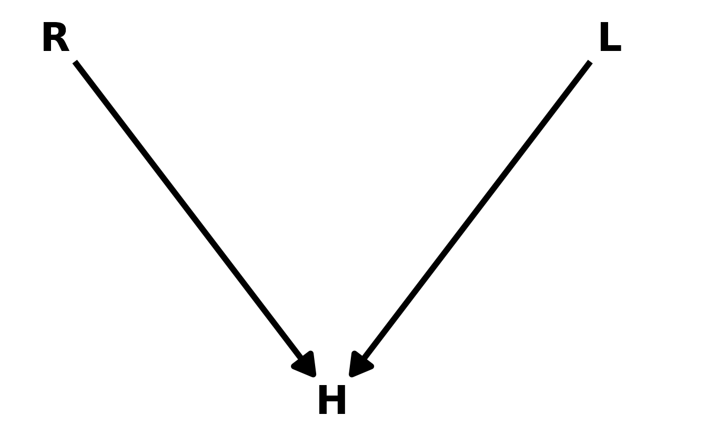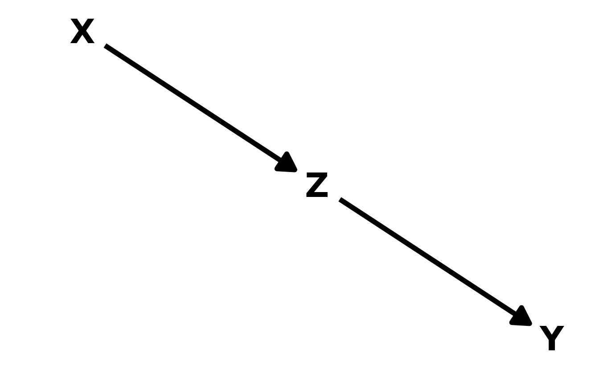
<p class="caption"> </p>
</div>

:::question
> **6M3.** Learning to analyze DAGs requires practice. For each of the four DAGs below, state which variables, if any, you must adjust for (condition on) to estimate the total causal influence of $X$ on $Y$.

<div class="table-question"><div class="figure" style="text-align: center">

<p class="caption"> </p>
</div></div>
:::

*Upper Left*: There are two back-door paths from $X$ to $Y$: $X \leftarrow Z \rightarrow Y$ and $X \leftarrow Z \leftarrow A \rightarrow Y$. In the first path $Z$ is a fork, and in the second, $Z$ is a pipe and $A$ is a fork. Thus, in both cases, conditioning on $Z$ would close the path. We can confirm with `dagitty::adjustmentSets()`.


```r
dag1 <- dagitty("dag{ X <- Z <- A -> Y <- X; Y <- Z }")
adjustmentSets(dag1, exposure = "X", outcome = "Y")
#> { Z }
```

*Upper Right*: Again, there are two paths from $X$ to $Y$: $X \rightarrow Z \rightarrow Y$ and $X \rightarrow Z \leftarrow A \rightarrow Y$. The first path is an indirect causal effect for $X$ on $Y$, which should be included when estimating the total causal effect of $X$ on $Y$. In the second path, $Z$ is a collider, so the path is already closed and therefore no action is needed. Thus, no adjustments are needed to estimate the total effect of $X$ of $Y$.


```r
dag2 <- dagitty("dag{ X -> Z <- A -> Y <- X; Y <- Z }")
adjustmentSets(dag2, exposure = "X", outcome = "Y")
#>  {}
```

*Lower Left*: There are two paths from $X$ to $Y$: $X \leftarrow A \rightarrow Z \leftarrow Y$ and $X \rightarrow Z \leftarrow Y$. There is only one causal path from $X$ to $Y$, the direct path. In both back-door paths, $Z$ is a collider so the paths are closed unless we include it, so no additional variables need to be added to the model.


```r
dag3 <- dagitty("dag{ Y -> Z <- A -> X -> Y; X -> Z }")
adjustmentSets(dag3, exposure = "X", outcome = "Y")
#>  {}
```

*Lower Right*: Finally, this DAG also has two causal paths from $X$ to $Y$. The direct effect, and an indirect effect through $Z$. There is one additional path, $X \leftarrow A \rightarrow Z \rightarrow Y$. Conditioning on $A$ will close the path.


```r
dag4 <- dagitty("dag{ Y <- Z <- A -> X -> Y; X -> Z }")
adjustmentSets(dag4, exposure = "X", outcome = "Y")
#> { A }
```

:::question
> **6H1.** Use the Waffle House data, `data(WaffleDivorce)`, to find the total causal influence of number of Waffle Houses on divorce rate. Justify your model or models with a causal graph.
:::

For this problem, we'll use the DAG given in the chapter example:


```r
waffle_dag <- dagitty("dag { S -> W -> D <- A <- S -> M -> D; A -> M }")
coordinates(waffle_dag) <- list(x = c(A = 1, S = 1, M = 2, W = 3, D = 3),
                                y = c(A = 1, S = 3, M = 2, W = 3, D = 1))

ggplot(waffle_dag, aes(x = x, y = y, xend = xend, yend = yend)) +
  geom_dag_text(color = "black", size = 10) +
  geom_dag_edges(edge_color = "black", edge_width = 2,
                 arrow_directed = grid::arrow(length = grid::unit(15, "pt"),
                                              type = "closed")) +
  theme_void()
```

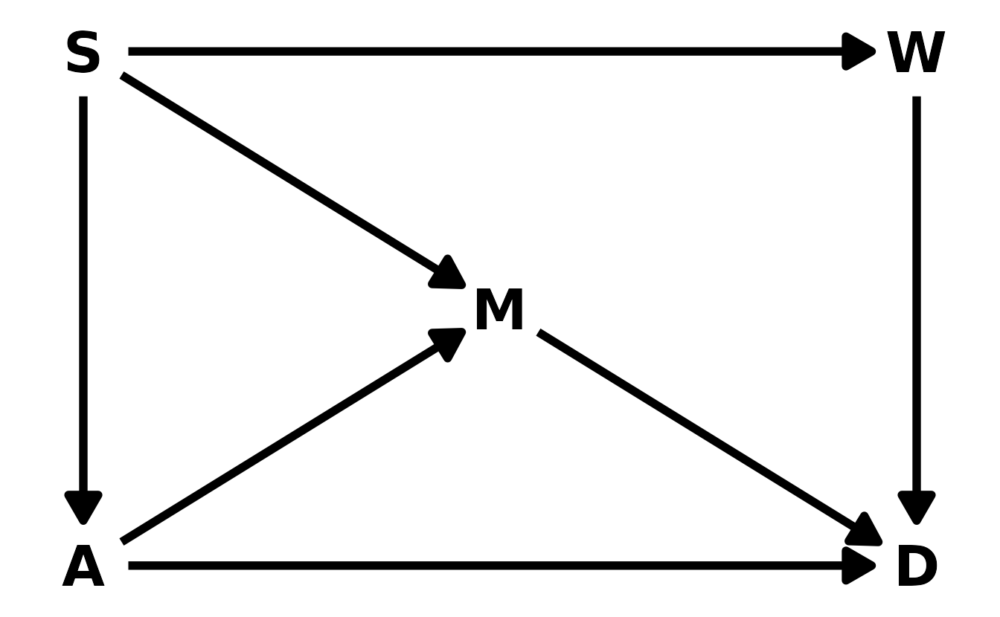

In order to estimate the total causal effect of Waffle Houses ($W$) on divorce rate ($D$), we have to condition on either $S$ or both $A$ and $M$. For simplicity, we'll condition on only $S$.


```r
adjustmentSets(waffle_dag, exposure = "W", outcome = "D")
#> { A, M }
#> { S }
```

We can use `brms::brm()` to estimate the model.


```r
data("WaffleDivorce")
waffle <- WaffleDivorce %>%
  as_tibble() %>%
  select(D = Divorce,
         A = MedianAgeMarriage,
         M = Marriage,
         S = South,
         W = WaffleHouses) %>%
  mutate(across(-S, standardize),
         S = factor(S))

waff_mod <- brm(D ~ 1 + W + S, data = waffle, family = gaussian,
                prior = c(prior(normal(0, 0.2), class = Intercept),
                          prior(normal(0, 0.5), class = b),
                          prior(exponential(1), class = sigma)),
                iter = 4000, warmup = 2000, chains = 4, cores = 4, seed = 1234,
                file = here("fits", "chp6", "b6h1"))
```

Finally, we can see the causal estimate of Waffle Houses on divorce rate by looking at the posterior distribution of the `b_W` parameter. Here, we can see that the estimate is very small, indicating that the number of Waffle Houses has little to no causal impact on the divorce rate in a state.


```r
spread_draws(waff_mod, b_W) %>%
  ggplot(aes(x = b_W)) +
  stat_halfeye(.width = c(0.67, 0.89, 0.97)) +
  labs(x = expression(beta[W]), y = "Density")
```

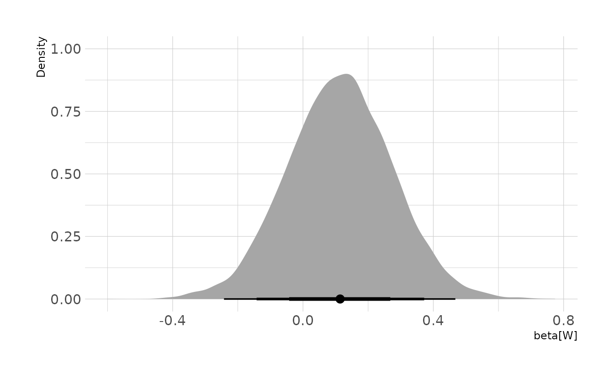

:::question
> **6H2.** Build a series of models to test the implied conditional independencies of the causal graph you used in the previous problem. If any of the tests fail, how do you think the graph needs to be ammended? Does the graph need more or fewer arrows? Feel free to nominate variables that aren't in the data.
:::

First we need to get the conditional independencies implied by our DAG.


```r
impliedConditionalIndependencies(waffle_dag)
#> A _||_ W | S
#> D _||_ S | A, M, W
#> M _||_ W | S
```

There are three models we need to estimate to evaluate the implied conditional independencies. Each one can be estimated with `brms::brm()`.


```r
waff_ci1 <- brm(A ~ 1 + W + S, data = waffle, family = gaussian,
                prior = c(prior(normal(0, 0.2), class = Intercept),
                          prior(normal(0, 0.5), class = b),
                          prior(exponential(1), class = sigma)),
                iter = 4000, warmup = 2000, chains = 4, cores = 4, seed = 1234,
                file = here("fits", "chp6", "b6h2-1"))

waff_ci2 <- brm(D ~ 1 + S + A + M + W, data = waffle, family = gaussian,
                prior = c(prior(normal(0, 0.2), class = Intercept),
                          prior(normal(0, 0.5), class = b),
                          prior(exponential(1), class = sigma)),
                iter = 4000, warmup = 2000, chains = 4, cores = 4, seed = 1234,
                file = here("fits", "chp6", "b6h2-2"))

waff_ci3 <- brm(M ~ 1 + W + S, data = waffle, family = gaussian,
                prior = c(prior(normal(0, 0.2), class = Intercept),
                          prior(normal(0, 0.5), class = b),
                          prior(exponential(1), class = sigma)),
                iter = 4000, warmup = 2000, chains = 4, cores = 4, seed = 1234,
                file = here("fits", "chp6", "b6h2-3"))
```

Finally, we can example the posterior distributions for the implied conditional independencies. The implied conditional independency tested in the first model, $A \!\perp\!\!\!\perp W | S$, appears to be met, as the $beta_W$ coefficient from the model is centered on zero. The same is true for the third implied conditional independency, $M \!\perp\!\!\!\perp W | S$. The second implied conditional independency, $D \!\perp\!\!\!\perp S | A, M, W$, is less clear, as the posterior distribution overlaps zero, but does indicate a slightly positive relationship between divorce rate a state's "southern" status, even after adjusting for median age of marriage, marriage rate, and the number of waffle houses. This is likely because there are other variables missing from the model that are related to both divorce rate and also southerness. For example, religiosity, family size, and education could all plausibly impact divorce rates and show regional differences in the United States.


```r
lbls <- c(expression("Model 1:"~beta[W]),
          expression("Model 2:"~beta[S]),
          expression("Model 3:"~beta[W]))

bind_rows(
  gather_draws(waff_ci1, b_W) %>%
    ungroup() %>%
    mutate(model = "ICI 1"),
  gather_draws(waff_ci2, b_S1) %>%
    ungroup() %>%
    mutate(model = "ICI 2"),
  gather_draws(waff_ci3, b_W) %>%
    ungroup() %>%
    mutate(model = "ICI 3")
) %>%
  ggplot(aes(x = .value, y= model)) +
  stat_halfeye(.width = c(0.67, 0.89, 0.97)) +
  scale_y_discrete(labels = lbls) +
  labs(x = "Parameter Estimate", y = "Implied Conditional Independency")
```

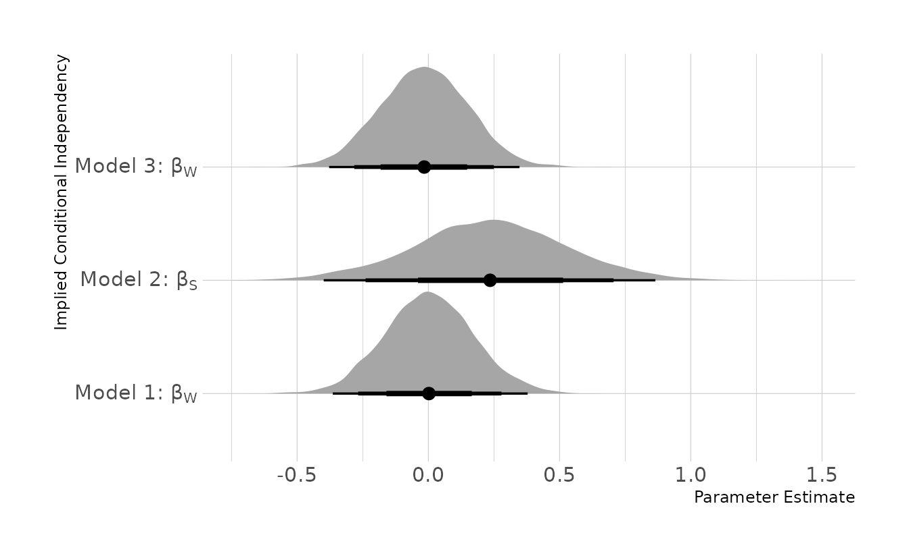

:::question
> All three problems below are based on the same data. The data in `data(foxes)` are 116 foxes from 30 different urban groups in England. These foxes are like street gangs. Group size varies from 2 to 8 individuals. Each group maintains its own urban territory. Some territories are larger than others. The `area` variable encodes this information. Some territories also have more `avgfood` than others. We want to model the `weight` of each fox. For the problems below, assume the following DAG:

<div class="table-question"></div>
:::

:::question
> **6H3.** Use a model to infer the total causal influence of `area` on `weight`. Would increasing the area available to each fox make it heavier (healthier)? You might want to standardize the variables. Regardless, use prior predictive simulation to show that your model's prior predictions stay within the possible outcome range.
:::

First, let's load the data and standardize the variables.


```r
data(foxes)

fox_dat <- foxes %>%
  as_tibble() %>%
  select(area, avgfood, weight, groupsize) %>%
  mutate(across(everything(), standardize))

fox_dat
#> # A tibble: 116 × 4
#>      area avgfood    weight groupsize
#>     <dbl>   <dbl>     <dbl>     <dbl>
#>  1 -2.24  -1.92    0.414       -1.52 
#>  2 -2.24  -1.92   -1.43        -1.52 
#>  3 -1.21  -1.12    0.676       -1.52 
#>  4 -1.21  -1.12    1.30        -1.52 
#>  5 -1.13  -1.32    1.12        -1.52 
#>  6 -1.13  -1.32   -1.08        -1.52 
#>  7 -2.02  -1.52    0.000291    -1.52 
#>  8 -2.02  -1.52   -0.371       -1.52 
#>  9  0.658 -0.0591  1.35        -0.874
#> 10  0.658 -0.0591  0.896       -0.874
#> # … with 106 more rows
```

For this first question, there are no back-door paths from area to weight. All of the arrows represent indirect effects of area on weight. Therefore, we do not want to condition on `avgfood` or `groupsize`, as this would close one or more of these indirect paths which are needed to estimate the total causal effect. We can confirm with `dagitty::adjustmentSets()`.


```r
fox_dag <- dagitty("dag{ area -> avgfood -> groupsize -> weight <- avgfood }")
adjustmentSets(fox_dag, exposure = "area", outcome = "weight")
#>  {}
```

Thus, our model for this question can be written as:

\begin{align}
  W_i &\sim \text{Normal}(\mu_i, \sigma) \\
  \mu_i &= \alpha + \beta_A \\
  \alpha &\sim \text{Normal}(0, 0.2) \\
  \beta_A &\sim \text{Normal}(0, 0.5) \\
  \sigma &\sim \text{Exponential}(1)
\end{align}

Now, let's do some prior predictive simulations to makes sure we're within the bounds of what might be expected. Nearly all the lines are within the bounds of what might be expected.


```r
set.seed(2020)

n <- 1000
tibble(group = seq_len(n),
       alpha = rnorm(n, 0, 0.2),
       beta = rnorm(n, 0, 0.5)) %>%
  expand(nesting(group, alpha, beta),
         area = seq(from = -2, to = 2, length.out = 100)) %>%
  mutate(weight = alpha + beta * area) %>%
  ggplot(aes(x = area, y = weight, group = group)) +
  geom_line(alpha = 1 / 10) +
  geom_hline(yintercept = c((0 - mean(foxes$weight)) / sd(foxes$weight),
                            (max(foxes$weight) - mean(foxes$weight)) /
                              sd(foxes$weight)),
             linetype = c("dashed", "solid"), color = "red") +
  annotate(geom = "text", x = -2, y = -3.83, hjust = 0, vjust = 1,
           label = "No weight") +
  annotate(geom = "text", x = -2, y = 2.55, hjust = 0, vjust = 0,
           label = "Maximum weight") +
  expand_limits(y = c(-4, 4)) +
  labs(x = "Standardized Area", y = "Standardized Weight")
```

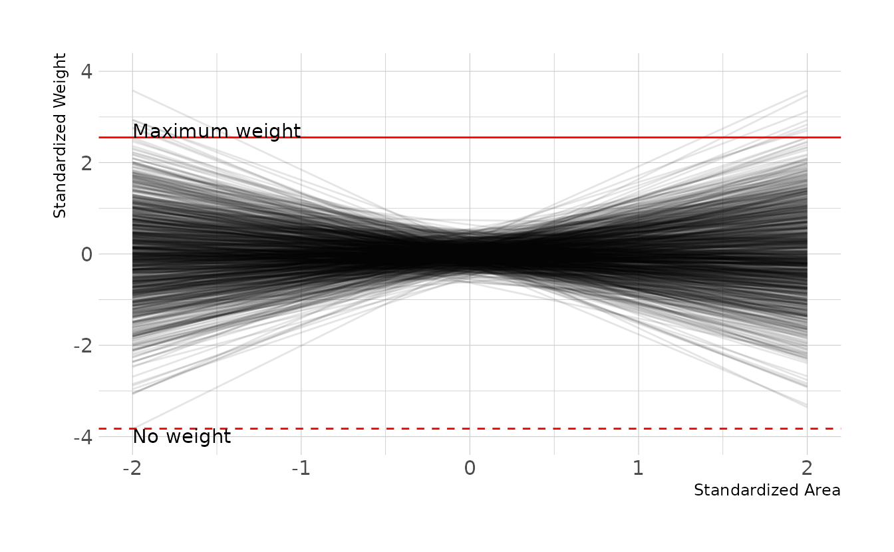

Finally, we can estimate the model. Conditional on this DAG and our data, it doesn't appear as though area size has any causal effect on the weight of foxes in this sample.


```r
area_mod <- brm(weight ~ 1 + area, data = fox_dat, family = gaussian,
                prior = c(prior(normal(0, 0.2), class = Intercept),
                          prior(normal(0, 0.5), class = b,),
                          prior(exponential(1), class = sigma)),
                iter = 4000, warmup = 2000, chains = 4, cores = 4, seed = 1234,
                file = here("fits", "chp6", "b6h3"))

as_draws_df(area_mod) %>%
  as_tibble() %>%
  select(b_Intercept, b_area, sigma) %>%
  pivot_longer(everything()) %>%
  mutate(name = factor(name, levels = c("b_Intercept", "b_area", "sigma"))) %>%
  ggplot(aes(x = value, y = fct_rev(name))) +
  stat_halfeye(.width = c(0.67, 0.89, 0.97)) +
  labs(x = "Parameter Estimate", y = "Parameter")
```

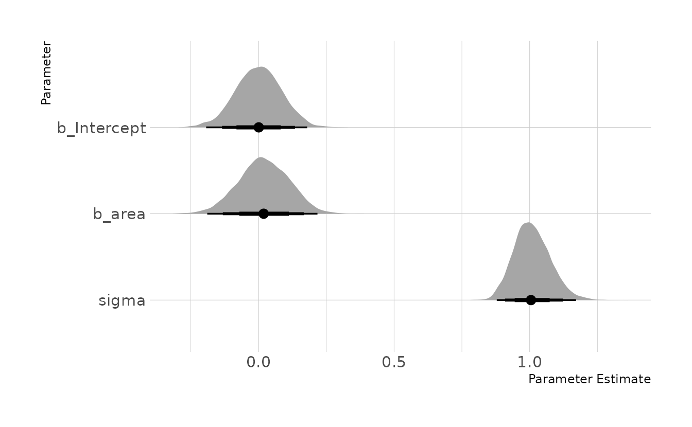

:::question
> **6H4.** Now infer the causal impact of adding food to a territory. Would this make foxes heavier? Which covariates do you need to adjust for to estimate the total causal influence of food?
:::

To estimate the total causal impact of food, we don't need to adjust for any variables. There is a direct path from average food to weight and an indirect path through group size. If we condition on group size, then that path would be closed and we would be left with only the direct effect. However, as we want the total effect, there is no adjustment to be made.


```r
adjustmentSets(fox_dag, exposure = "avgfood", outcome = "weight")
#>  {}
```

When we estimate the model regressing weight on average food available, we see that there is no effect of food on weight. Given the DAG, this is expected. If there were an impact of food on weight, then we would have expected to see an impact of area on weight in the previous problem, as area is upstream of average food in the causal model.


```r
food_mod <- brm(weight ~ 1 + avgfood, data = fox_dat, family = gaussian,
                prior = c(prior(normal(0, 0.2), class = Intercept),
                          prior(normal(0, 0.5), class = b,),
                          prior(exponential(1), class = sigma)),
                iter = 4000, warmup = 2000, chains = 4, cores = 4, seed = 1234,
                file = here("fits", "chp6", "b6h4"))

as_draws_df(food_mod) %>%
  as_tibble() %>%
  select(b_Intercept, b_avgfood, sigma) %>%
  pivot_longer(everything()) %>%
  mutate(name = factor(name, levels = c("b_Intercept", "b_avgfood", "sigma"))) %>%
  ggplot(aes(x = value, y = fct_rev(name))) +
  stat_halfeye(.width = c(0.67, 0.89, 0.97)) +
  labs(x = "Parameter Estimate", y = "Parameter")
```

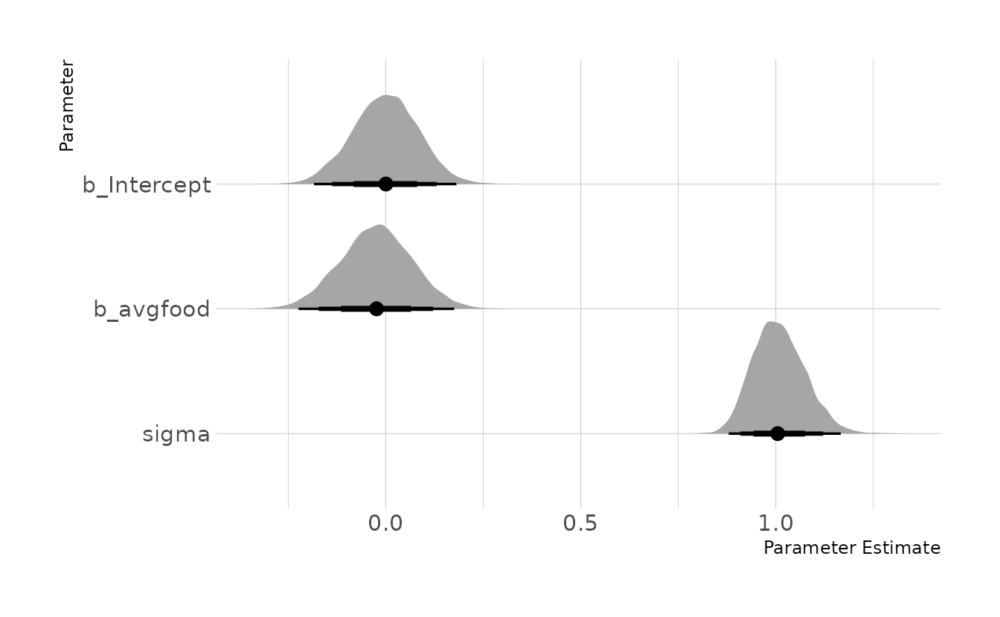

:::question
> **6H5.** Now infer the causal impact of group size. Which covariates do you need to adjust for? Looking at the posterior distribution of the resulting model, what do you think explains these data? That is, can you explain the estimates for all three problems? How do they go together?
:::

When assessing the causal impact of group size, there is one back-door path: $G \leftarrow F \rightarrow W$. In this path, average food, $F$, is a fork, so we have to condition on it to isolate the effect of group size.


```r
adjustmentSets(fox_dag, exposure = "groupsize", outcome = "weight")
#> { avgfood }
```

When we estimate this model, we see a negative effect for group size when controlling for food. We also now see a positive effect for average food when controlling for group size. Thus, the causal effect of group size is to decrease weight. Logically this makes sense, as there would be less food for each fox. This model also indicates that the direct effect of average food is to increase weight. That is, if group size is held constant, more food results in more weight. However, the total causal effect of food on weight, as we saw in the last problem, is nothing. This is because more food also leads to larger groups, which in turn decreases weight. This is a masking effect, also called a post-treatment bias.


```r
grp_mod <- brm(weight ~ 1 + avgfood + groupsize, data = fox_dat,
               family = gaussian,
               prior = c(prior(normal(0, 0.2), class = Intercept),
                         prior(normal(0, 0.5), class = b,),
                         prior(exponential(1), class = sigma)),
               iter = 4000, warmup = 2000, chains = 4, cores = 4, seed = 1234,
               file = here("fits", "chp6", "b6h5"))

as_draws_df(grp_mod) %>%
  as_tibble() %>%
  select(b_Intercept, b_avgfood, b_groupsize, sigma) %>%
  pivot_longer(everything()) %>%
  mutate(name = factor(name, levels = c("b_Intercept", "b_avgfood",
                                        "b_groupsize", "sigma"))) %>%
  ggplot(aes(x = value, y = fct_rev(name))) +
  stat_halfeye(.width = c(0.67, 0.89, 0.97)) +
  labs(x = "Parameter Estimate", y = "Parameter")
```

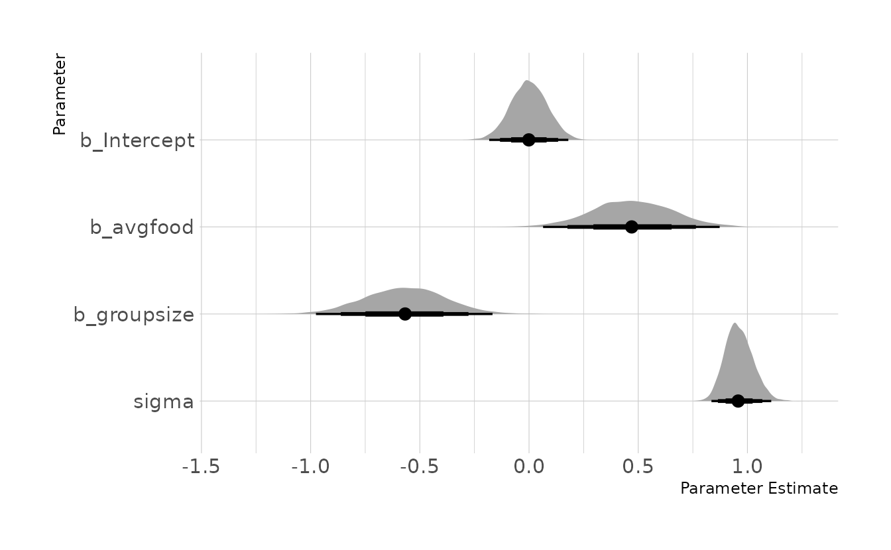

:::question
> **6H6.** Consider your own research question. Draw a DAG to represent it. What are the testable implications of your DAG? Are there any variables you could condition on to close all backdoor paths? Are there unobserved variables that you have omitted? Would a reasonable colleague imagine additional threats to causal inference that you have ignored?
:::

For this question, we'll use the same instructional intervention described for question **6E2**. The DAG is shown below. In this DAG, we're interested in the effect of a new professional development intervention ($D$) on student performance ($P$). However, the professional development works by improving the teacher's instruction ($I$), and student performance is also affected by the students' pre-existing knowledge ($K$).


```r
ed_dag <- dagitty("dag { D -> I -> P <- K }")
coordinates(ed_dag) <- list(x = c(D = 1, I = 1.5, P = 2, K = 2.5),
                            y = c(D = 3, I = 2, P = 1, K = 2))

ggplot(ed_dag, aes(x = x, y = y, xend = xend, yend = yend)) +
  geom_dag_text(color = "black", size = 10) +
  geom_dag_edges(edge_color = "black", edge_width = 2,
                 arrow_directed = grid::arrow(length = grid::unit(15, "pt"),
                                              type = "closed")) +
  theme_void()
```

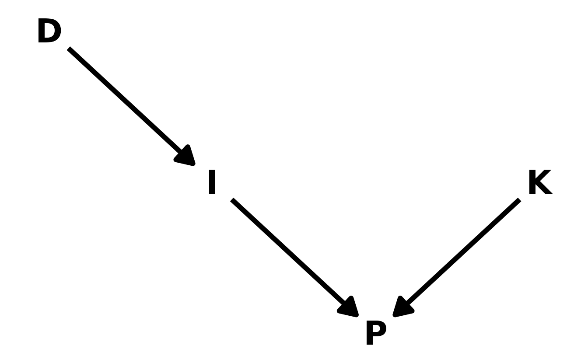

Based on this DAG, there are three testable implications:

1. $D \!\perp\!\!\!\perp K$
2. $D \!\perp\!\!\!\perp P | I$
3. $I \!\perp\!\!\!\perp K$


```r
impliedConditionalIndependencies(ed_dag)
#> D _||_ K
#> D _||_ P | I
#> I _||_ K
```

If we are interested in the causal impact of the professional development intervention $D$ on student performance $P$, then there are no back-door paths to close. Conditioning on the quality of instruction would introduce a post-treatment bias that would mask the effect of the professional development on the student performance.


```r
adjustmentSets(ed_dag, exposure = "D", outcome = "P")
#>  {}
```

There are many other factors not included in this DAG that are known to have an impact both on quality of instruction and student performance. These could include the socioeconomic and socioemotional state of the student, student motivation, school funding, class size, and at-home educational support, to name just a few. Students are also grouped into classes and schools, so there are likely group-level effects that are not accounted for here.

:::question
> **6H7.** For the DAG you made in the previous problem, can you write a data generating simulation for it? Can you design one or more statistical models to produce causal estimates? If so, try to calculate interesting counterfactuals. If not, use the simulation to estimate the size of the bias you might expect. Under what conditions would you, for example, infer the opposite of a true causal effect?
:::

Given the DAG, we can generate data and estimate some causal models to test it. First, let's generate data. For the sake of this example, we'll assume there are no group level effects and that all teachers are equally effective. These assumptions wouldn't hold in real data, but will suffice for this exercise.


```r
set.seed(2010)

students <- 500

ed_dat <- tibble(k = rnorm(students, mean = 0, sd = 2),
                 d = sample(0L:1L, students, replace = TRUE),
                 i = rnorm(students, mean = 1 + 3 * d),
                 p = k + rnorm(students, 0.8 * i)) %>%
  mutate(across(where(is.double), standardize))

ed_dat
#> # A tibble: 500 × 4
#>          k     d        i      p
#>      <dbl> <int>    <dbl>  <dbl>
#>  1 -0.472      1  1.61     1.05 
#>  2  0.0678     1  0.986    0.973
#>  3  1.09       1  1.05     1.42 
#>  4  0.290      0 -1.60    -0.385
#>  5 -0.131      1  1.28     0.731
#>  6  1.54       0 -0.00907  1.11 
#>  7 -0.474      0 -1.35    -0.794
#>  8 -1.47       1  0.345   -0.425
#>  9  0.735      0 -0.559    0.439
#> 10  0.695      0 -0.372    0.155
#> # … with 490 more rows
```

Now let's estimate a model to find the causal effect of professional development on student performance.

\begin{align}
  P_i &\sim \text{Normal}(\mu_i, \sigma) \\
  \mu_i &= \alpha + \beta_D \\
  \alpha &\sim \text{Normal}(0,0.2) \\
  \beta_D &\sim \text{Normal}(0,0.5) \\
  \sigma &\sim \text{Exponential}(1)
\end{align}


```r
ed_mod <- brm(p ~ 1 + d, data = ed_dat, family = gaussian,
              prior = c(prior(normal(0, 0.2), class = Intercept),
                        prior(normal(0, 0.5), class = b),
                        prior(exponential(1), class = sigma)),
              iter = 4000, warmup = 2000, chains = 4, cores = 4, seed = 1234,
              file = here("fits", "chp6", "b6h7-causal"))

as_draws_df(ed_mod) %>%
  as_tibble() %>%
  select(b_Intercept, b_d, sigma) %>%
  pivot_longer(everything()) %>%
  ggplot(aes(x = value, y = name)) +
  stat_halfeye(.width = c(0.67, 0.89, 0.97)) +
  labs(x = "Parameter Value", y = "Parameter")
```

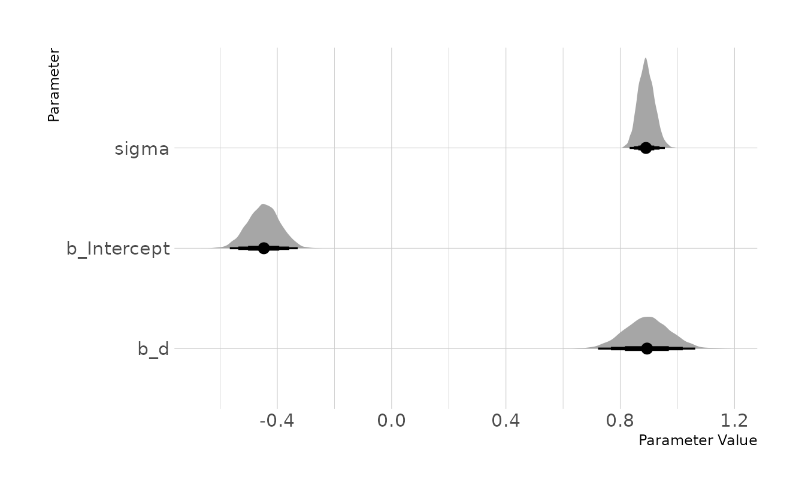

Here we can see that, as expected given the data is simulated, there is a strong effect of professional development on student performance. With students whose teachers received the professional development showing a 0.88 standard deviation increase in performance compared to students whose teachers did not receive the professional development.

## Homework

:::question
> **1.** The first two problems are based on the same data. The data in `data(foxes)` are 116 foxes from 30 different urban groups in England. These fox groups are like street gangs. Group size (`groupsize`) varies from 2 to 8 individuals. Each group maintains its own (almost exclusive) urban territory. Some territories are larger tahn others. The `area` variable encodes this information. Some territories also have more `avgfood` than others. And food influences the `weight` of each fox. Assume this DAG:

<div class="table-question"></div>

> where $F$ is `avgfood`, $G$ is `groupsize`, $A$ is `area`, and $W$ is `weight`.

> Use the backdoor criterion and estimate the total causal influence of $A$ on $F$. What effect would increasing the area of a territory have on the amount of food inside it?
:::

There is only one path from $A$ to $F$, the direct path. Thus there are no backdoors, and no additional variables that need to be included in the model. We can confirm with dagitty.


```r
fox_dag <- dagitty("dag{ A -> F -> G -> W <- F }")

adjustmentSets(fox_dag, exposure = "A", outcome = "F")
#>  {}
```

Given that, we can estimate our model with {brms}. We'll standardize the variables to make setting the priors easier.


```r
data(foxes)

fox_dat <- foxes %>%
  as_tibble() %>%
  select(area, avgfood, weight, groupsize) %>%
  mutate(across(everything(), standardize))

food_on_area <- brm(avgfood ~ 1 + area, data = fox_dat, family = gaussian,
                    prior = c(prior(normal(0, 0.2), class = Intercept),
                              prior(normal(0, 0.5), class = b,),
                              prior(exponential(1), class = sigma)),
                    iter = 4000, warmup = 2000, chains = 4, cores = 4, seed = 1234,
                    file = here("fits", "hw3", "w3h1"))

summary(food_on_area)
#>  Family: gaussian 
#>   Links: mu = identity; sigma = identity 
#> Formula: avgfood ~ 1 + area 
#>    Data: fox_dat (Number of observations: 116) 
#>   Draws: 4 chains, each with iter = 2000; warmup = 0; thin = 1;
#>          total post-warmup draws = 8000
#> 
#> Population-Level Effects: 
#>           Estimate Est.Error l-95% CI u-95% CI Rhat Bulk_ESS Tail_ESS
#> Intercept     0.00      0.04    -0.09     0.09 1.00     8076     6131
#> area          0.88      0.04     0.79     0.96 1.00     8389     5927
#> 
#> Family Specific Parameters: 
#>       Estimate Est.Error l-95% CI u-95% CI Rhat Bulk_ESS Tail_ESS
#> sigma     0.48      0.03     0.42     0.54 1.00     7997     6226
#> 
#> Draws were sampled using sample(hmc). For each parameter, Bulk_ESS
#> and Tail_ESS are effective sample size measures, and Rhat is the potential
#> scale reduction factor on split chains (at convergence, Rhat = 1).
```

We see a fairly strong effect of area on the average amount of food. The credible interval for `area` is well above zero. For an increase of 1 standard deviation in `area` we would expect to see about a .9 standard deviation increase in `food`. Logically this makes sense, as a greater area means there are would be more prey available.

:::question
> **2.** Now infer both the **total** and **direct** causal effects of adding food $F$ to a territory on the weight $W$ of foxes. Which covariates do you need to adjust for in each case? In light of your estimates from this problem and the previous one, what do you think is going on with these foxes? Feel free to speculate---all that matters is that you justify your speculation.
:::

There are no backdoor paths from $F$ to $W$, so there are no covariates that need to be added when evaluating the total effect of food on weight. If we want the direct effect, then we need to close the path of $F \rightarrow G \rightarrow W$ by adding group size as a covariate. We can again confirm with dagitty.


```r
adjustmentSets(fox_dag, exposure = "F", outcome = "W", effect = "total")
#>  {}

adjustmentSets(fox_dag, exposure = "F", outcome = "W", effect = "direct")
#> { G }
```

Now we estimate our models. First the total effect. In this model we see basically no effect of food on weight. The 95% interval in the {brms} output is -0.21 to 0.15 with a mean of -0.02. So the effect is just as likely to be positive as negative.


```r
food_total <- brm(weight ~ 1 + avgfood, data = fox_dat, family = gaussian,
                  prior = c(prior(normal(0, 0.2), class = Intercept),
                            prior(normal(0, 0.5), class = b,),
                            prior(exponential(1), class = sigma)),
                  iter = 4000, warmup = 2000, chains = 4, cores = 4, seed = 1234,
                  file = here("fits", "hw3", "w3h2-total"))

summary(food_total)
#>  Family: gaussian 
#>   Links: mu = identity; sigma = identity 
#> Formula: weight ~ 1 + avgfood 
#>    Data: fox_dat (Number of observations: 116) 
#>   Draws: 4 chains, each with iter = 2000; warmup = 0; thin = 1;
#>          total post-warmup draws = 8000
#> 
#> Population-Level Effects: 
#>           Estimate Est.Error l-95% CI u-95% CI Rhat Bulk_ESS Tail_ESS
#> Intercept    -0.00      0.08    -0.17     0.16 1.00     7369     5854
#> avgfood      -0.02      0.09    -0.21     0.15 1.00     7826     6205
#> 
#> Family Specific Parameters: 
#>       Estimate Est.Error l-95% CI u-95% CI Rhat Bulk_ESS Tail_ESS
#> sigma     1.01      0.07     0.89     1.15 1.00     7839     6107
#> 
#> Draws were sampled using sample(hmc). For each parameter, Bulk_ESS
#> and Tail_ESS are effective sample size measures, and Rhat is the potential
#> scale reduction factor on split chains (at convergence, Rhat = 1).
```

Next we estimate the direct effect. Here we see that when we stratify by group size, we see a strong positive effect of food on weight. This indicates that within a given group size, more food is associated with more weight.


```r
food_direct <- brm(weight ~ 1 + avgfood + groupsize, data = fox_dat,
                   family = gaussian,
                   prior = c(prior(normal(0, 0.2), class = Intercept),
                             prior(normal(0, 0.5), class = b,),
                             prior(exponential(1), class = sigma)),
                   iter = 4000, warmup = 2000, chains = 4, cores = 4, seed = 1234,
                   file = here("fits", "hw3", "w3h2-direct"))

summary(food_direct)
#>  Family: gaussian 
#>   Links: mu = identity; sigma = identity 
#> Formula: weight ~ 1 + avgfood + groupsize 
#>    Data: fox_dat (Number of observations: 116) 
#>   Draws: 4 chains, each with iter = 2000; warmup = 0; thin = 1;
#>          total post-warmup draws = 8000
#> 
#> Population-Level Effects: 
#>           Estimate Est.Error l-95% CI u-95% CI Rhat Bulk_ESS Tail_ESS
#> Intercept    -0.00      0.08    -0.16     0.16 1.00     5680     4403
#> avgfood       0.47      0.18     0.11     0.84 1.00     4022     3986
#> groupsize    -0.57      0.19    -0.93    -0.21 1.00     4021     4085
#> 
#> Family Specific Parameters: 
#>       Estimate Est.Error l-95% CI u-95% CI Rhat Bulk_ESS Tail_ESS
#> sigma     0.96      0.06     0.85     1.09 1.00     5544     5204
#> 
#> Draws were sampled using sample(hmc). For each parameter, Bulk_ESS
#> and Tail_ESS are effective sample size measures, and Rhat is the potential
#> scale reduction factor on split chains (at convergence, Rhat = 1).
```

Altogether, these results seem to suggest a masking effect. That is, as more food is available, more foxes move into the territory, increasing the group size. This continues until an equilibrium is reached where the amount of food available is equally good (or equally bad) within each territory. Thus, the total effect of food is negligible because as more food becomes available, the group size increases such that the amount of food available for each individual fox remains relatively stable. 

:::question
> **3.** Reconsider the Table 2 Fallacy example (from Lecture 6), this time with an unobserved confound $U$ that influences both smoking $S$ and stroke $Y$. Here's the modified DAG:

<div class="table-question"></div>

> First use the backdoor criterion to determine and adjustment set that allows you to estimate the causal effect of $X$ on $Y$, i.e., $P(Y|\text{do}(X))$. Second explain the proper interpretation of each coefficient implied by the regression model that corresponds to the adjustment set. Which coefficients (slopes) are causal and which are not? There is no need to fit any models. Just think through the implications.
:::

There are 5 paths from $X$ to $Y$:

1. $X \rightarrow Y$
2. $X \leftarrow S \rightarrow Y$
3. $X \leftarrow A \rightarrow Y$
4. $X \leftarrow A \rightarrow S \rightarrow Y$
5. $X \leftarrow A \rightarrow S \leftarrow U \rightarrow Y$

Path 1 is the effect of $X$ on $Y$, which we want. The rest are backdoor paths which must be closed. Conditioning on $A$ and $S$ will close all of the paths, which we can confirm with dagitty.


```r
stroke_dag <- dagitty("dag{
  A -> S -> X -> Y;
  A -> X; A -> Y; S -> Y;
  S <- U -> Y 
  X [exposure]
  Y [outcome]
  U [unobserved]
}")

adjustmentSets(stroke_dag)
#> { A, S }
```

However, the unobserved variable $U$ has important implications for the interpretation of the model. There are three slope coefficients that would be in the canonical Table 2: $\beta_X$, $\beta_S$, and $\beta_A$. The focus of our investigation, $\beta_X$ represents the causal effect of $X$ on $Y$. However, because $S$ is a collider, both $\beta_S$ and $\beta_A$ are confounded by $U$. Thus, these coefficients should not be interpreted as any type of causal effect.

:::question
> **4 - OPTIONAL CHALLENGE.** Write a synthetic data simulation for the causal model shown in **Problem 3**. Be sure to include the unobserved confound in the simulation. Choose any functional relationships that you like---you don't have to get the epidemiology correct. You just need to honor the causal structure. Then design a regression model to estimate the influence of $X$ on $Y$ and use it on your synthetic data. How large of a sample do you need to reliably estimate $P(Y|\text{do}(X))$? Define "reliably" as you like, but justify your definition.
:::

Since we're going to be simulating a bunch a data sets, we'll start by writing a function that will generate a single data set based on the DAG. The function allows us to specify a sample size and the relationship between $X$ and $Y$. Notice that although $U$ is used to generate the data, the variable is removed before return the data set, as it is unobserved (`select(-U)`).


```r
sim_dat <- function(n = 100, bx = 0) {
  tibble(U = rnorm(n, 0, 1),
         A = rnorm(n, 0, 1)) %>% 
    mutate(S = rnorm(n, A + U, 1),
           X = rnorm(n, A + S, 1),
           Y = rnorm(n, A + S + (bx * X) + U, 1)) %>% 
    select(-U) %>% 
    mutate(across(everything(), standardize))
}
```

We'll test one example data set. We use the `sim_dat()` function we just created to generate a data set with 10 subjects and a positive relationship between $X$ and $Y$ of 0.3. 


```r
set.seed(208)

dat1 <- sim_dat(n = 10, bx = 0.3)

mod1 <- brm(Y ~ 1 + X + S + A, data = dat1, family = gaussian,
            prior = c(prior(normal(0, 0.2), class = Intercept),
                      prior(normal(0, 0.5), class = b,),
                      prior(exponential(1), class = sigma)),
            iter = 4000, warmup = 2000, chains = 4, cores = 4, seed = 1234,
            file = here("fits", "hw3", "w3h4"))

summary(mod1, prob = 0.89)
#>  Family: gaussian 
#>   Links: mu = identity; sigma = identity 
#> Formula: Y ~ 1 + X + S + A 
#>    Data: dat1 (Number of observations: 10) 
#>   Draws: 4 chains, each with iter = 2000; warmup = 0; thin = 1;
#>          total post-warmup draws = 8000
#> 
#> Population-Level Effects: 
#>           Estimate Est.Error l-89% CI u-89% CI Rhat Bulk_ESS Tail_ESS
#> Intercept     0.00      0.09    -0.14     0.14 1.00     5459     4269
#> X             0.31      0.28    -0.13     0.75 1.00     4000     3847
#> S             0.61      0.22     0.24     0.96 1.00     4549     4029
#> A             0.05      0.22    -0.29     0.42 1.00     4558     4417
#> 
#> Family Specific Parameters: 
#>       Estimate Est.Error l-89% CI u-89% CI Rhat Bulk_ESS Tail_ESS
#> sigma     0.31      0.10     0.19     0.48 1.00     3566     4676
#> 
#> Draws were sampled using sample(hmc). For each parameter, Bulk_ESS
#> and Tail_ESS are effective sample size measures, and Rhat is the potential
#> scale reduction factor on split chains (at convergence, Rhat = 1).
```

And it worked! We got back an estimate of $X$ very close to 0.3, and equally likely to be positive or negative. This was with a sample size of only 10.

The question asks us what sample size is needed for a *reliable* estimate of $\beta_X$. There are two ways (at least) we could think about this. The first is how "correct" our estimate is on average. That is, the mean difference between the true value (0.3 in our example data set) and the estimated posterior mean (0.37 in the above model summary). Thus, the difference here is 0.07. This measure is also referred to as the mean absolute difference. Here, absolute indicates that we normally take the absolute value of the difference so that positive and negative deviations don't cancel each other out.

The other measure of reliability we might consider is the width of our chosen credible interval. If the posterior interval is very wide, we might say that we have an unreliable estimate of $\beta_X$, because there are a wide range of values the model views as plausible. A smaller interval would be more reliable, because this would indicate a high degree of confidence that our estimate is in a more narrow range of values.

In the simulation, we'll generate 100 data sets with each sample size, fit a model to each data set, and calculate our outcome measures. To make things easier, we'll build another function. First we generate the data, then fit the model (`suppressMessages()` and `capture.output()` just suppress the model fitting messages since we'll be fitting many models), and then we use `mean_hdi()` to calculate our measures of reliability.


```r
sim_func <- function(n, bx = 0) {
  dat <- sim_dat(n = n, bx = bx)
  
  suppressMessages(output <- capture.output(
    mod <- brm(Y ~ 1 + X + S + A, data = dat, family = gaussian,
               prior = c(prior(normal(0, 0.2), class = Intercept),
                         prior(normal(0, 0.5), class = b,),
                         prior(exponential(1), class = sigma)),
               refresh = 0,
               iter = 4000, warmup = 2000, chains = 4, cores = 4)
  ))
  
  as_draws_df(mod, "b_X") %>% 
    mean_hdi(.width = 0.89) %>% 
    mutate(abs_error = abs(b_X - bx),
           int_width = .upper - .lower) %>% 
    select(abs_error, int_width)
}
```

We'll investigate sample sizes of 10, 20, 50, 100, 250, 500, and 1,000. For each sample size, we'll conduct 100 replications (i.e., 100 data sets per sample size condition). The following code will create 100 rows for each sample size, and then apply our `sim_func()` to the sample size of each row.


```r
sim_results <- expand_grid(sample_size = c(10, 20, 50, 100, 250, 500, 1000),
                           replication = seq_len(100)) %>% 
  mutate(results = map(sample_size, sim_func, bx = 0.3)) %>% 
  unnest(results) %>% 
  write_rds(here("fits", "hw3", "w3h4-sim.rds"))
```


Looking at our results we can see for each replication, the absolute value of the difference between the mean of the posterior and the true value (0.3; `abs_error`), as well as the width of the 89% compatibility interval.


```r
sim_results
#> # A tibble: 700 × 4
#>    sample_size replication abs_error int_width
#>          <dbl>       <int>     <dbl>     <dbl>
#>  1          10           1    0.206      0.774
#>  2          10           2    0.265      1.08 
#>  3          10           3    0.0771     0.907
#>  4          10           4    0.378      0.954
#>  5          10           5    0.109      0.991
#>  6          10           6    0.0423     0.970
#>  7          10           7    0.460      0.764
#>  8          10           8    0.0568     0.999
#>  9          10           9    0.0854     0.706
#> 10          10          10    0.0566     1.01 
#> # … with 690 more rows
```

Across all replications, we see that the that average absolute error is similar for all sample sizes. However, there is much more variability at the lower sample sizes. That is, with a sample size of 10, it's not unexpected for that we would see an estimate that is off by 0.5. With larger samples, the range of bias values gets narrower, and we are less likely to see estimates that are far off from the true value.

We also see that small sample sizes result in large and more variable interval widths. As the sample size gets larger, the width of the 89% compatibility interval decreases and becomes more consistent (i.e., the width is very similar in each replication).


```r
sim_results %>% 
  select(-replication) %>% 
  pivot_longer(-sample_size, names_to = "measure", values_to = "value") %>% 
  mutate(measure = factor(measure, levels = c("abs_error", "int_width"),
                          labels = c("Absolute Error", "89% Interval Width"))) %>% 
  ggplot(aes(x = factor(sample_size), y = value)) +
  facet_wrap(~measure, nrow = 1) +
  stat_interval(.width = c(0.67, 0.89, 0.97)) +
  scale_color_manual(values = ramp_blue(seq(0.9, 0.1, length.out = 3)),
                     breaks = c(0.67, 0.89, 0.97)) +
  labs(x = "Sample Size", y = "Value", color = "Interval")
```

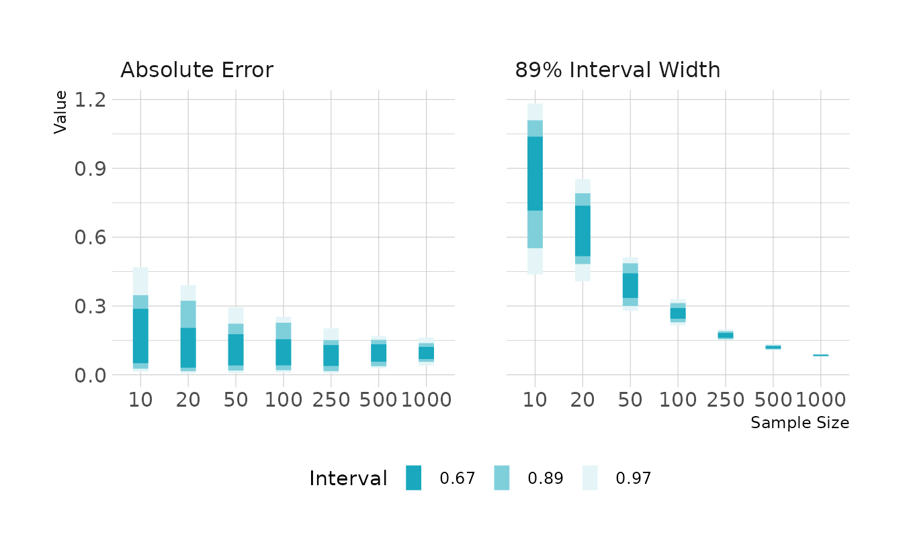
