# Generalized Linear Models

The fifth week covers [Chapter 10 (Big Entropy and the Generalized Linear Model)](https://bookdown.org/content/4857/big-entropy-and-the-generalized-linear-model.html), and [Chapter 11 (God Spiked the Integers)](https://bookdown.org/content/4857/god-spiked-the-integers.html).

## Lectures

Lecture 9:

<iframe src="https://www.youtube.com/embed/nPi5yGbfxuo" width="100%" height="400px" data-external="1"></iframe>

Lecture 10:

<iframe src="https://www.youtube.com/embed/YrwL6t0kW2I" width="100%" height="400px" data-external="1"></iframe>

## Exercises

### Chapter 10

Chapter 10 is a conceptual chapter, so there are no exercises to complete.

### Chapter 11

:::question
> **11E1.** If an event has probability 0.35, what are the log-odds of this event?
:::

The log-odds are given by the logit link:

$$
\log\frac{p}{1-p}
$$

In code:


```r
log(0.35 / (1 - 0.35))
#> [1] -0.619
```


:::question
> **11E2.** If an event has log-odds 3.2, what is the probability of this event?
:::

To convert from log-odds to probability, we use the inverse logit, which is given by:

$$
\frac{\exp(\alpha)}{\exp(\alpha) + 1}
$$
In code:


```r
exp(3.2) / (exp(3.2) + 1)
#> [1] 0.961
```


:::question
> **11E3.** Suppose that a coefficient in a logistic regression has value 1.7. What does this imply about the proportional change in odds of the outcome?
:::

We can calculate the proportional odds by exponentiating the coefficient.


```r
exp(1.7)
#> [1] 5.47
```

A proportional odds of about 5.5 means that each unit increase in the predictor multiplies the odds of the outcome occurring by 5.5.


:::question
> **11E4.** Why do Poisson regressions sometimes require the use of an *offset*? Provide an example.
:::

An offset is the duration that a count was accumulated during. If all of the observations were accumulated during the same observation periods, then an offset is not needed. However, if there are differences (e.g., some counts are weekly while others are daily), an offset is needed.

As an example, say you were modeling how many houses Realtor sells. If some Realtors provide you data with weekly counts of houses sold, and some provide monthly data, you will need an offset to account for the fact that we expect larger counts from longer periods of time.

:::question
> **11M1.** As explained in the chapter, binomial data can be organized in aggregated and disaggregated forms, without any impact on inference. But the likelihood of the data does change when the data are converted between the two formats. Can you explain why?
:::

The likelihood of the aggregated binomial includes a multiplicative term to account for all the different ways that we could get the observed number of counts. For example, say we saw 2 success in 5 trials. In aggregated form, the likelihood hood is:

$$
\frac{5!}{2!(5-2)!}p^2(1-p)^{5-2}
$$
The fraction out front is the multiplicative term, accounting for all the ways we could see 2 successes out of five trials. In the long disaggregated format, the likelihood would only be:

$$
p^2(1-p)^{5-2}
$$

This is because we know exactly how we got 2 out 5 from the series of 1s and 0s. Because there is no multiplicative factor the likelihoods will be different. However, because that multiplicative factor is not a function of $p$, the posterior distributions, and therefore the inferences, are unaffected.


:::question
> **11M2.** If a coefficient in a Poisson regression has value 1.7, what does this imply about the change in the outcome?
:::

There is no straightforward answer. Poisson models typically use the log link. Therefore, a change in the outcome resulting from a 1.7 unit change in the predictor depends on the values of the other parameters, and the scale of the predictor. The best we can do is calculate a proportional change in the odds. Doing that, this question is the same as **11E3.**, and a 1.7 unit change in the predictor results in 5.5 times increase in the odds.


:::question
> **11M3.** Explain why the logit link is appropriate for a binomial generalized linear model.
:::

In binomial models, we need to map the continuous values from the linear model to the probability space constrained between 0 and 1. The logit link is on possible way to do this. Other link function can accomplish the same thing (e.g., the probit link), but any function that will map continuous values to a [0,1] bounded space will do the trick.


:::question
> **11M4.** Explain why the log link is appropriate for a Poisson generalized linear model.
:::

Similar to the previous question, we now need a function that maps the continuous linear model to a strictly positive space. The log link accomplishes this. The inverse of the log link is the exponential, and any value that is exponentiated will be positive.


:::question
> **11M5.** What would it imply to use a logit link for the mean of a Poisson generalized linear model? Can you think of a real research problem for which this would make sense?
:::

A logit link would imply a model with a known maximum count. Normally, this value is 1, but it could be any arbitrary number such as, where $M$ is the maximum count:

$$
\begin{align}
  y_i &\sim \text{Poisson}(\mu_i) \\
  \log\frac{\mu_i}{M - \mu_i} &= \alpha + \beta x_i
\end{align}
$$
Usually, if there is a known maximum, it makes more sense to use a binomial model. However, if $M$ is very large such that you may never reach it, and the probability is low, this type of logit-Poisson could be used.


:::question
> **11M6.** State the constraints for which the binomial and Poisson distributions have maximum entropy. Are the constraints different at all for binomial and Poisson? Why or why not?
:::

The constraints for the binomial and Poisson are the same because the Poisson is the same as a binomial model where the number of trials is very large and the probability of observing the event is very low. The constraints are:

1. Discrete binary outcomes
2. Constant probability of the event across trials


:::question
> **11M7.** Use `quap` to construct a quadratic approximate posterior distribution for the chimpanzee model that includes a unique intercept for each action, `m11.4` (page 330). Compare the quadratic approximation to the posterior distribution produced instead from MCMC. Can you explain both the differences and the similarities between the approximate and the MCMC distributions? Relax the prior on the actor intercepts to Normal(0,10). Re-estimate the posterior using both `ulam` and `quap`. Do the difference increase or decrease? Why?
:::

We'll start by estimating `m11.4` with both `quap()` and `brm()`.


```r
data("chimpanzees")

chimp_dat <- chimpanzees %>% 
  mutate(treatment = 1 + prosoc_left + 2 * condition,
         treatment = factor(treatment),
         actor = factor(actor))

dat_list <- list(pulled_left = chimp_dat$pulled_left,
                 actor = as.integer(chimp_dat$actor),
                 treatment = as.integer(chimp_dat$treatment))

q11.4 <- quap(alist(pulled_left ~ dbinom(1, p),
                    logit(p) <- a[actor] + b[treatment],
                    a[actor] ~ dnorm(0, 1.5),
                    b[treatment] ~ dnorm(0, 0.5)),
              data = dat_list)

b11.4 <- brm(bf(pulled_left ~ a + b,
                a ~ 0 + actor,
                b ~ 0 + treatment,
                nl = TRUE), data = chimp_dat, family = bernoulli,
             prior = c(prior(normal(0, 1.5), class = b, nlpar = a),
                       prior(normal(0, 0.5), class = b, nlpar = b)),
             iter = 4000, warmup = 2000, chains = 4, cores = 4, seed = 1234,
             file = here("fits", "chp11", "b11.4"))
```

Looking at the posterior distributions, the quadratic approximation and MCMC are very similar. The only parameter that shows a noticeable difference is Actor 2. Looking a little closer, we see that for Actor 2, MCMC results in a posterior shifted slightly to the right. This is because the MCMC posterior is slightly skewed, whereas the QUAP posterior is forced to be Gaussian. Therefore, more density is given to the lower tail and less to the upper tail than in the MCMC posterior.


```r
q_samp <- extract.samples(q11.4)

q_draws <- bind_cols(
  q_samp$a %>% 
    as_tibble(.name_repair = ~paste0("b_a_actor", 1:ncol(q_samp$a))) %>% 
    slice_sample(n = 8000) %>% 
    rowid_to_column(var = ".draw"),
  q_samp$b %>% 
    as_tibble(.name_repair = ~paste0("b_b_treatment", 1:ncol(q_samp$b))) %>% 
    slice_sample(n = 8000)
) %>% 
  pivot_longer(-.draw, names_to = "parameter", values_to = "QUAP")

b_draws <- as_draws_df(b11.4) %>% 
  as_tibble() %>% 
  select(-lp__) %>% 
  pivot_longer(cols = -c(.chain, .iteration, .draw),
               names_to = "parameter", values_to = "MCMC")

post_comp <- full_join(b_draws, q_draws, by = c(".draw", "parameter")) %>% 
  pivot_longer(cols = c(MCMC, QUAP), names_to = "type") %>% 
  mutate(parameter = str_replace_all(parameter, "b_[a|b]_([a-z]*)([0-9])",
                                     "\\1 \\2"),
         parameter = str_to_title(parameter))

post_comp %>% 
  ggplot(aes(x = value, color = type)) +
  facet_wrap(~parameter, nrow = 3) +
  geom_density(key_glyph = "timeseries") +
  scale_color_okabeito() +
  labs(x = "Value", y = "Density", color = NULL)
```


```r
post_comp %>% 
  filter(parameter == "Actor 2") %>% 
  ggplot(aes(x = value, color = type)) +
  geom_density(key_glyph = "timeseries") +
  scale_color_okabeito() +
  labs(x = "Actor 2", y = "Density", color = NULL)
```

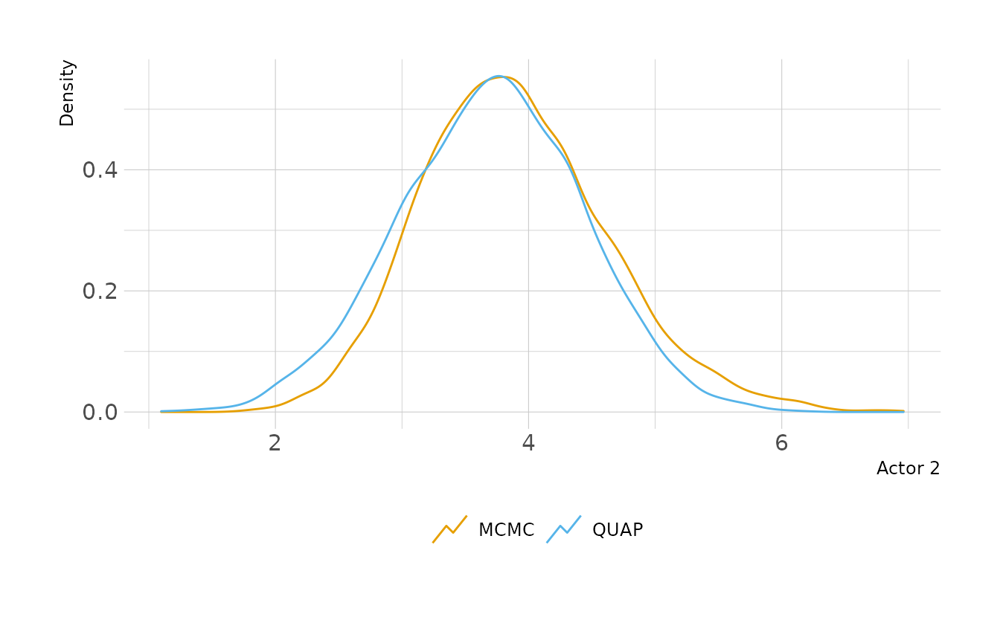

Now let's modify our prior distributions. By loosening the prior, we're letting the actor intercepts take even more extreme values. This should have the effect of letting the posterior become even more skewed.


```r
q11.4_wide <- quap(alist(pulled_left ~ dbinom(1, p),
                         logit(p) <- a[actor] + b[treatment],
                         a[actor] ~ dnorm(0, 10),
                         b[treatment] ~ dnorm(0, 0.5)),
                   data = dat_list)

b11.4_wide <- brm(bf(pulled_left ~ a + b,
                     a ~ 0 + actor,
                     b ~ 0 + treatment,
                     nl = TRUE), data = chimp_dat, family = bernoulli,
                  prior = c(prior(normal(0, 10), class = b, nlpar = a),
                            prior(normal(0, 0.5), class = b, nlpar = b)),
                  iter = 4000, warmup = 2000, chains = 4, cores = 4, seed = 1234,
                  file = here("fits", "chp11", "b11.4-wide"))
```

Let's look at Actor 2 again. We see that the MCMC posterior has much more skew now. However the QUAP posterior is still constrained to be Gaussian. In this case, QUAP is a pretty bad approximation of the true shape of the posterior.


```r
q_samp <- extract.samples(q11.4_wide)

q_draws <- bind_cols(
  q_samp$a %>% 
    as_tibble(.name_repair = ~paste0("b_a_actor", 1:ncol(q_samp$a))) %>% 
    slice_sample(n = 8000) %>% 
    rowid_to_column(var = ".draw"),
  q_samp$b %>% 
    as_tibble(.name_repair = ~paste0("b_b_treatment", 1:ncol(q_samp$b))) %>% 
    slice_sample(n = 8000)
) %>% 
  pivot_longer(-.draw, names_to = "parameter", values_to = "QUAP")

b_draws <- as_draws_df(b11.4_wide) %>% 
  as_tibble() %>% 
  select(-lp__) %>% 
  pivot_longer(cols = -c(.chain, .iteration, .draw),
               names_to = "parameter", values_to = "MCMC")

post_comp <- full_join(b_draws, q_draws, by = c(".draw", "parameter")) %>% 
  pivot_longer(cols = c(MCMC, QUAP), names_to = "type") %>% 
  mutate(parameter = str_replace_all(parameter, "b_[a|b]_([a-z]*)([0-9])",
                                     "\\1 \\2"),
         parameter = str_to_title(parameter))

post_comp %>% 
  filter(parameter == "Actor 2") %>% 
  ggplot(aes(x = value, color = type)) +
  geom_density(key_glyph = "timeseries") +
  scale_color_okabeito() +
  labs(x = "Actor 2", y = "Density", color = NULL)
```

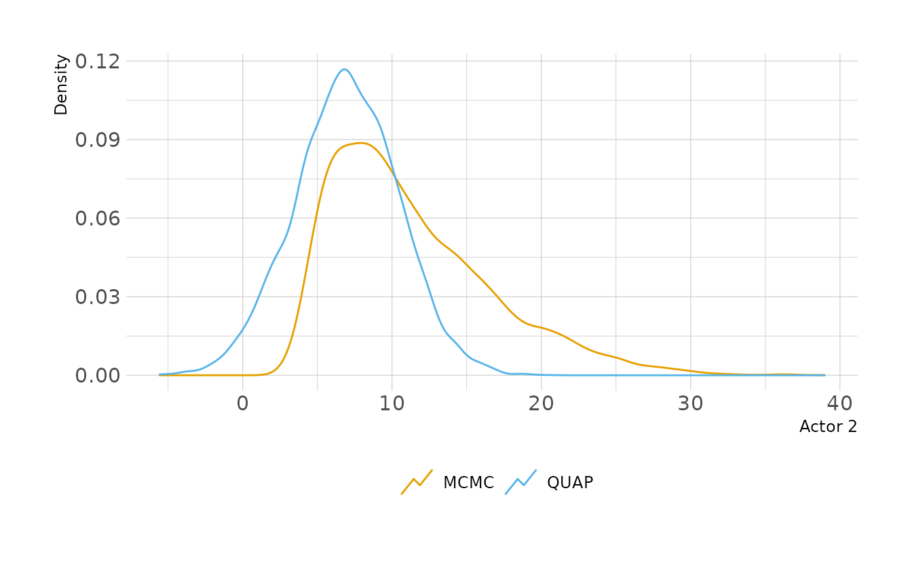


:::question
> **11M8.** Revisit the `data(Kline)` islands example. This time drop Hawaii from the sample and refit the models. What changes do you observe?
:::

First the data and fitting the same model from the chapter.


```r
data("Kline")

kline_dat <- Kline %>% 
  mutate(P = standardize(log(population)))

no_hawaii <- filter(kline_dat, culture != "Hawaii")

b11.10b <- brm(bf(total_tools ~ a + b * P,
                  a ~ 0 + contact,
                  b ~ 0 + contact,
                  nl = TRUE), data = no_hawaii, family = poisson,
               prior = c(prior(normal(3, 0.5), class = b, nlpar = a),
                         prior(normal(0, 0.2), class = b, nlpar = b)),
               iter = 4000, warmup = 2000, chains = 4, cores = 4, seed = 1234,
               file = here("fits", "chp11", "b11.10b"))

summary(b11.10b)
#>  Family: poisson 
#>   Links: mu = log 
#> Formula: total_tools ~ a + b * P 
#>          a ~ 0 + contact
#>          b ~ 0 + contact
#>    Data: no_hawaii (Number of observations: 9) 
#>   Draws: 4 chains, each with iter = 2000; warmup = 0; thin = 1;
#>          total post-warmup draws = 8000
#> 
#> Population-Level Effects: 
#>               Estimate Est.Error l-95% CI u-95% CI Rhat Bulk_ESS Tail_ESS
#> a_contacthigh     3.61      0.07     3.46     3.75 1.00     8138     6148
#> a_contactlow      3.18      0.12     2.93     3.41 1.00     6940     5105
#> b_contacthigh     0.19      0.16    -0.12     0.50 1.00     7833     5821
#> b_contactlow      0.19      0.13    -0.06     0.44 1.00     7351     6431
#> 
#> Draws were sampled using sample(hmc). For each parameter, Bulk_ESS
#> and Tail_ESS are effective sample size measures, and Rhat is the potential
#> scale reduction factor on split chains (at convergence, Rhat = 1).
```

In this model without Hawaii, the slopes (`b_*` parameters in the summary) are nearly identical. This is different than the chapter, where high and low contact had different slopes. Thus, it appears that Hawaii was driving the difference in slopes.


:::question
> **11H1.** Use WAIC or PSIS to compare the chimpanzee model that includes a unique intercept for each actor, `m11.4` (page 330), to the simpler models fit in the same section. Interpret the results.
:::

There are four models from the chapter that we need to replicate:


```r
data("chimpanzees")

chimp_dat <- chimpanzees %>% 
  mutate(treatment = 1 + prosoc_left + 2 * condition,
         treatment = factor(treatment),
         actor = factor(actor))

b11.1 <- brm(bf(pulled_left ~ a,
                a ~ 1,
                nl = TRUE), data = chimp_dat, family = bernoulli,
             prior = c(prior(normal(0, 10), class = b, nlpar = a)),
             iter = 4000, warmup = 2000, chains = 4, cores = 4, seed = 1234,
             file = here("fits", "chp11", "b11.1"))

b11.2 <- brm(bf(pulled_left ~ a + b,
                a ~ 1,
                b ~ 0 + treatment,
                nl = TRUE), data = chimp_dat, family = bernoulli,
             prior = c(prior(normal(0, 10), class = b, nlpar = a),
                       prior(normal(0, 10), class = b, nlpar = b)),
             iter = 4000, warmup = 2000, chains = 4, cores = 4, seed = 1234,
             file = here("fits", "chp11", "b11.2"))

b11.3 <- brm(bf(pulled_left ~ a + b,
                a ~ 1,
                b ~ 0 + treatment,
                nl = TRUE), data = chimp_dat, family = bernoulli,
             prior = c(prior(normal(0, 1.5), class = b, nlpar = a),
                       prior(normal(0, 0.5), class = b, nlpar = b)),
             iter = 4000, warmup = 2000, chains = 4, cores = 4, seed = 1234,
             file = here("fits", "chp11", "b11.3"))

b11.4 <- brm(bf(pulled_left ~ a + b,
                a ~ 0 + actor,
                b ~ 0 + treatment,
                nl = TRUE), data = chimp_dat, family = bernoulli,
             prior = c(prior(normal(0, 1.5), class = b, nlpar = a),
                       prior(normal(0, 0.5), class = b, nlpar = b)),
             iter = 4000, warmup = 2000, chains = 4, cores = 4, seed = 1234,
             file = here("fits", "chp11", "b11.4"))

b11.1 <- add_criterion(b11.1, criterion = "loo")
b11.2 <- add_criterion(b11.2, criterion = "loo")
b11.3 <- add_criterion(b11.3, criterion = "loo")
b11.4 <- add_criterion(b11.4, criterion = "loo")
```

Now we can compare using PSIS. The comparison shows pretty strong support for `b11.4`, which is the model with actor intercepts. Based on what we learned in the chapter, this makes sense. Most of the variation was across individual chimpanzees, rather than across treatments. Thus, adding actor information provides much better predictions.


```r
loo_compare(b11.1, b11.2, b11.3, b11.4)
#>       elpd_diff se_diff
#> b11.4   0.0       0.0  
#> b11.3 -75.3       9.2  
#> b11.2 -75.6       9.3  
#> b11.1 -78.0       9.5
```


:::question
> **11H2.** The data contained in `library(MASS);data(eagles)` are records of salmon pirating attempts by Bald Eagles in Washington State. See `?eagles` for details. While one eagle feeds, sometime another will swoop in and try to steal the salmon from it. Call the feeding eagle the "victim" and the thief the "pirate." Use the available data to build a binomial GLM of successful pirating attempts.

>  (a) Consider the following model:
  $$
  \begin{align}
    y_i &\sim \text{Binomial}(n_i,p_i) \\
    \text{logit}(p_i) &= \alpha + \beta_PP_i + \beta_VV_i + \beta_AA_i \\
    \alpha &\sim \text{Normal}(0, 1.5) \\
    \beta_P,\beta_V,\beta_A &\sim \text{Normal}(0, 0.5)
  \end{align}
  $$

> where $y$ is the number of successful attempts, $n$ is the total number of attempts, $P$ is a dummy variable indicating whether or not the pirate had large body size, $V$ is a dummy variable indicating whether or not the victim had large body size, and finally $A$ is a dummy variable indicating whether or not the pirate was an adult. Fit the model above to the `eagles` data, using both `quap` and `ulam`. Is the quadratic approximation okay?
:::

First, the data:


```r
data(eagles, package = "MASS")

eagle_dat <- eagles %>% 
  as_tibble() %>% 
  mutate(pirateL = ifelse(P == "L", 1, 0),
         victimL = ifelse(V == "L", 1, 0),
         pirateA = ifelse(A == "A", 1, 0))
```

Now two models, the first with `quap()` and the second using {brms}. We can compare the parameter estimates using `precis()` for the QUAP model and `fixef()` for the {brms} model. Overall, the estimates are very similar. However, it should be noted that all of the {brms} parameters are slightly more extreme than the QUAP versions. This is because the MCMC posteriors do not have to be strictly Gaussian, and therefore can have a little more skew. If we used wider priors, the difference would be even more evident.


```r
eagle_quap <- quap(alist(y ~ dbinom(n, p),
                         logit(p) <- a + bP * pirateL + bV * victimL + bA * pirateA,
                         a ~ dnorm(0, 1.5),
                         bP ~ dnorm(0, 1),
                         bV ~ dnorm(0, 1),
                         bA ~ dnorm(0, 1)),
                   data = eagle_dat)

eagle_brms <- brm(y | trials(n) ~ 1 + pirateL + victimL + pirateA,
                  data = eagle_dat, family = binomial,
                  prior = c(prior(normal(0, 1.5), class = Intercept),
                            prior(normal(0, 1), class = b)),
                  iter = 4000, warmup = 2000, chains = 4, cores = 4, seed = 1234,
                  file = here("fits", "chp11", "b11h2-1"))

precis(eagle_quap)
#>      mean    sd   5.5% 94.5%
#> a   0.351 0.479 -0.415  1.12
#> bP  2.581 0.437  1.882  3.28
#> bV -2.711 0.470 -3.463 -1.96
#> bA  0.892 0.407  0.242  1.54

fixef(eagle_brms, probs = c(.055, .945))
#>           Estimate Est.Error   Q5.5 Q94.5
#> Intercept    0.370     0.511 -0.435  1.20
#> pirateL      2.637     0.446  1.945  3.37
#> victimL     -2.790     0.484 -3.588 -2.04
#> pirateA      0.901     0.419  0.239  1.57
```


:::question
>  (b) Now interpret the estimates. If the quadratic approximation turned out okay, then it's okay to use the `quap` estimates. Otherwise stick to `ulam` estimates. Then plot the posterior predictions. Compute and display both (1) the predicted **probability** of success and its 89% interval for each row (*i*) in the data, as well as (2) the predicted success **count** and its 89% interval. What different information does each type of posterior prediction provide?
:::

We'll use the MCMC estimates from {brms}. Starting with the intercept, this is the log-odds of a successful attempt when all of the predictors are 0 (i.e., a small non-adult pirate and small victim). Just under 60% of these attempts are expected to succeed.


```r
as_draws_df(eagle_brms, variable = "b_Intercept") %>% 
  mutate(prob = inv_logit_scaled(b_Intercept)) %>% 
  mean_hdi(prob, .width = 0.89)
#> # A tibble: 1 × 6
#>    prob .lower .upper .width .point .interval
#>   <dbl>  <dbl>  <dbl>  <dbl> <chr>  <chr>    
#> 1 0.586  0.406  0.779   0.89 mean   hdi
```

The slopes are hard to interpret in isolation, because the impact of one variable depends on the other variables. The easiest way to interpret is to make the plot of the probabilities and expected counts. For each case type, we can see the probability of a successful attempt, and the number of expected counts. The difference is that the probabilities do not account for sample size. For example we can see that the SIS case (small immature pirate, small victim) has a relatively high expected probability of a successful attempt. However, because we see so few of those cases, the expected number of successful attempts is still very low. If you looked only at the probabilities, you might expect a lot of these cases. On the other hand, if you looked only at the expected counts, you might think that the probability of success is very low. They two outputs provide complementary information.


```r
eagle_dat %>% 
  add_linpred_draws(eagle_brms) %>% 
  mutate(prob = inv_logit_scaled(.linpred),
         label = paste0(P, A, V)) %>% 
  ggplot(aes(x = label, y = prob)) +
  stat_pointinterval(aes(color = "Posterior"), .width = 0.89, size = 5) +
  geom_point(data = eagle_dat, size = 2,
             aes(x = paste0(P, A, V), y = y / n, color = "Observed")) +
  scale_color_manual(values = c("Posterior" = "#009FB7",
                                "Observed" = "#272727"),
                     name = NULL) +
  labs(x = "Case", y = "Probability")

eagle_dat %>% 
  add_epred_draws(eagle_brms) %>% 
  mutate(label = paste0(P, A, V)) %>% 
  ggplot(aes(x = label, y = .epred)) +
  stat_pointinterval(aes(color = "Posterior"), .width = 0.89, size = 5) +
  geom_point(data = eagle_dat, size = 2,
             aes(x = paste0(P, A, V), y = y, color = "Observed")) +
  scale_color_manual(values = c("Posterior" = "#009FB7",
                                "Observed" = "#272727"),
                     name = NULL) +
  labs(x = "Case", y = "Successes")
```

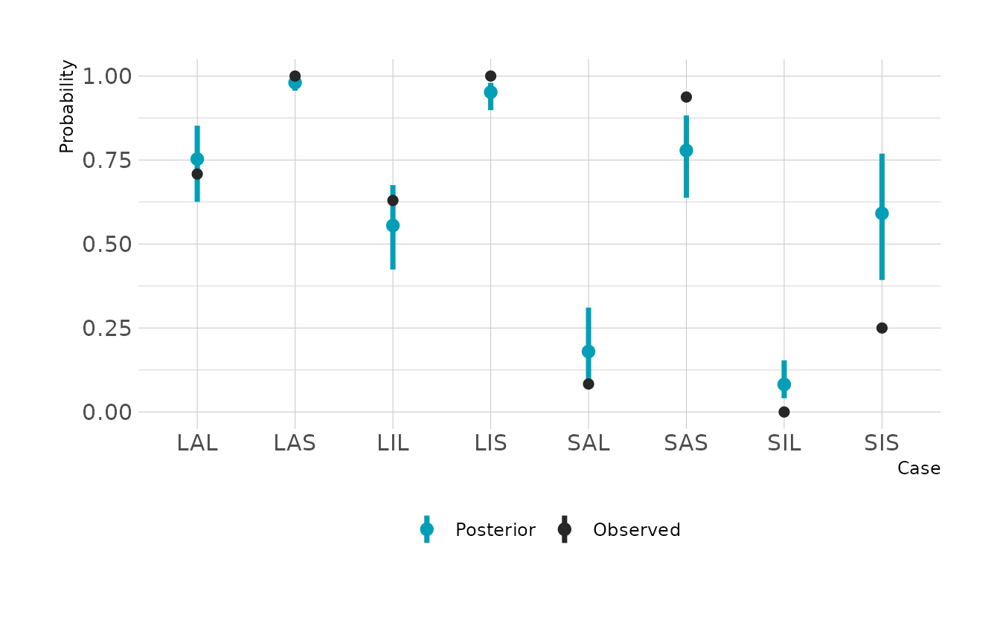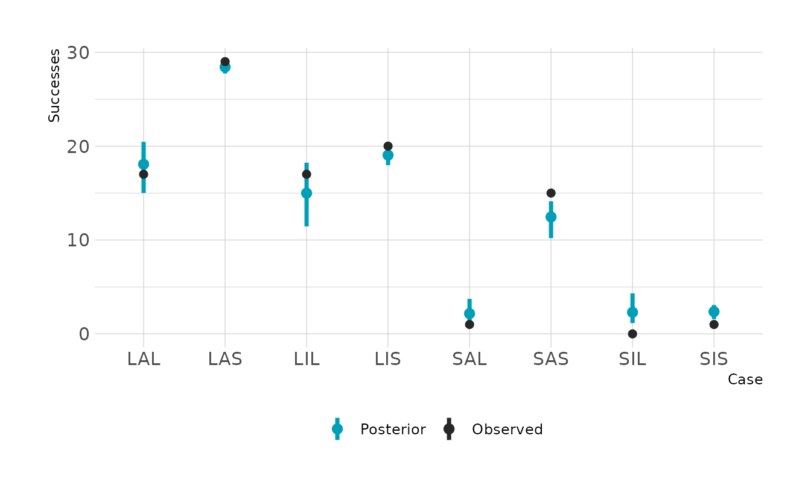


:::question
>  (c) Now try to improve the model. Consider an interaction between the pirate's size and age (immature or adult). Compare this model to the previous one, using WAIC. Interpret.
:::

First we'll fit the model with an interaction and add WAIC information to this model and our previous {brms} model. When we add the WAIC information, we get some warnings about `p_waic` values greater than 0.4. When we compare the WAIC values, we see that there is minimal difference, and the non-interaction model is preferred. Thus, we conclude that the interaction term does not have a large impact on the predictive power of the model.


```r
eagle_brms2 <- brm(y | trials(n) ~ 1 + pirateL * pirateA + victimL,
                   data = eagle_dat, family = binomial,
                   prior = c(prior(normal(0, 1.5), class = Intercept),
                             prior(normal(0, 1), class = b)),
                   iter = 4000, warmup = 2000, chains = 4, cores = 4, seed = 1234,
                   file = here("fits", "chp11", "b11h2-2"))

eagle_brms <- add_criterion(eagle_brms, criterion = "waic")
eagle_brms2 <- add_criterion(eagle_brms2, criterion = "waic")

loo_compare(eagle_brms, eagle_brms2, criterion = "waic")
#>             elpd_diff se_diff
#> eagle_brms   0.0       0.0   
#> eagle_brms2 -0.2       0.3
```


:::question
> **11H3.** The data contained in `data(salamanders)` are counts of salamanders (*Plethodon elongatus*) from 47 different 49-m^2^ plots in northern California. The column `SALAMAN` is the count in each plot, and the columns `PCTCOVER` and `FORESTAGE` are percent of ground cover and age of trees in the plot, respectively. You will model `SALAMAN` as a Poisson variable.

>  (a) Model the relationship between density and percent cover, using a log-link (same as the example in the book and lecture). Use weakly informative priors of your choosing. Check the quadratic approximation again, by comparing `quap` to `ulam`. Then plot the expected counts and their 89% interval against percent cover. In which ways does the model do a good job? A bad job?
:::

We'll start by loading the data and standardizing the predictor variables. Then we can fit both the QUAP and MCMC models. Once again, we see some noticeable differences between the posteriors from the two estimation methods. So moving forward, we'll use the MCMC model.


```r
data("salamanders")

salamander_dat <- salamanders %>% 
  mutate(cov = standardize(PCTCOVER),
         age = standardize(FORESTAGE))

sal_quap <- quap(alist(SALAMAN ~ dpois(lambda),
                       log(lambda) <- a + bC * cov,
                       a ~ dnorm(0, 1),
                       bC ~ dnorm(0, 0.5)),
                 data = salamander_dat)

sal_brms <- brm(SALAMAN ~ 1 + cov, data = salamander_dat, family = poisson,
                prior = c(prior(normal(0, 1), class = Intercept),
                          prior(normal(0, 0.5), class = b)),
                iter = 4000, warmup = 2000, chains = 4, cores = 4, seed = 1234,
                file = here("fits", "chp11", "b11h3-1"))

precis(sal_quap)
#>     mean    sd  5.5% 94.5%
#> a  0.508 0.138 0.287 0.729
#> bC 1.032 0.164 0.769 1.294

fixef(sal_brms, probs = c(0.055, 0.945))
#>           Estimate Est.Error  Q5.5 Q94.5
#> Intercept    0.491     0.138 0.262 0.701
#> cov          1.047     0.163 0.793 1.316
```

Now let's visualize the expected counts. It looks like the model does pretty well for low values of ground cover, but at high values, there is much more variance that might be expected.


```r
set.seed(219)

epreds <- tibble(cov = seq(-2, 1.5, by = 0.05)) %>% 
  add_epred_draws(sal_brms)

preds <- tibble(cov = seq(-2, 1.5, by = 0.01)) %>% 
  add_predicted_draws(sal_brms)

ggplot() +
  stat_lineribbon(data = preds, aes(x = cov, y = .prediction,
                                    fill = "Prediction (89%)"),
                  .width = c(0.89), size = 0) +
  stat_lineribbon(data = epreds, aes(x = cov, y = .epred),
                  .width = c(0.67, 0.89, 0.97), size = 0.5) +
  geom_point(data = salamander_dat, aes(x = cov, y = SALAMAN)) +
  scale_fill_manual(values = c("#F0F0F0", ramp_blue(seq(1, 0.2, length.out = 3))),
                    breaks = c("Prediction (89%)", 0.67, 0.89, 0.97)) +
  labs(x = "Ground cover (standardized)", y = "Observed Salamanders",
       fill = "Interval")
```

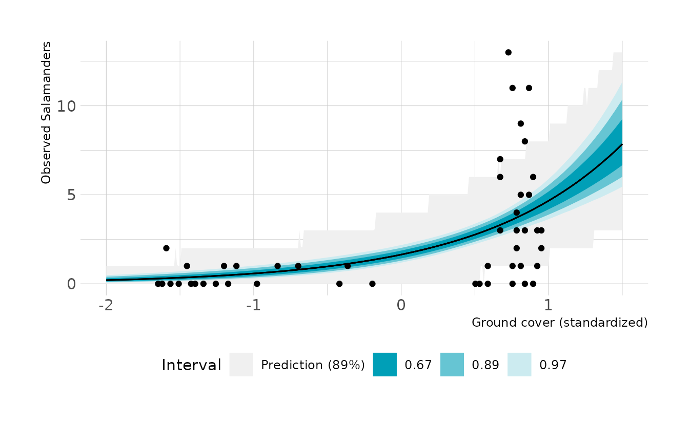


:::question
>  (b) Can you improve the model by using the other predictor, `FORESTAGE`? Try any models you think useful. Can you explain why `FORESTAGE` helps or does not help with prediction?
:::

Let's try adding age as a predictor. When we look at the output, we see that `age` doesn't add much of anything to the prediction. This is likely because ground cover is a pipe between forest age and the number of salamanders. That is, older forest have more ground cover, which is what leads to more salamanders.


```r
sal_brms2 <- brm(SALAMAN ~ 1 + cov + age, data = salamander_dat, family = poisson,
                prior = c(prior(normal(0, 1), class = Intercept),
                          prior(normal(0, 0.5), class = b)),
                iter = 4000, warmup = 2000, chains = 4, cores = 4, seed = 1234,
                file = here("fits", "chp11", "b11h3-2"))

summary(sal_brms2)
#>  Family: poisson 
#>   Links: mu = log 
#> Formula: SALAMAN ~ 1 + cov + age 
#>    Data: salamander_dat (Number of observations: 47) 
#>   Draws: 4 chains, each with iter = 2000; warmup = 0; thin = 1;
#>          total post-warmup draws = 8000
#> 
#> Population-Level Effects: 
#>           Estimate Est.Error l-95% CI u-95% CI Rhat Bulk_ESS Tail_ESS
#> Intercept     0.48      0.14     0.19     0.75 1.00     3562     3680
#> cov           1.04      0.18     0.70     1.40 1.00     3285     3984
#> age           0.02      0.09    -0.17     0.20 1.00     4568     4558
#> 
#> Draws were sampled using sample(hmc). For each parameter, Bulk_ESS
#> and Tail_ESS are effective sample size measures, and Rhat is the potential
#> scale reduction factor on split chains (at convergence, Rhat = 1).
```

This is supported by next model. When we include only age, we see that age is a strong predictor of salamanders. It's only when we stratify by ground cover that forest age loses its predictive power. Thus, it seems that forest age is really just a useful proxy if we don't have actual ground cover data.


```r
sal_brms3 <- brm(SALAMAN ~ 1 + age, data = salamander_dat, family = poisson,
                prior = c(prior(normal(0, 1), class = Intercept),
                          prior(normal(0, 0.5), class = b)),
                iter = 4000, warmup = 2000, chains = 4, cores = 4, seed = 1234,
                file = here("fits", "chp11", "b11h3-3"))

summary(sal_brms3)
#>  Family: poisson 
#>   Links: mu = log 
#> Formula: SALAMAN ~ 1 + age 
#>    Data: salamander_dat (Number of observations: 47) 
#>   Draws: 4 chains, each with iter = 2000; warmup = 0; thin = 1;
#>          total post-warmup draws = 8000
#> 
#> Population-Level Effects: 
#>           Estimate Est.Error l-95% CI u-95% CI Rhat Bulk_ESS Tail_ESS
#> Intercept     0.82      0.10     0.62     1.01 1.00     4513     4838
#> age           0.36      0.08     0.20     0.51 1.00     4560     4866
#> 
#> Draws were sampled using sample(hmc). For each parameter, Bulk_ESS
#> and Tail_ESS are effective sample size measures, and Rhat is the potential
#> scale reduction factor on split chains (at convergence, Rhat = 1).
```


:::question
> **11H4.** The data in `data(NWOGrants)` are outcomes for scientific funding applications for the Netherlands Organization for Scientific Research (NWO) from 2010--2012 [see @vanderlee, for data and context]. These data have a very similar structure to the `UCBAdmit` data discussed in the chapter. I want you to consider a similar question: What are the total and direct causal effects of gender on grant awards? Consider a mediation path (a pipe) through discipline. Draw the corresponding DAG and then use one or more binomial GLMs to answer the question. What is your causal interpretation? If NWO's goal is to equalize rates of funding between men and women, what type of intervention would be most effective?
:::

Let's start with the DAG. We'll denote gender as $G$, discipline as $D$, and award as $A$. Our DAG can then be defined as in the figure below. Gender influences both whether or not an award is given, as well as which discipline an individual might go into.


```
#> 
#> Attaching package: 'ggdag'
#> The following object is masked from 'package:stats':
#> 
#>     filter
```

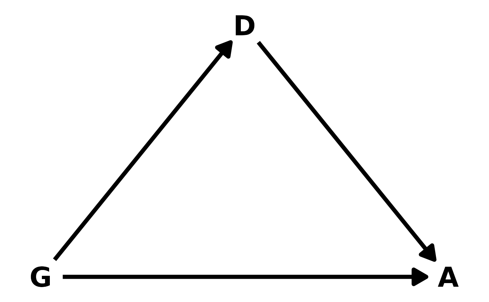

To estimate the total and direct effects, we need two models. For the total effect, we condition only on gender. For the direct effect, we also condition on discipline.


```r
data("NWOGrants")

nwo_dat <- NWOGrants %>% 
  mutate(gender = factor(gender, levels = c("m", "f")))

b11h4_total <- brm(awards | trials(applications) ~ 0 + gender, data = nwo_dat,
                   family = binomial,
                   prior = prior(normal(0, 1.5), class = b),
                   iter = 4000, warmup = 2000, chains = 4, cores = 4, seed = 1234,
                   file = here("fits", "chp11", "b11h4-total"))

b11h4_direct <- brm(bf(awards | trials(applications) ~ g + d + i,
                       g ~ 0 + gender,
                       d ~ 0 + discipline,
                       i ~ 0 + gender:discipline,
                       nl = TRUE), data = nwo_dat, family = binomial,
                    prior = c(prior(normal(0, 1.5), nlpar = g),
                              prior(normal(0, 1.5), nlpar = d),
                              prior(normal(0, 1.5), nlpar = i)),
                    iter = 4000, warmup = 2000, chains = 4, cores = 4, seed = 1234,
                    file = here("fits", "chp11", "b11h4-direct"))
```

Let's look at the difference between males and females in these different models. When looking at the total effect, we see that males are favored by approximately 3 percentage points.


```r
as_draws_df(b11h4_total) %>% 
  mutate(diff_male = inv_logit_scaled(b_genderm) - inv_logit_scaled(b_genderf)) %>% 
  ggplot(aes(x = diff_male)) +
  stat_halfeye(.width = c(0.67, 0.89, 0.97), fill = "#009FB7") +
  labs(x = "&beta;<sub>M</sub> &minus; &beta;<sub>F</sub>", y = "Density")
```


When we condition on discipline, we see a slightly different story. The marginal effect of gender across disciplines shows that in some cases females are advantaged and in other cases disadvantaged. 


```r
apps_per_dept <- nwo_dat %>% 
  group_by(discipline) %>% 
  summarize(applications = sum(applications))

# simulate as if all applications are from males
male_dat <- apps_per_dept %>% 
  mutate(gender = "m") %>% 
  uncount(applications) %>% 
  mutate(applications = 1L)

# simulate as if all applications are from females
female_dat <- apps_per_dept %>% 
  mutate(gender = "f") %>% 
  uncount(applications) %>% 
  mutate(applications = 1L)

marg_eff <- bind_rows(add_epred_draws(male_dat, b11h4_direct),
                      add_epred_draws(female_dat, b11h4_direct)) %>% 
  pivot_wider(names_from = "gender", values_from = ".epred") %>% 
  mutate(diff = m - f)

ggplot(marg_eff, aes(x = diff)) +
  stat_halfeye(.width = c(0.67, 0.89, 0.97), fill = "#009FB7") +
  geom_vline(xintercept = 0, linetype = "dashed") +
  labs(x = "Difference in Awards (Male - Female)", y = "Density")
```


Together this indicates that women are relatively more likely to apply for grants in disciplines with lower award rates. Thus, overall women are awarded grants less often. However, within disciplines, there are advantages and disadvantages that tend to even out, at least in this data set. If we were trying to intervene, I would recommend encouraging women to apply for grants in disciplines for which women have relatively lower application rates, but for which there are higher award rates.


:::question
> **11H5.** Suppose that the NWO Grants sample has an unobserved confound that influences both choice of discipline and the probability of an award. One example of such a confound could be the career stage of each applicant. Suppose that in some disciplines, junior scholars apply for most of the grants. In other disciplines, scholars from all career stages compete. As a result, career stage influences discipline as well as the probability of being awarded a grant. Add these influences to your DAG from the previous problem. What happens now when you condition on discipline? Does it provide an un-confounded estimate of the direct path from gender to an award? Why or why not? Justify your answer with the backdoor criterion. If you have trouble thinking this though, try simulating fake data, assuming your DAG is true. Then analyze it using the model from the previous problem. What do you conclude? Is it possible for gender to have a real direct causal influence but for a regression conditioning on both gender and discipline to suggest zero influence?
:::

Here's our new DAG, where $S$ is the unobserved career stage. Now, $D$ is a collider. So if we condition on $D$ to get the direct effect, we open a backdoor through $S$ to $A$. This means it's not possible to accurately estimate the direct effect of gender on award decisions, using this DAG.

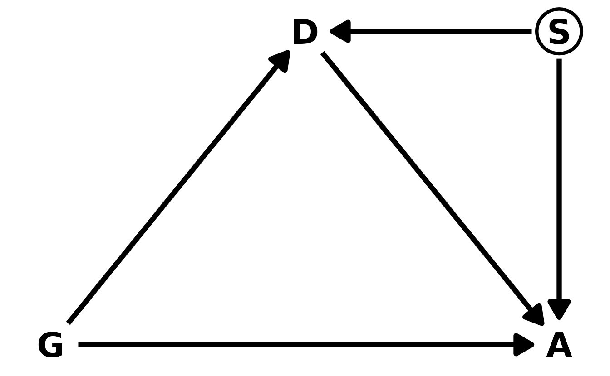

We can run a quick simulation to demonstrate this. We'll generate a data set from this new DAG and estimate the direct effect model from the previous question.


```r
n <- 1000
g <- rbernoulli(n, p = 0.5)
s <- rbernoulli(n, p = 0.5)
d <- rbernoulli(n, p = inv_logit_scaled(2 * g - s))
a <- rbernoulli(n, p = inv_logit_scaled(0 * g + d + s - 2))

dat <- tibble(g, d, a) %>% 
  mutate(across(everything(), as.integer),
         across(everything(), as.factor))

mod <- brm(a ~ 1 + d + g, data = dat, family = bernoulli,
           prior = c(prior(normal(0, 1), class = Intercept),
                     prior(normal(0, 1), class = b)),
           iter = 4000, warmup = 2000, chains = 4, cores = 4,
           file = here("fits", "chp11", "b11h5-sim"))

as_draws_df(mod, variable = "b_g1") %>% 
  mean_hdi(b_g1, .width = 0.89)
#> # A tibble: 1 × 6
#>    b_g1  .lower .upper .width .point .interval
#>   <dbl>   <dbl>  <dbl>  <dbl> <chr>  <chr>    
#> 1 0.233 -0.0116  0.468   0.89 mean   hdi
```

Here, even though we simulated 0 effect of gender on award status, there is a consistently positive relationship estimated by the model. This is because the collider has opened a non-causal path through career stage, inducing a relationship where in reality none exists. This illustrates that it's not possible to estimate a non-confounded estimate of the direct effect of gender, given just data on gender, discipline, and award status.


:::question
> **11H6.** The data in `data(Primates301)` are 301 primate species and associated measures. In this problem, you will consider how brain size is associated with social learning. There are three parts.

>  (a) Model the number of observations of `social_learning` for each species as a function of the log brain size. Use a Poisson distribution for the `social_learning` outcome variable. Interpret the resulting posterior.
:::

As always, we'll start by prepping the data. In our first model, we are predicting social learning with the standardized log brain size.


```r
data("Primates301")

primate_dat <- Primates301 %>% 
  as_tibble() %>% 
  select(social_learning, genus, species, brain, research_effort) %>% 
  drop_na(everything()) %>% 
  mutate(log_brain = standardize(log(brain)),
         log_effort = log(research_effort)) %>% 
  rowid_to_column()

b11h6a <- brm(social_learning ~ 1 + log_brain, data = primate_dat,
              family = poisson,
              prior = c(prior(normal(0, 1), class = Intercept),
                        prior(normal(0, 0.5), class = b)),
              iter = 4000, warmup = 2000, chains = 4, cores = 4, seed = 1234,
              file = here("fits", "chp11", "b11h6a"))

summary(b11h6a)
#>  Family: poisson 
#>   Links: mu = log 
#> Formula: social_learning ~ 1 + log_brain 
#>    Data: primate_dat (Number of observations: 150) 
#>   Draws: 4 chains, each with iter = 2000; warmup = 0; thin = 1;
#>          total post-warmup draws = 8000
#> 
#> Population-Level Effects: 
#>           Estimate Est.Error l-95% CI u-95% CI Rhat Bulk_ESS Tail_ESS
#> Intercept    -1.18      0.12    -1.41    -0.95 1.00     1622     2007
#> log_brain     2.76      0.07     2.61     2.90 1.00     1604     2001
#> 
#> Draws were sampled using sample(hmc). For each parameter, Bulk_ESS
#> and Tail_ESS are effective sample size measures, and Rhat is the potential
#> scale reduction factor on split chains (at convergence, Rhat = 1).
```

The summary indicates a strong positive relationship between social learning behaviors and brain size. We can check how good the predictions are by looking at the posterior predictive checks. Overall it doesn't look to bad, but there are definitely some places where we miss pretty badly.


```r
preds <- primate_dat %>% 
  add_predicted_draws(b11h6a)

preds %>% 
  filter(rowid %in% 1:50) %>% 
  ggplot(aes(x = rowid)) +
  stat_pointinterval(aes(y = .prediction, color = "Posterior"), .width = 0.89) +
  geom_point(data = filter(primate_dat, rowid %in% 1:50),
             aes(y = social_learning, color = "Observed")) +
  scale_color_manual(values = c("Posterior" = "#272727", "Observed" = "#009FB7")) +
  expand_limits(y = c(0, 200)) +
  labs(x = "Case", y = "Social Learning", color = NULL)

preds %>% 
  filter(rowid %in% 51:100) %>% 
  ggplot(aes(x = rowid)) +
  stat_pointinterval(aes(y = .prediction, color = "Posterior"), .width = 0.89) +
  geom_point(data = filter(primate_dat, rowid %in% 51:100),
             aes(y = social_learning, color = "Observed")) +
  scale_color_manual(values = c("Posterior" = "#272727", "Observed" = "#009FB7")) +
  expand_limits(y = c(0, 200)) +
  labs(x = "Case", y = "Social Learning", color = NULL)

preds %>% 
  filter(rowid %in% 101:150) %>% 
  ggplot(aes(x = rowid)) +
  stat_pointinterval(aes(y = .prediction, color = "Posterior"), .width = 0.89) +
  geom_point(data = filter(primate_dat, rowid %in% 101:150),
             aes(y = social_learning, color = "Observed")) +
  scale_color_manual(values = c("Posterior" = "#272727", "Observed" = "#009FB7")) +
  expand_limits(y = c(0, 200)) +
  labs(x = "Case", y = "Social Learning", color = NULL)
```

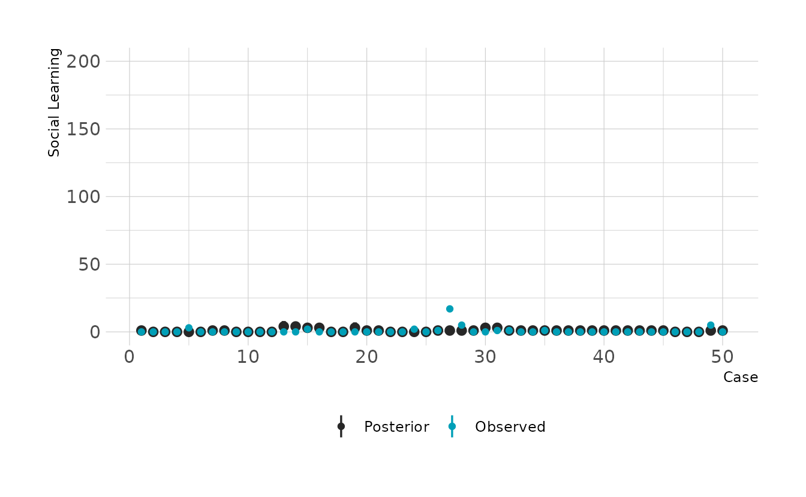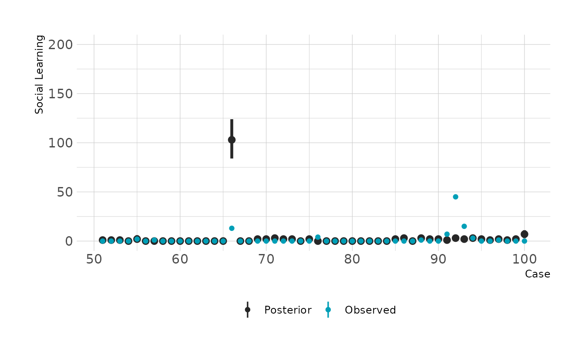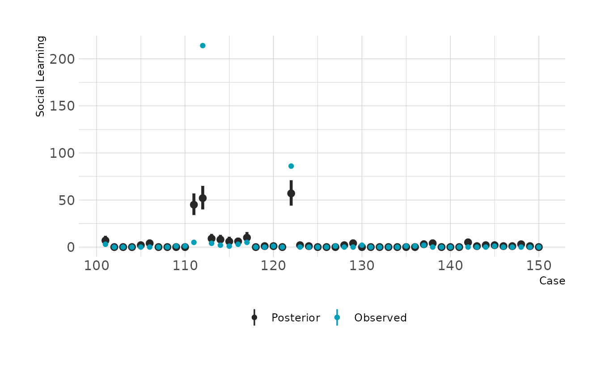


:::question
>  (b) Some species are studied much more than others. So the number of reported instances of `social_learning` could be a product of research effort. Use the `research_effort` variable, specifically its logarithm, as an additional predictor variable. Interpret the coefficient for log `research_effort`. How does this model differ from the previous one?
:::

Let's add research effort to the model. We now see a slightly weaker relationship between brain size and social learning.


```r
b11h6b <- brm(social_learning ~ 1 + log_brain + log_effort, data = primate_dat,
              family = poisson,
              prior = c(prior(normal(0, 1), class = Intercept),
                        prior(normal(0, 0.5), class = b)),
              iter = 4000, warmup = 2000, chains = 4, cores = 4, seed = 1234,
              file = here("fits", "chp11", "b11h6b"))

summary(b11h6b)
#>  Family: poisson 
#>   Links: mu = log 
#> Formula: social_learning ~ 1 + log_brain + log_effort 
#>    Data: primate_dat (Number of observations: 150) 
#>   Draws: 4 chains, each with iter = 2000; warmup = 0; thin = 1;
#>          total post-warmup draws = 8000
#> 
#> Population-Level Effects: 
#>            Estimate Est.Error l-95% CI u-95% CI Rhat Bulk_ESS Tail_ESS
#> Intercept     -6.53      0.33    -7.19    -5.89 1.00     2480     3093
#> log_brain      0.39      0.08     0.23     0.55 1.00     3010     3328
#> log_effort     1.64      0.07     1.51     1.78 1.00     2450     3089
#> 
#> Draws were sampled using sample(hmc). For each parameter, Bulk_ESS
#> and Tail_ESS are effective sample size measures, and Rhat is the potential
#> scale reduction factor on split chains (at convergence, Rhat = 1).
```

Where does this model perform better or worse than prior model? Let's look at the pointwise PSIS-LOO. Points on the right of the plot are those where the second model including research effort provides better predictions. Note that for the most part, these are those with the highest research effort.


```r
b11h6a <- add_criterion(b11h6a, criterion = "loo")
b11h6b <- add_criterion(b11h6b, criterion = "loo")

set.seed(220)

library(gghighlight)

bind_cols(
  primate_dat,
  as_tibble(b11h6a$criteria$loo$pointwise) %>% 
    select(loo1 = elpd_loo),
  as_tibble(b11h6b$criteria$loo$pointwise) %>% 
    select(loo2 = elpd_loo)
) %>% 
  mutate(diff = loo2 - loo1) %>% 
  ggplot(aes(x = diff, y = log_effort)) +
  geom_vline(xintercept = 0, linetype = "dashed") +
  geom_point() +
  gghighlight(n = 1, diff > 15, label_key = genus, max_highlight = 10) +
  labs(x = "LOO<sub>2</sub> - LOO<sub>1</sub>", y = "Research Effort (log)")
```

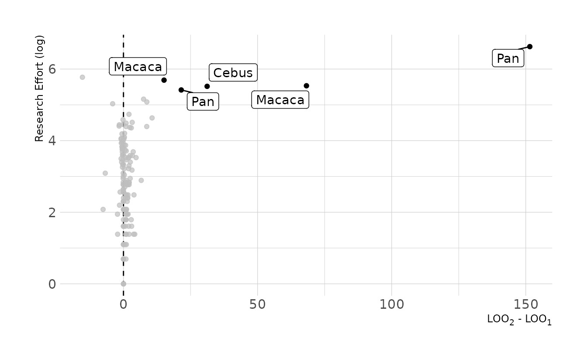


:::question
>  (c) Draw a DAG to represent how you think the variables `social_learning`, `brain`, and `research_effort` interact. Justify the DAG with the measured associations in the two models above (and any other models you used).
:::

Here is the DAG I would predict based on the previous models, where $B$ is brain size, $E$ is research effort, and $S$ is social learning behaviors. Based on this DAG, brain size influences both research effort and social learning behaviors. Finally, although research effort doesn't actually influence social learning behaviors, it does influence the social learning variable, because if there is no effort, we won't observe anything (i.e., false 0s).

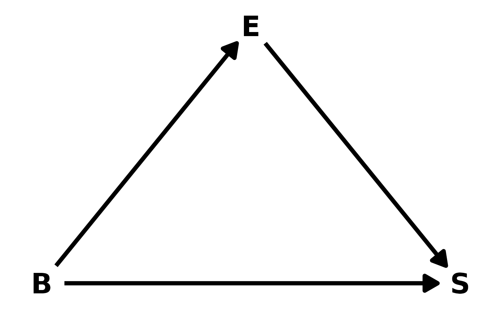

This is consistent with our models. When we added research effort to the model, the effect of brain size decreased, which is consistent with effort being a pipe between brain size and social learning behaviors. Additionally, if scientists tend to study those primates with large brains, then that could lead to a exaggerated effect of brain size on social learning behaviors, which was observed in the first model.


## Homework

:::question
> **1.** The data in `data(NWOGrants)` are outcomes for scientific funding applications for the Netherlands Organization for Scientific Research (NWO) from 2010--2012 [see @vanderlee]. These data have a very similar structure to the UCBAdmit data discussed in Chapter 11. Draw a DAG for this sample and then use one or more binomial GLMs to estimate the TOTAL causal effect of gender on grant awards.
:::

First, let's take a look at the data. As the question identified, this data is nearly identical to the `UCBAdmit` data, with the exception that department has been replaced with discipline.


```r
data("NWOGrants")

nwo_dat <- NWOGrants %>% 
  mutate(gender = factor(gender, levels = c("m", "f")))

nwo_dat
#>             discipline gender applications awards
#> 1    Chemical sciences      m           83     22
#> 2    Chemical sciences      f           39     10
#> 3    Physical sciences      m          135     26
#> 4    Physical sciences      f           39      9
#> 5              Physics      m           67     18
#> 6              Physics      f            9      2
#> 7           Humanities      m          230     33
#> 8           Humanities      f          166     32
#> 9   Technical sciences      m          189     30
#> 10  Technical sciences      f           62     13
#> 11   Interdisciplinary      m          105     12
#> 12   Interdisciplinary      f           78     17
#> 13 Earth/life sciences      m          156     38
#> 14 Earth/life sciences      f          126     18
#> 15     Social sciences      m          425     65
#> 16     Social sciences      f          409     47
#> 17    Medical sciences      m          245     46
#> 18    Medical sciences      f          260     29
```

We'll denote gender as $G$, discipline as $D$, and award as $A$. Our DAG can then be defined as in the figure below. Gender influences both whether or not an award is given, as well as which discipline an individual might go into.


For the total effect, we don't need to condition on any other variables. We can confirm this with {dagitty}.


```r
library(dagitty)

adjustmentSets(nwo_dag, exposure = "G", outcome = "A")
#>  {}
```

We can now fit our model.


```r
w5h1 <- brm(awards | trials(applications) ~ 0 + gender, data = nwo_dat,
            family = binomial,
            prior = prior(normal(0, 1.5), class = b),
            iter = 4000, warmup = 2000, chains = 4, cores = 4, seed = 1234,
            file = here("fits", "hw5", "w5h1"))

summary(w5h1)
#>  Family: binomial 
#>   Links: mu = logit 
#> Formula: awards | trials(applications) ~ 0 + gender 
#>    Data: nwo_dat (Number of observations: 18) 
#>   Draws: 4 chains, each with iter = 2000; warmup = 0; thin = 1;
#>          total post-warmup draws = 8000
#> 
#> Population-Level Effects: 
#>         Estimate Est.Error l-95% CI u-95% CI Rhat Bulk_ESS Tail_ESS
#> genderm    -1.53      0.06    -1.66    -1.41 1.00     7943     5028
#> genderf    -1.74      0.08    -1.90    -1.58 1.00     7710     5042
#> 
#> Draws were sampled using sample(hmc). For each parameter, Bulk_ESS
#> and Tail_ESS are effective sample size measures, and Rhat is the potential
#> scale reduction factor on split chains (at convergence, Rhat = 1).
```

From the summary, it appears that females are less likely to get be awarded grants, but we need to compute the contrast to know for certain. The plot below shows the contrast for males compared to females. On average, males are favored by about 3 percentage points. The contrast is fairly reliably above 0, indicating some bias in favor of males.


```r
as_draws_df(w5h1) %>% 
  mutate(diff_male = inv_logit_scaled(b_genderm) - inv_logit_scaled(b_genderf)) %>% 
  ggplot(aes(x = diff_male)) +
  stat_halfeye(.width = c(0.67, 0.89, 0.97), fill = "#009FB7") +
  labs(x = "&beta;<sub>M</sub> &minus; &beta;<sub>F</sub>", y = "Density")
```

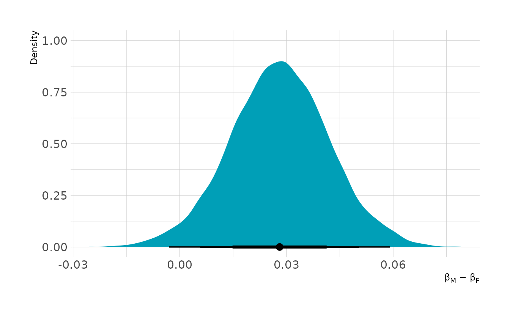


:::question
> **2.** Now estimate the DIRECT causal effect of gender on grant awards. Compute the average direct causal effect of gender, weighting each discipline in proportion to the number of applications in the sample. Refer to the marginal effect example in Lecture 9 for help.
:::

For the direct effect we need to condition on the discipline.


```r
adjustmentSets(nwo_dag, exposure = "G", outcome = "A", effect = "direct")
#> { D }
```

Let's fit the model, stratifying by both gender and discipline.


```r
w5h2 <- brm(bf(awards | trials(applications) ~ g + d + i,
               g ~ 0 + gender,
               d ~ 0 + discipline,
               i ~ 0 + gender:discipline,
               nl = TRUE), data = nwo_dat, family = binomial,
            prior = c(prior(normal(0, 1.5), nlpar = g),
                      prior(normal(0, 1.5), nlpar = d),
                      prior(normal(0, 1.5), nlpar = i)),
            iter = 4000, warmup = 2000, chains = 4, cores = 4, seed = 1234,
            file = here("fits", "hw5", "w5h2"))

summary(w5h2)
#>  Family: binomial 
#>   Links: mu = logit 
#> Formula: awards | trials(applications) ~ g + d + i 
#>          g ~ 0 + gender
#>          d ~ 0 + discipline
#>          i ~ 0 + gender:discipline
#>    Data: nwo_dat (Number of observations: 18) 
#>   Draws: 4 chains, each with iter = 2000; warmup = 0; thin = 1;
#>          total post-warmup draws = 8000
#> 
#> Population-Level Effects: 
#>                                        Estimate Est.Error l-95% CI u-95% CI
#> g_genderm                                 -1.10      0.64    -2.33     0.12
#> g_genderf                                 -1.13      0.63    -2.38     0.11
#> d_disciplineChemicalsciences               0.03      0.95    -1.84     1.91
#> d_disciplineEarthDlifesciences            -0.24      0.94    -2.13     1.55
#> d_disciplineHumanities                    -0.34      0.93    -2.20     1.47
#> d_disciplineInterdisciplinary             -0.39      0.96    -2.23     1.49
#> d_disciplineMedicalsciences               -0.45      0.94    -2.28     1.38
#> d_disciplinePhysicalsciences              -0.16      0.94    -2.02     1.66
#> d_disciplinePhysics                       -0.05      0.97    -1.95     1.90
#> d_disciplineSocialsciences                -0.51      0.95    -2.37     1.36
#> d_disciplineTechnicalsciences             -0.28      0.94    -2.09     1.63
#> i_genderm:disciplineChemicalsciences       0.03      0.96    -1.84     1.91
#> i_genderf:disciplineChemicalsciences      -0.01      0.97    -1.90     1.88
#> i_genderm:disciplineEarthDlifesciences     0.19      0.96    -1.64     2.10
#> i_genderf:disciplineEarthDlifesciences    -0.43      0.96    -2.27     1.48
#> i_genderm:disciplineHumanities            -0.36      0.96    -2.21     1.49
#> i_genderf:disciplineHumanities             0.02      0.96    -1.89     1.90
#> i_genderm:disciplineInterdisciplinary     -0.57      0.97    -2.47     1.31
#> i_genderf:disciplineInterdisciplinary      0.21      0.99    -1.72     2.19
#> i_genderm:disciplineMedicalsciences        0.07      0.97    -1.84     1.98
#> i_genderf:disciplineMedicalsciences       -0.51      0.97    -2.39     1.39
#> i_genderm:disciplinePhysicalsciences      -0.18      0.94    -2.05     1.67
#> i_genderf:disciplinePhysicalsciences       0.05      0.98    -1.85     1.91
#> i_genderm:disciplinePhysics                0.13      1.00    -1.83     2.07
#> i_genderf:disciplinePhysics               -0.17      1.06    -2.24     1.92
#> i_genderm:disciplineSocialsciences        -0.11      0.96    -1.98     1.80
#> i_genderf:disciplineSocialsciences        -0.40      0.97    -2.33     1.49
#> i_genderm:disciplineTechnicalsciences     -0.30      0.96    -2.19     1.63
#> i_genderf:disciplineTechnicalsciences      0.05      0.96    -1.84     1.91
#>                                        Rhat Bulk_ESS Tail_ESS
#> g_genderm                              1.00     7420     5345
#> g_genderf                              1.00     7452     5142
#> d_disciplineChemicalsciences           1.00     8877     5846
#> d_disciplineEarthDlifesciences         1.00     8520     5222
#> d_disciplineHumanities                 1.00     8616     5858
#> d_disciplineInterdisciplinary          1.00     9211     5567
#> d_disciplineMedicalsciences            1.00     8894     5890
#> d_disciplinePhysicalsciences           1.00     7923     5277
#> d_disciplinePhysics                    1.00     9096     6519
#> d_disciplineSocialsciences             1.00     8734     6004
#> d_disciplineTechnicalsciences          1.00     8373     5770
#> i_genderm:disciplineChemicalsciences   1.00     8939     5983
#> i_genderf:disciplineChemicalsciences   1.00     8895     6237
#> i_genderm:disciplineEarthDlifesciences 1.00     9695     5729
#> i_genderf:disciplineEarthDlifesciences 1.00     8663     5995
#> i_genderm:disciplineHumanities         1.00     8531     5813
#> i_genderf:disciplineHumanities         1.00     8670     5291
#> i_genderm:disciplineInterdisciplinary  1.00     9355     5558
#> i_genderf:disciplineInterdisciplinary  1.00     9395     5567
#> i_genderm:disciplineMedicalsciences    1.00     7963     5397
#> i_genderf:disciplineMedicalsciences    1.00     9254     6110
#> i_genderm:disciplinePhysicalsciences   1.00     8395     5734
#> i_genderf:disciplinePhysicalsciences   1.00     8613     6035
#> i_genderm:disciplinePhysics            1.00     9136     6291
#> i_genderf:disciplinePhysics            1.00     8993     6508
#> i_genderm:disciplineSocialsciences     1.00     9101     5986
#> i_genderf:disciplineSocialsciences     1.00     8303     5710
#> i_genderm:disciplineTechnicalsciences  1.00     8591     6009
#> i_genderf:disciplineTechnicalsciences  1.00     9055     5815
#> 
#> Draws were sampled using sample(hmc). For each parameter, Bulk_ESS
#> and Tail_ESS are effective sample size measures, and Rhat is the potential
#> scale reduction factor on split chains (at convergence, Rhat = 1).
```

Now let's compute the marginal effect. Overall, there is a slight bias toward males, who are on average about 1.5 percentage points more likely to be awarded a grant. The 89% interval is about &minus;0.12 to 0.12. Thus, overall, the advantages are relatively balanced, and after statistically removing the effect of discipline, there does not appear to be a strong effect of gender on the awarding of grants.


```r
apps_per_dept <- nwo_dat %>% 
  group_by(discipline) %>% 
  summarize(applications = sum(applications))

# simulate as if all applications are from males
male_dat <- apps_per_dept %>% 
  mutate(gender = "m") %>% 
  uncount(applications) %>% 
  mutate(applications = 1L)

# simulate as if all applications are from females
female_dat <- apps_per_dept %>% 
  mutate(gender = "f") %>% 
  uncount(applications) %>% 
  mutate(applications = 1L)

marg_eff <- bind_rows(add_epred_draws(male_dat, w5h2),
                      add_epred_draws(female_dat, w5h2)) %>% 
  pivot_wider(names_from = "gender", values_from = ".epred") %>% 
  mutate(diff = m - f)

mean_qi(marg_eff$diff, .width = c(0.67, 0.89, 0.97))
#>        y    ymin   ymax .width .point .interval
#> 1 0.0158 -0.0638 0.0832   0.67   mean        qi
#> 2 0.0158 -0.1177 0.1212   0.89   mean        qi
#> 3 0.0158 -0.1682 0.1620   0.97   mean        qi

ggplot(marg_eff, aes(x = diff)) +
  stat_halfeye(.width = c(0.67, 0.89, 0.97), fill = "#009FB7") +
  geom_vline(xintercept = 0, linetype = "dashed") +
  labs(x = "Difference in Awards (Male - Female)", y = "Density")
```

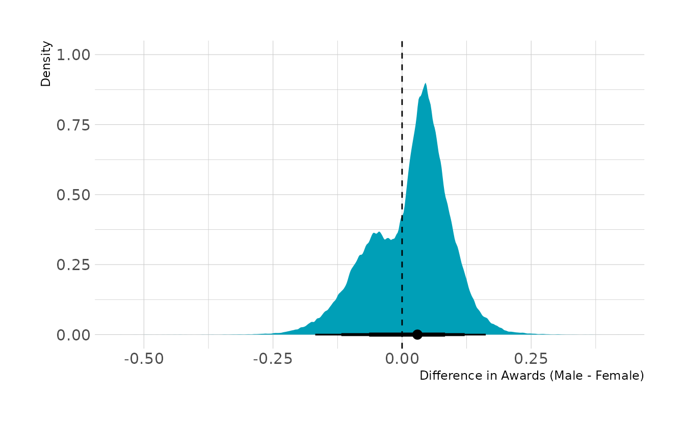


:::question
> **3.** Considering the total effect (problem 1) and direct effect (problem 2) of gender, what causes contribute to the average difference between women and men in award rate in this sample? It is not necessary to say whether or not there is evidence of discrimination. Simply explain how the direct effects you have estimated make sense (or not) of the total effect.
:::

The results from the first two problems indicate that 1) total effect of gender is that females are disadvantaged, but also that 2) the direct effect is a balanced disadvantage to both males and females depending on the discipline. This is because, in this data, females tended to apply slightly more to disciplines with lower overall award rates.

The figure below shows, for each discipline, the proportion of female and male applications that were submitted. That is, of all applications submitted by females, just under 35% were submitted to the social sciences. Similarly, about 25% of male applications were to the social sciences. Thus, disciplines below the dashed line are those where a relatively larger proportion of females submitted applications. Finally, the size of the points represents the award rate for each discipline (i.e., granted awards out of total applications).

Overall we see that disciplines above the dashed line (i.e., those where males were relatively more likely to apply) tended to have higher award rates than those below the dashed line. Thus, because females were relatively more likely to apply to disciplines with lower award rates, females were less likely overall to be awarded a grant.


```r
nwo_dat %>% 
  group_by(discipline) %>% 
  summarize(f = sum(applications[which(gender == "f")]),
            m = sum(applications[which(gender == "m")]),
            total_apps = sum(applications),
            total_awards = sum(awards)) %>% 
  mutate(female_pct = f / sum(f),
         male_pct = m / sum(m),
         award_pct = total_awards / total_apps) %>% 
  ggplot(aes(x = female_pct, y = male_pct)) +
  geom_point(aes(size = award_pct, color = abs(female_pct - male_pct) > 0.05)) +
  geom_abline(intercept = 0, slope = 1, linetype = "dashed") +
  geom_label_repel(data = ~filter(.x, abs(female_pct - male_pct) > 0.05),
                   aes(label = discipline),
                   max.overlaps = Inf, nudge_y = 0.03) +
  scale_size(breaks = seq(0.1, 0.3, by = 0.04)) +
  scale_color_manual(values = c("black", "#009FB7")) +
  guides(color = "none") +
  expand_limits(x = c(0, 0.35), y = c(0, 0.35)) +
  coord_equal() +
  labs(x = "Female Application Rate", y = "Male Application Rate",
       size = "Award Rate") +
  theme(legend.position = "right")
```

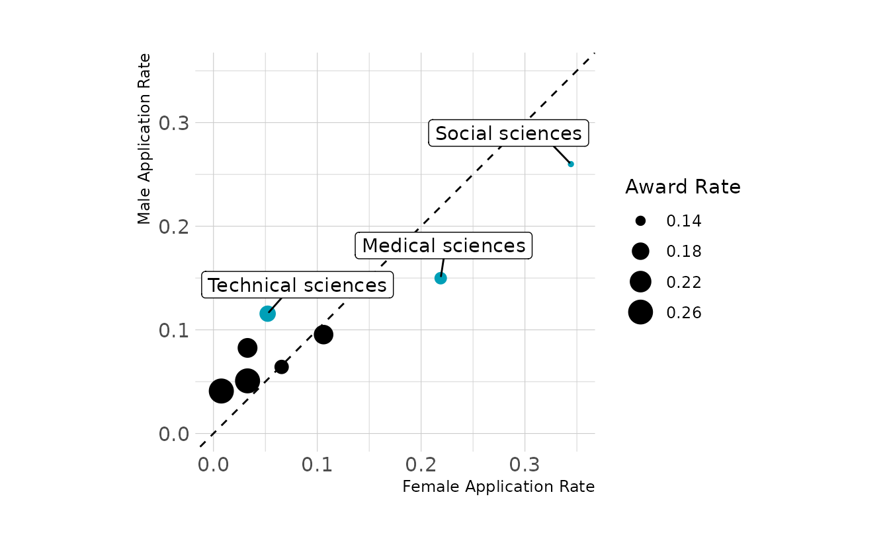


:::question
> **4 - OPTIONAL CHALLENGE.** The data in `data(UFClefties)` are the outcomes of 205 Ultimate Fighting Championship (UFC) matches (see `?UFClefties` for details). It is widely believed that left-handed fighters (aka "Southpaws") have an advantage against right-handed fighters, and left-handed men are indeed over-represented among fighters (and fencers and tennis players) compared to the general population. Estimate the average advantage, if any, that a left-handed fighter has against right-handed fighters. Based upon your estimate, why do you think lefthanders are over-represented among UFC fighters?
:::

This question is more complicated that might first appear. This is because our data set is pre-conditioned on a collider. Let's draw a DAG to illustrate. In the DAG, $L$ is left-handedness, $W$ is win/lose, $Q$ is an indicator for whether or not someone has qualified for the UFC, and $A$ is the ability of the fighters. Looking at the DAG, our data is pre-conditioned on $Q$, that is, our data contains information only on fighters who qualified for the UFC. Thus, there is a backdoor path open from left-handedness to wins that is confounding the true relationship between left-handedness and winning.

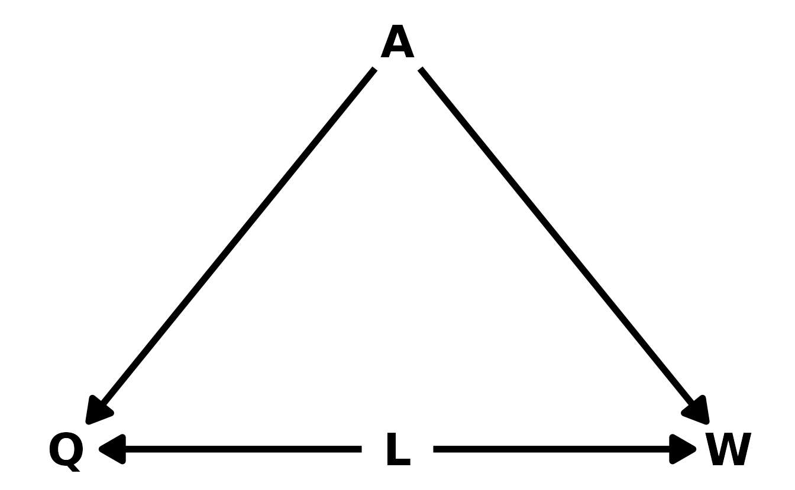

We can run a quick simulation to illustrate the problem. Let's simulate data where there are two ways to get into the UFC: 1) you are high ability, or 2) you have lower ability but are left handed, giving you a slight advantage. Thus, there are only high ability right-handed individuals, and both low and high ability left-handed individuals.


```r
set.seed(221)

n <- 5000
L <- as.integer(rbernoulli(n, 0.1))
A <- rnorm(n)

# qualify for UFC if high A, or lower A but left handed
Q <- ifelse(A > 2 | (A > 1.25 & L == 1L), 1L, 0L)

# filter to only qualified individuals
ufc_fighters <- tibble(l = L, a = A, q = Q) %>% 
  filter(q == 1L) %>% 
  select(-q) %>% 
  rowid_to_column(var = "fighter_id")

# create data
k <- 2.0    # importance of ability difference
b <- 0.5    # left-handedness advantage

ufc_sim <- 
  tibble(fighter_1 = ufc_fighters$fighter_id[ufc_fighters$fighter_id %% 2 == 1],
         fighter_2 = ufc_fighters$fighter_id[ufc_fighters$fighter_id %% 2 == 0]) %>% 
  left_join(ufc_fighters, by = c("fighter_1" = "fighter_id")) %>% 
  left_join(ufc_fighters, by = c("fighter_2" = "fighter_id")) %>% 
  rename(l1 = l.x, a1 = a.x, l2 = l.y, a2 = a.y) %>% 
  mutate(score1 = a1 + b * l1,
         score2 = a2 + b * l2,
         p = inv_logit(k * (score1 - score2)),
         fighter1_win = as.integer(rbernoulli(1, p = p))) %>% 
  select(fighter_1, fighter_2, l1, l2, fighter1_win)
```

Now let's fit the model and see the effect of left-handedness. Overall, we estimate a slight *disadvantage* of being left-handed, even though the data was simulated to have an advantage of 0.5. This is our collider bias in action.


```r
w5h4 <- brm(bf(fighter1_win ~ 0 + b * (l1 - l2),
               b ~ 1,
               nl = TRUE), data = ufc_sim, family = bernoulli,
            prior = c(prior(normal(0, 0.5), class = b, nlpar = b)),
            iter = 4000, warmup = 2000, chains = 4, cores = 4, seed = 1234,
            file = here("fits", "hw5", "w5h4"))

as_draws_df(w5h4) %>% 
  ggplot(aes(x = b_b_Intercept)) +
  stat_halfeye(.width = 0.89, fill = "#009FB7") +
  labs(x = "&beta;<sub>L</sub>", y = "Density")
```

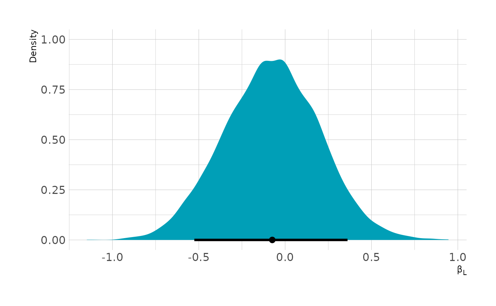

If we want to close the backdoor path, we need to condition on fighter ability. Unfortunately we don't have ability estimates in our data. There are ways we could estimate this directly from the data using something like a [Bradley-Terry]() model or [Elo]() ratings, but we only have a limited number of matches for each of our fighters. The most matches we have for any one fighter is 5. This will make it hard to get reliable estimates of fighter ability with methods we've learned so far. This is prime case for multilevel models, but that will come in future weeks.


```r
data(UFClefties)

tibble(fighter = c(UFClefties$fighter1, UFClefties$fighter2)) %>% 
  count(fighter, sort = TRUE)
#> # A tibble: 244 × 2
#>    fighter     n
#>      <int> <int>
#>  1     123     5
#>  2     232     5
#>  3      19     4
#>  4      58     4
#>  5      62     4
#>  6      63     4
#>  7      71     4
#>  8      78     4
#>  9     113     4
#> 10     175     4
#> # … with 234 more rows
```
